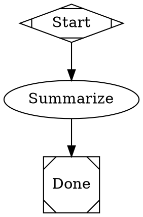

# Orchestra

A declarative pipeline execution engine for orchestrating multi-stage AI workflows. Pipelines are defined as **Graphviz DOT files** — directed graphs where nodes represent tasks (LLM calls, human gates, parallel branches, conditional logic) and edges define the flow.

Orchestra implements the [Attractor specification](attractor/attractor-spec.md) extended with capabilities for software development: multi-LLM agent coordination, multi-repo git workspace management, persistent execution state via CXDB, and human-in-the-loop approval gates.

## Features

- **Declarative DOT pipelines** — Visual, version-controllable, diffable workflow definitions
- **Multi-LLM agent orchestration** — Layered prompt composition (role + persona + personality + task) with provider-agnostic model tiers
- **Parallel execution** — Fan-out/fan-in patterns for concurrent agent work
- **Human-in-the-loop** — Approval gates, interactive chat-style nodes, and structured decision points
- **Git workspace integration** — Multi-repo support, per-agent worktree isolation, per-turn commits with LLM-generated messages
- **Persistent state & resumability** — All execution state stored in CXDB; resume from any checkpoint or replay from a fork point
- **Goal gates** — Mark nodes as required-success with automatic retry routing
- **Conditional branching** — Edge conditions based on outcome and context values
- **Model stylesheet** — CSS-like per-node model overrides by ID, class, or wildcard
- **Validation & linting** — `orchestra compile` for dry-run graph validation before execution

## Getting Started

### Prerequisites

- Python 3.11+
- [uv](https://docs.astral.sh/uv/) (recommended) or pip
- [CXDB](https://github.com/anthropics/cxdb) server (for persistence)

### Installation

```bash
git clone <repo-url>
cd orchestra

# Install with uv (recommended)
uv sync

# Or with pip
python -m venv .venv
source .venv/bin/activate
pip install -e ".[dev]"
```

### Start CXDB

Orchestra requires a running CXDB server for execution state persistence:

```bash
docker run -p 9009:9009 -p 9010:9010 cxdb/cxdb:latest
```

Verify connectivity:

```bash
orchestra doctor
```

### Run Your First Pipeline

```bash
cd examples/brainstorm
orchestra run brainstorm.dot
```

## Usage

### CLI Commands

```bash
# Execute a pipeline (with optional variables and auto-approve mode)
orchestra run <pipeline.dot> [--auto-approve] [--single-line] [key=value ...]

# Validate a pipeline without executing
orchestra compile <pipeline.dot>

# List sessions
orchestra status [--detail]

# Resume a paused or crashed session
orchestra resume <session_id>

# Resume at a specific agent turn (fine-grained)
orchestra resume <session_id> --turn <turn_id>

# Fork and re-execute from a checkpoint
orchestra replay <session_id> --checkpoint <turn_id>

# Connect to a running session's event stream
orchestra attach <session_id>

# Clean up stale session branches and worktrees
orchestra cleanup

# Verify CXDB connectivity
orchestra doctor
```

### Pipeline Variables

Pass variables to pipelines at runtime using `key=value` syntax:

```bash
orchestra run pr-review.dot pr_number=123 repo=org/my-repo
```

Variables are available in prompt templates via Jinja2: `{{ pr_number }}`.

## Pipeline Definition

Pipelines are Graphviz DOT files with Orchestra-specific node and edge attributes.

### Node Shapes

| Shape | DOT Syntax | Purpose |
|---|---|---|
| Start | `shape=Mdiamond` | Pipeline entry point |
| Exit | `shape=Msquare` | Pipeline terminal |
| Task (LLM) | `shape=box` | Agent-driven LLM execution |
| Human Gate | `shape=hexagon` | Human approval/decision point |
| Conditional | `shape=diamond` | Conditional branching |
| Parallel Fan-Out | `shape=component` | Spawn parallel branches |
| Fan-In | `shape=tripleoctagon` | Collect parallel results |
| Tool | `shape=parallelogram` | Non-LLM tool/command execution |

### Minimal Pipeline



### Edge Conditions

Edges support conditions for routing based on outcome or context:

```dot
gate -> retry   [condition="context.verdict=insufficient", max_visits=3]
gate -> proceed [condition="outcome=success"]
```

Edge selection follows a 5-step deterministic algorithm: condition match > preferred label > suggested IDs > weight > lexical order.

### Model Stylesheet

Override models per-node using CSS-like selectors in the graph attributes:

```dot
graph [
    model_stylesheet="
        *            { llm_model: worker; llm_provider: anthropic; }
        #critic      { llm_model: smart; }
        .reviewer    { llm_model: smart; }
    "
]
```

## Configuration

### orchestra.yaml

Place an `orchestra.yaml` in your pipeline directory (or any parent directory):

```yaml
backend: langgraph          # langgraph | direct | cli_agent | simulation

providers:
  default: anthropic
  anthropic:
    models:
      smart: claude-opus-4-20250514
      worker: claude-sonnet-4-20250514
      cheap: claude-haiku-3-20250514
  openai:
    models:
      smart: gpt-4o
      worker: gpt-4o-mini

cxdb:
  url: http://localhost:9010

workspace:
  repos:
    backend:
      path: ../backend
      branch_prefix: orchestra/
      push: on_completion    # on_completion | on_checkpoint | never

agents:
  security-reviewer:
    role: prompts/roles/pr-reviewer.yaml
    persona: prompts/personas/security-specialist.yaml
    personality: prompts/personalities/critic.yaml
    task: prompts/tasks/review-security.yaml
    model: smart
```

### Provider Tiers

Models are referenced by semantic tier (`smart`, `worker`, `cheap`) rather than literal model strings. Each provider maps tiers to specific models:

```yaml
providers:
  anthropic:
    models:
      smart: claude-opus-4-20250514      # Complex reasoning
      worker: claude-sonnet-4-20250514   # General tasks
      cheap: claude-haiku-3-20250514     # Commit messages, summaries
```

### Agent Prompt Composition

Agent prompts are composed from four YAML layers, each in its own file:

```
role       — Core system instructions and capabilities
persona    — Domain specialization (e.g., security expert)
personality — Communication style (e.g., critical, balanced)
task       — Specific instructions for this pipeline node
```

```yaml
# prompts/roles/pr-reviewer.yaml
role:
  name: pr-reviewer
  system: |
    You are an expert code reviewer. Analyze pull request diffs
    for correctness, maintainability, and best practices.
```

### Environment Variables

| Variable | Description |
|---|---|
| `CXDB_URL` | Override CXDB endpoint |
| `ORCHESTRA_REAL_LLM` | Set to `1` to enable real LLM integration tests |

## Examples

### Adversarial PR Review

Four specialist agents review a PR in parallel, an adversarial critic enforces quality, and a synthesizer produces the final verdict interactively with the human:

```bash
cd examples/pr-review
orchestra run pr-review.dot pr_number=123
```

```
start → get_diff → fan_out → [security, architecture] → fan_in → critic → gate
  gate → fan_out (if insufficient, up to 3x)
  gate → synthesize (interactive) → approval
    approval → exit (approve)
    approval → rework → approval (revise)
```

### Interactive Brainstorm

Multi-turn brainstorming conversation followed by autonomous summarization:

```bash
cd examples/brainstorm
orchestra run brainstorm.dot
```

### Design Interview

Requirements gathering, architecture review with human approval gate, and autonomous documentation:

```bash
cd examples/interview
orchestra run interview.dot
```

### Workspace Demo

Demonstrates git workspace integration with per-turn commits:

```bash
cd examples/workspace-demo
orchestra run workspace-demo.dot
```

## LLM Backends

Orchestra supports multiple execution backends via the `CodergenBackend` interface:

| Backend | Description |
|---|---|
| `langgraph` | Primary. LangGraph ReAct agent with tool use and per-turn visibility |
| `direct` | Single LLM API call, no tools. For analysis/synthesis nodes |
| `cli_agent` | Wraps a CLI agent subprocess (Claude Code, Codex, etc.) |
| `simulation` | Returns placeholder responses. For testing without LLMs |

Set the backend in `orchestra.yaml`:

```yaml
backend: langgraph
```

## Workspace & Git Integration

Orchestra manages git operations across multiple repositories:

- **Session branches** — Each pipeline run creates a branch per repo: `{prefix}{pipeline}/{session-id}`
- **Worktree-per-agent** — Parallel agents get isolated git worktrees for concurrent writes
- **Per-turn commits** — Each agent loop turn commits only its tracked file writes
- **LLM commit messages** — Commit messages generated by the `cheap` tier model from the diff
- **Workspace snapshots** — Git SHAs recorded at per-turn and per-node granularity for precise resume

Configure in `orchestra.yaml`:

```yaml
workspace:
  repos:
    my-repo:
      path: ../my-repo
      branch_prefix: orchestra/
      push: on_completion
```

## Development

### Running Tests

```bash
# All tests
pytest

# Specific file
pytest tests/test_engine.py

# Integration tests (requires CXDB)
pytest -m integration

# With real LLM calls
ORCHESTRA_REAL_LLM=1 pytest tests/test_pr_review_real.py
```

### Linting & Formatting

```bash
ruff check src/ tests/
ruff format src/ tests/
```

### Project Structure

```
src/orchestra/
├── cli/            # CLI commands (run, compile, status, resume, replay, cleanup, doctor)
├── parser/         # DOT parser (Lark grammar + transformer)
├── engine/         # Pipeline execution engine (runner, edge selection, retry, goal gates)
├── handlers/       # Node handlers (codergen, wait_human, parallel, conditional, tool, etc.)
├── backends/       # LLM execution backends (langgraph, direct, cli_agent, simulation)
├── config/         # Configuration loading, provider resolution, file discovery
├── models/         # Data models (context, outcome, graph, agent_turn, diagnostics)
├── prompts/        # Prompt composition and template rendering
├── workspace/      # Git integration (session branches, worktrees, commits, snapshots)
├── storage/        # CXDB client, type registry, binary protocol
├── validation/     # Graph linting and validation rules
├── conditions/     # Edge condition expression evaluator
├── transforms/     # AST transforms (variable expansion, model stylesheet)
├── interviewer/    # Human interaction (Console, Callback, Queue, AutoApprove)
├── events/         # Event system (PipelineStarted, NodeCompleted, etc.)
└── ui/             # CLI UI (spinner, progress display)
```

## Dependencies

| Package | Purpose |
|---|---|
| `lark` | DOT grammar parsing |
| `typer` | CLI framework |
| `httpx` | HTTP client (CXDB) |
| `pydantic` | Data validation |
| `pyyaml` | YAML configuration |
| `blake3` | Content-addressed blob hashing |
| `msgpack` | Binary serialization (CXDB protocol) |
| `jinja2` | Prompt template rendering |
| `prompt_toolkit` | Interactive CLI input |
| `langchain-core` | LangChain base abstractions |
| `langchain-anthropic` | Anthropic LLM integration |
| `langchain-openai` | OpenAI LLM integration |
| `langgraph` | ReAct agent framework (primary backend) |

## Architecture

Orchestra follows a layered architecture:

1. **DOT Parser** — Lark grammar parses `.dot` files into an AST
2. **AST Transforms** — Variable expansion, model stylesheet application
3. **Validation** — Graph structure linting (start/exit nodes, reachability, edge validity)
4. **Engine** — Single-threaded traversal loop with deterministic edge selection
5. **Handlers** — Shape-to-handler mapping dispatches each node type
6. **Backends** — `CodergenBackend` interface isolates LLM implementation details
7. **Workspace** — Reacts to engine events, manages git operations per-turn
8. **Storage** — CXDB persistence for sessions, checkpoints, agent turns, and artifacts

The engine emits typed events (`PipelineStarted`, `NodeCompleted`, `AgentTurnCompleted`, etc.) consumed by the UI, workspace layer, and storage layer. This keeps the engine headless and composable.

## License

See [LICENSE](LICENSE) for details.
