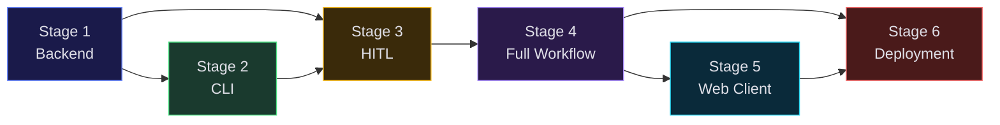

# Appendix B: Dependency Map

Stages 5 and 6 are independent of each other — either can be built first. Stage 5 needs Stage 4 for the full graph definition. Stage 6 needs Stage 4 for the worker logic. Both can proceed in parallel once Stage 4 is complete.
