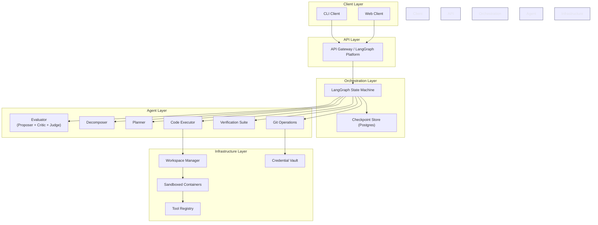

# Agentic Software Development Orchestration System

## System Design Document

---

## Overview

This document specifies a staged build plan for an agentic software development system built on LangGraph. The system uses a mixture-of-experts architecture with adversarial goal evaluation, human-in-the-loop collaboration, programmatic verification, and git integration. Each stage is independently deployable and builds on the prior stage without requiring rewrites.

### Design Principles

- **Provider-agnostic**: Any LLM backend via LangChain's `init_chat_model()`.
- **State-first**: All behavior derives from a single, evolving `AgentState` schema.
- **Incremental complexity**: Each stage adds a layer; nothing from prior stages is thrown away.
- **Separation of concerns**: Graph logic, interaction layer, and infrastructure are independent.

---

## Target Architecture

The system is built across six stages. Each stage is documented in a separate file:

- [Stage 1: LangGraph Backend](stages/stage1.md) - Minimal Evaluate → Plan → Execute graph
- [Stage 2: CLI Layer](stages/stage2.md) - Command-line interface wrapper
- [Stage 3: Human-in-the-Loop Collaboration](stages/stage3.md) - Multi-turn goal and plan refinement
- [Stage 4: Full Coding Workflow](stages/stage4.md) - Adversarial evaluation, decomposition, execution, verification, git integration
- [Stage 5: Web Client](stages/stage5.md) - React web interface with real-time visualization
- [Stage 6: Remote Deployment](stages/stage6.md) - Containerized workers, workspace isolation, credential management

See also:

- [Appendix A: Data Models](appendices/appendix-a.md) - Pydantic models for structured outputs
- [Appendix B: Dependency Map](appendices/appendix-b.md) - Stage dependencies and build order
