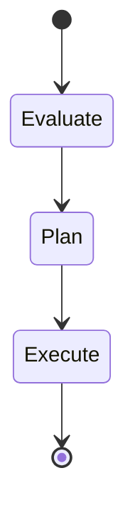

# Stage 1: LangGraph Backend

### Objective

Implement a minimal Evaluate → Plan → Execute graph in LangGraph with programmatic invocation. No CLI, no UI. The outcome is a working graph you can call from a Python script or test suite.

### Architecture



### State Schema

```python
from typing import TypedDict, Optional
from langgraph.graph import MessagesState

class AgentState(TypedDict):
    # Input
    raw_goal: str

    # Evaluate
    goal_spec: dict          # structured goal with criteria
    goal_feasibility: str    # "feasible" | "needs_refinement" | "infeasible"
    evaluation_notes: str

    # Plan
    plan: list[dict]         # ordered list of steps
    plan_status: str         # "draft" | "approved"

    # Execute
    current_step: int
    step_results: list[dict]
    execution_status: str    # "in_progress" | "complete" | "failed"
    final_output: Optional[str]
```

### Node Implementations

Each node is a plain async function. No classes, no tools, no complexity beyond what the stage requires.

```python
from langchain_core.prompts import ChatPromptTemplate
from langgraph.graph import StateGraph, START, END

async def evaluate(state: AgentState) -> dict:
    """Analyze the goal, determine feasibility, extract structure."""
    prompt = ChatPromptTemplate.from_messages([
        ("system", (
            "You are a goal analyst. Given a raw goal, produce:\n"
            "1. A structured goal_spec (JSON) with: title, description, "
            "acceptance_criteria (list), constraints (list)\n"
            "2. A feasibility assessment: feasible / needs_refinement / infeasible\n"
            "3. Evaluation notes explaining your reasoning."
        )),
        ("human", "{raw_goal}")
    ])
    chain = prompt | llm.with_structured_output(GoalEvaluation)
    result = await chain.ainvoke({"raw_goal": state["raw_goal"]})
    return {
        "goal_spec": result.goal_spec,
        "goal_feasibility": result.feasibility,
        "evaluation_notes": result.notes,
    }

async def plan(state: AgentState) -> dict:
    """Convert a structured goal into an ordered execution plan."""
    prompt = ChatPromptTemplate.from_messages([
        ("system", (
            "You are a planner. Given a structured goal, produce an ordered "
            "list of implementation steps. Each step has: title, description, "
            "expected_output, and verification_method."
        )),
        ("human", "Goal: {goal_spec}")
    ])
    chain = prompt | llm.with_structured_output(ExecutionPlan)
    result = await chain.ainvoke({"goal_spec": state["goal_spec"]})
    return {
        "plan": result.steps,
        "plan_status": "draft",
    }

async def execute(state: AgentState) -> dict:
    """Execute plan steps sequentially. Stub implementation for Stage 1."""
    results = []
    for i, step in enumerate(state["plan"]):
        prompt = ChatPromptTemplate.from_messages([
            ("system", "Execute the following step and produce the output."),
            ("human", "Step: {step}\n\nPrevious results: {previous}")
        ])
        chain = prompt | llm
        result = await chain.ainvoke({
            "step": step,
            "previous": results
        })
        results.append({
            "step": i,
            "title": step["title"],
            "output": result.content,
            "status": "complete"
        })
    return {
        "step_results": results,
        "current_step": len(results),
        "execution_status": "complete",
    }
```

### Graph Construction

```python
def build_graph(llm):
    graph = StateGraph(AgentState)

    graph.add_node("evaluate", evaluate)
    graph.add_node("plan", plan)
    graph.add_node("execute", execute)

    graph.add_edge(START, "evaluate")
    graph.add_edge("evaluate", "plan")
    graph.add_edge("plan", "execute")
    graph.add_edge("execute", END)

    return graph.compile()
```

### Invocation

```python
from langchain.chat_models import init_chat_model

llm = init_chat_model("claude-sonnet-4-5-20250929")
graph = build_graph(llm)

result = await graph.ainvoke({
    "raw_goal": "Add a REST endpoint for user profile updates"
})

print(result["plan"])
print(result["step_results"])
```

### Deliverables

| Artifact        | Description                                                       |
| --------------- | ----------------------------------------------------------------- |
| `state.py`      | `AgentState` TypedDict and Pydantic models for structured outputs |
| `nodes.py`      | `evaluate`, `plan`, `execute` functions                           |
| `graph.py`      | `build_graph()` factory                                           |
| `run.py`        | Script to invoke the graph with a goal string                     |
| `test_graph.py` | Tests that assert state shape at each transition                  |

### Exit Criteria

- [ ] `await graph.ainvoke({"raw_goal": "..."})` runs end-to-end without error.
- [ ] Returned state contains populated `goal_spec`, `plan`, and `step_results`.
- [ ] Provider can be swapped by changing the model string (test with at least two providers).
