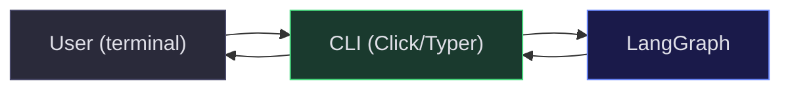

# Stage 2: CLI Layer

### Objective

Wrap the graph in a command-line interface. The user types a goal, sees each phase's output, and gets a final result. No interactivity yet — the graph runs straight through.

### Architecture



### CLI Design

```
$ agent dev <goal> [options]

Options:
  --model TEXT       Model string (default: claude-sonnet-4-5-20250929)
  --repo PATH        Repository path (default: current directory)
  --verbose          Show full LLM outputs
  --output FORMAT    Output format: text | json (default: text)
```

### Implementation

```python
import typer
import asyncio
from rich.console import Console
from rich.panel import Panel
from rich.progress import Progress, SpinnerColumn, TextColumn

app = typer.Typer()
console = Console()

def display_phase(phase: str, content: dict):
    """Render phase output with Rich formatting."""
    colors = {
        "evaluate": "blue",
        "plan": "magenta",
        "execute": "green",
    }
    color = colors.get(phase, "white")
    console.print(Panel(
        format_content(phase, content),
        title=f"[bold {color}]{phase.title()}[/]",
        border_style=color,
    ))

@app.command()
def dev(
    goal: str,
    model: str = "claude-sonnet-4-5-20250929",
    repo: str = ".",
    verbose: bool = False,
):
    """Run an agentic development workflow."""
    console.print(f"\n[dim]Model: {model}[/dim]")
    console.print(f"[dim]Goal: {goal}[/dim]\n")

    llm = init_chat_model(model)
    graph = build_graph(llm)

    # Stream node completions for live output
    async def run():
        async for event in graph.astream_events(
            {"raw_goal": goal},
            version="v2"
        ):
            if event["event"] == "on_chain_end":
                node = event.get("name")
                if node in ("evaluate", "plan", "execute"):
                    display_phase(node, event["data"]["output"])

    asyncio.run(run())

if __name__ == "__main__":
    app()
```

### Streaming Progress

During execution, show a live progress indicator using `astream_events`:

```python
async def run_with_progress(graph, inputs):
    with Progress(
        SpinnerColumn(),
        TextColumn("[progress.description]{task.description}"),
        console=console,
    ) as progress:
        current_task = None

        async for event in graph.astream_events(inputs, version="v2"):
            if event["event"] == "on_chain_start":
                node = event.get("name", "")
                if node in ("evaluate", "plan", "execute"):
                    if current_task:
                        progress.update(current_task, description=f"✓ {node}")
                    current_task = progress.add_task(
                        f"Running: {node}...", total=None
                    )

            elif event["event"] == "on_chain_end":
                node = event.get("name", "")
                if node in ("evaluate", "plan", "execute"):
                    display_phase(node, event["data"]["output"])
```

### Deliverables

| Artifact         | Description                             |
| ---------------- | --------------------------------------- |
| `cli.py`         | Typer application with `dev` command    |
| `display.py`     | Rich-based rendering for each phase     |
| `pyproject.toml` | Package config with `agent` entry point |

### Exit Criteria

- [ ] `agent dev "Add user authentication"` runs end-to-end and prints formatted output.
- [ ] `--model` flag switches providers without code changes.
- [ ] `--output json` emits machine-readable output for scripting.
