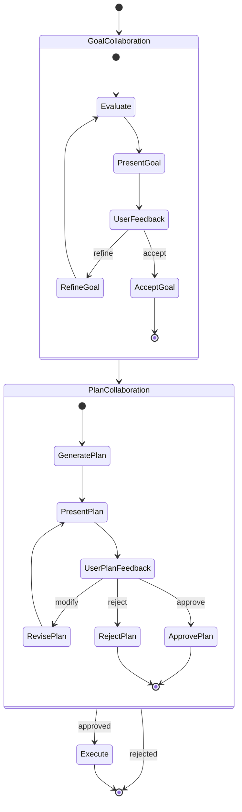

# Stage 3: Human-in-the-Loop Collaboration

### Objective

Transform evaluation and planning from single-pass phases into collaborative, multi-turn dialogues. The user co-develops the goal and plan with the agents. Execution remains autonomous.

### Architecture



### State Additions

```python
class AgentState(TypedDict):
    # ... (all fields from Stage 1) ...

    # Collaboration state
    phase: str                           # current interaction phase
    collaboration_history: list[dict]    # [{role, content, timestamp}]

    # Goal collaboration
    goal_iteration: int                  # how many refinement rounds
    user_goal_feedback: Optional[str]    # latest user input on goal

    # Plan collaboration
    plan_iteration: int
    user_plan_feedback: Optional[str]
    plan_change_log: list[str]           # what changed each iteration
```

### Interrupt Pattern

The key mechanism is LangGraph's `interrupt()`. When a node calls `interrupt()`, the graph freezes, persists state to the checkpointer, and returns the interrupt payload to the caller. The caller (CLI) collects user input and resumes the graph with `Command(resume=...)`.

```python
from langgraph.types import interrupt, Command
from langgraph.checkpoint.memory import MemorySaver

async def present_goal(state: AgentState) -> dict:
    """Pause for human feedback on the evaluated goal."""
    response = interrupt({
        "type": "goal_review",
        "goal_spec": state["goal_spec"],
        "feasibility": state["goal_feasibility"],
        "notes": state["evaluation_notes"],
        "iteration": state.get("goal_iteration", 1),
        "prompt": "Review the goal analysis. Respond with feedback or 'accept'."
    })
    # `response` is whatever the CLI passes via Command(resume=...)
    decision = "accept" if response.get("decision") == "accept" else "refine"
    return {
        "user_goal_feedback": response.get("feedback", ""),
        "phase": "refine_goal" if decision == "refine" else "plan",
        "goal_iteration": state.get("goal_iteration", 1) + (
            1 if decision == "refine" else 0
        ),
    }

async def refine_goal(state: AgentState) -> dict:
    """Incorporate user feedback into the goal."""
    prompt = ChatPromptTemplate.from_messages([
        ("system",
         "Refine the following goal based on user feedback. "
         "Preserve what was accepted, modify what was criticized."),
        ("human",
         "Current goal:\n{goal_spec}\n\n"
         "User feedback:\n{feedback}\n\n"
         "Evaluation history:\n{history}")
    ])
    chain = prompt | llm.with_structured_output(GoalEvaluation)
    result = await chain.ainvoke({
        "goal_spec": state["goal_spec"],
        "feedback": state["user_goal_feedback"],
        "history": state.get("collaboration_history", []),
    })
    return {
        "goal_spec": result.goal_spec,
        "goal_feasibility": result.feasibility,
        "evaluation_notes": result.notes,
    }
```

### Graph Construction (Updated)

```python
def build_graph(llm, checkpointer=None):
    graph = StateGraph(AgentState)

    # Goal collaboration sub-flow
    graph.add_node("evaluate", evaluate)
    graph.add_node("present_goal", present_goal)
    graph.add_node("refine_goal", refine_goal)

    # Plan collaboration sub-flow
    graph.add_node("plan", plan)
    graph.add_node("present_plan", present_plan)
    graph.add_node("revise_plan", revise_plan)

    # Autonomous execution
    graph.add_node("execute", execute)

    # Wiring
    graph.add_edge(START, "evaluate")
    graph.add_edge("evaluate", "present_goal")

    graph.add_conditional_edges("present_goal", lambda s: s["phase"], {
        "refine_goal": "refine_goal",
        "plan": "plan",
    })
    graph.add_edge("refine_goal", "evaluate")

    graph.add_edge("plan", "present_plan")
    graph.add_conditional_edges("present_plan", lambda s: s["phase"], {
        "revise_plan": "revise_plan",
        "execute": "execute",
        "rejected": END,
    })
    graph.add_edge("revise_plan", "present_plan")

    graph.add_edge("execute", END)

    return graph.compile(checkpointer=checkpointer or MemorySaver())
```

### CLI Interaction Loop

```python
async def run_interactive(goal: str, model: str):
    checkpointer = MemorySaver()
    graph = build_graph(init_chat_model(model), checkpointer)
    config = {"configurable": {"thread_id": str(uuid4())}}

    # First invocation — runs to first interrupt
    state = await graph.ainvoke({"raw_goal": goal}, config)

    while True:
        # The graph is paused at an interrupt.
        # Determine what type of review is needed.
        snapshot = await graph.aget_state(config)
        interrupted = snapshot.next  # tuple of next node(s)

        if not interrupted:
            # Graph completed
            display_summary(snapshot.values)
            break

        # Get the interrupt payload
        interrupt_value = snapshot.tasks[0].interrupts[0].value

        if interrupt_value["type"] == "goal_review":
            display_goal_evaluation(interrupt_value)
            user_input = prompt_user("Feedback (or 'accept'): ")

            if user_input.strip().lower() == "accept":
                resume_value = {"decision": "accept"}
            else:
                resume_value = {"decision": "refine", "feedback": user_input}

        elif interrupt_value["type"] == "plan_review":
            display_plan(interrupt_value)
            user_input = prompt_user("Feedback (or 'approve'): ")

            if user_input.strip().lower() in ("approve", "yes", "lgtm"):
                resume_value = {"decision": "approve"}
            elif user_input.strip().lower() in ("reject", "no", "cancel"):
                resume_value = {"decision": "reject"}
            else:
                resume_value = {"decision": "modify", "feedback": user_input}

        # Resume the graph with the user's input
        state = await graph.ainvoke(
            Command(resume=resume_value),
            config,
        )
```

### Deliverables

| Artifact                | Description                                                               |
| ----------------------- | ------------------------------------------------------------------------- |
| `nodes.py`              | Updated with `present_goal`, `refine_goal`, `present_plan`, `revise_plan` |
| `graph.py`              | Updated with conditional edges and checkpointer                           |
| `cli.py`                | Interactive loop with interrupt handling                                  |
| `test_collaboration.py` | Tests that simulate multi-turn refinement                                 |

### Exit Criteria

- [ ] User can refine the goal across 3+ rounds before accepting.
- [ ] User can modify the plan, and changes are reflected in the revised plan.
- [ ] User can reject the plan, and the graph exits cleanly.
- [ ] Execution runs autonomously after plan approval — no further prompts.
- [ ] State survives process restart (checkpointer persistence).
