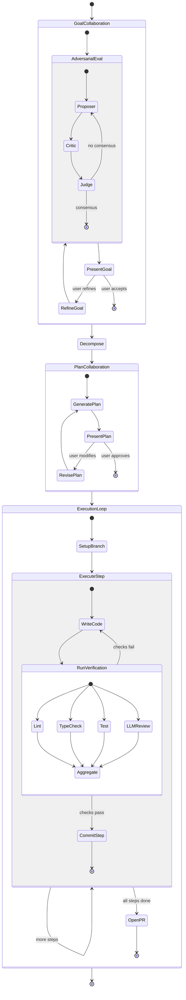
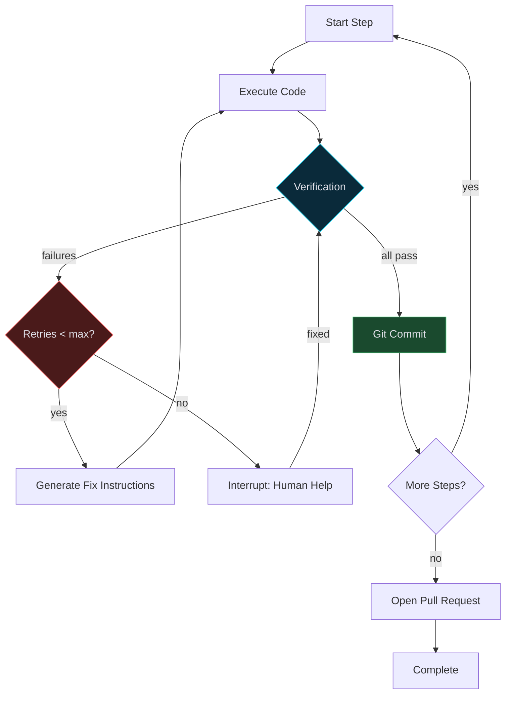

# Stage 4: Full Coding Workflow

### Objective

Build out the execution phase into a real software development pipeline: adversarial goal evaluation, task decomposition, code execution with real tools, programmatic verification, and git integration.

### Architecture



### State Schema (Full)

```python
class AgentState(TypedDict):
    # ── Input ──────────────────────────────────
    raw_goal: str
    repo_path: str
    repo_url: Optional[str]

    # ── Goal Evaluation ────────────────────────
    goal_spec: GoalSpec
    eval_history: list[EvalRound]       # adversarial debate rounds
    eval_verdict: str                   # "accept" | "refine"
    goal_iteration: int
    user_goal_feedback: Optional[str]

    # ── Decomposition ──────────────────────────
    tasks: list[Task]                   # sub-tasks with dependencies
    task_graph: dict                    # adjacency list for ordering

    # ── Planning ───────────────────────────────
    plan: ExecutionPlan
    plan_status: str
    plan_iteration: int
    user_plan_feedback: Optional[str]

    # ── Execution ──────────────────────────────
    current_task_index: int
    current_step: int                   # step within current task
    step_results: list[StepResult]
    execution_context: dict             # shared state across steps
    files_changed: list[str]

    # ── Verification ───────────────────────────
    verification: VerificationResult
    verification_retries: int
    fix_instructions: Optional[str]
    max_retries: int                    # default 3

    # ── Git ─────────────────────────────────────
    branch_name: str
    commit_history: list[CommitRecord]
    pr_url: Optional[str]

    # ── Collaboration ──────────────────────────
    phase: str
    collaboration_history: list[dict]
```

### Adversarial Evaluation (New)

Replaces the simple `evaluate` node from Stage 1. Three sub-agents debate internally before presenting to the user.

```python
class AdversarialEvalNode:
    def __init__(self, llm, max_rounds: int = 3):
        self.proposer = llm.with_structured_output(Proposal)
        self.critic = llm.with_structured_output(Critique)
        self.judge = llm.with_structured_output(Verdict)
        self.max_rounds = max_rounds

    async def __call__(self, state: AgentState) -> dict:
        goal = state.get("refined_goal") or state["goal_spec"] or state["raw_goal"]
        history = state.get("eval_history", [])

        for round_num in range(self.max_rounds):
            proposal = await self.proposer.ainvoke({...})
            critique = await self.critic.ainvoke({...})
            verdict = await self.judge.ainvoke({...})

            history.append(EvalRound(
                round=round_num + 1,
                proposal=proposal,
                critique=critique,
                verdict=verdict,
            ))

            if verdict.decision == "accept":
                break

        return {
            "goal_spec": verdict.refined_goal or goal,
            "eval_history": history,
            "eval_verdict": verdict.decision,
        }
```

### Tool Registry

The executor needs real tools. Define them as LangChain tools with clear interfaces.

```python
from langchain_core.tools import tool
import subprocess

@tool
def read_file(path: str) -> str:
    """Read a file from the repository."""
    with open(path) as f:
        return f.read()

@tool
def write_file(path: str, content: str) -> str:
    """Write content to a file in the repository."""
    Path(path).parent.mkdir(parents=True, exist_ok=True)
    with open(path, "w") as f:
        f.write(content)
    return f"Wrote {len(content)} bytes to {path}"

@tool
def run_command(command: str, cwd: str = ".") -> str:
    """Run a shell command and return stdout + stderr."""
    result = subprocess.run(
        command, shell=True, cwd=cwd,
        capture_output=True, text=True, timeout=120
    )
    return f"exit={result.returncode}\n{result.stdout}\n{result.stderr}"

@tool
def search_codebase(query: str, path: str = ".") -> str:
    """Search the codebase using ripgrep."""
    result = subprocess.run(
        ["rg", "--json", query, path],
        capture_output=True, text=True
    )
    return result.stdout

@tool
def git_diff(cwd: str = ".") -> str:
    """Show current uncommitted changes."""
    result = subprocess.run(
        ["git", "diff"], cwd=cwd, capture_output=True, text=True
    )
    return result.stdout

TOOL_REGISTRY = [read_file, write_file, run_command, search_codebase, git_diff]
```

### Verification Suite

```python
class VerificationSuite:
    checks = {
        "lint": "ruff check {path} --output-format json",
        "typecheck": "mypy {path} --output json",
        "test": "pytest {path} -x --tb=short -q",
        "security": "semgrep --config auto {path} --json",
    }

    async def run_all(self, repo_path: str, files: list[str]) -> VerificationResult:
        results = await asyncio.gather(*[
            self._run_check(name, cmd, repo_path)
            for name, cmd in self.checks.items()
        ])
        return VerificationResult(
            checks={name: result for name, result in zip(self.checks, results)},
            passed=all(r.passed for r in results),
        )

    async def _run_check(self, name: str, cmd_template: str, path: str) -> CheckResult:
        cmd = cmd_template.format(path=path)
        proc = await asyncio.create_subprocess_shell(
            cmd, stdout=asyncio.subprocess.PIPE, stderr=asyncio.subprocess.PIPE
        )
        stdout, stderr = await proc.communicate()
        return CheckResult(
            name=name,
            passed=proc.returncode == 0,
            output=stdout.decode(),
            errors=stderr.decode(),
        )
```

### Git Operations

```python
class GitOps:
    def __init__(self, repo_path: str):
        self.repo = git.Repo(repo_path)

    def create_branch(self, name: str):
        self.repo.git.checkout("-b", name)

    def commit(self, message: str, files: list[str]):
        self.repo.index.add(files)
        self.repo.index.commit(message)

    def push(self):
        self.repo.remote("origin").push()

    def create_pr(self, title: str, body: str, base: str = "main") -> str:
        """Create PR via GitHub API. Returns PR URL."""
        # Uses PyGithub or gh CLI
        ...
```

### Execution Flow with Retry



### Deliverables

| Artifact               | Description                                     |
| ---------------------- | ----------------------------------------------- |
| `nodes/adversarial.py` | Proposer, Critic, Judge agents                  |
| `nodes/decompose.py`   | Task decomposition node                         |
| `nodes/execute.py`     | ReAct agent with tool use                       |
| `nodes/verify.py`      | Parallel verification suite                     |
| `nodes/git_ops.py`     | Branch, commit, PR operations                   |
| `tools/`               | Tool definitions (file I/O, shell, search, git) |
| `models.py`            | All Pydantic models for structured outputs      |
| `graph.py`             | Full graph with all conditional edges           |

### Exit Criteria

- [ ] Adversarial eval produces multi-round debate transcripts.
- [ ] Decomposer breaks a goal into 3+ ordered sub-tasks.
- [ ] Executor writes real files to the filesystem.
- [ ] Verification catches intentionally broken code and triggers retry.
- [ ] Git commits happen at each successful step with semantic messages.
- [ ] A PR is opened at the end with a generated description.
