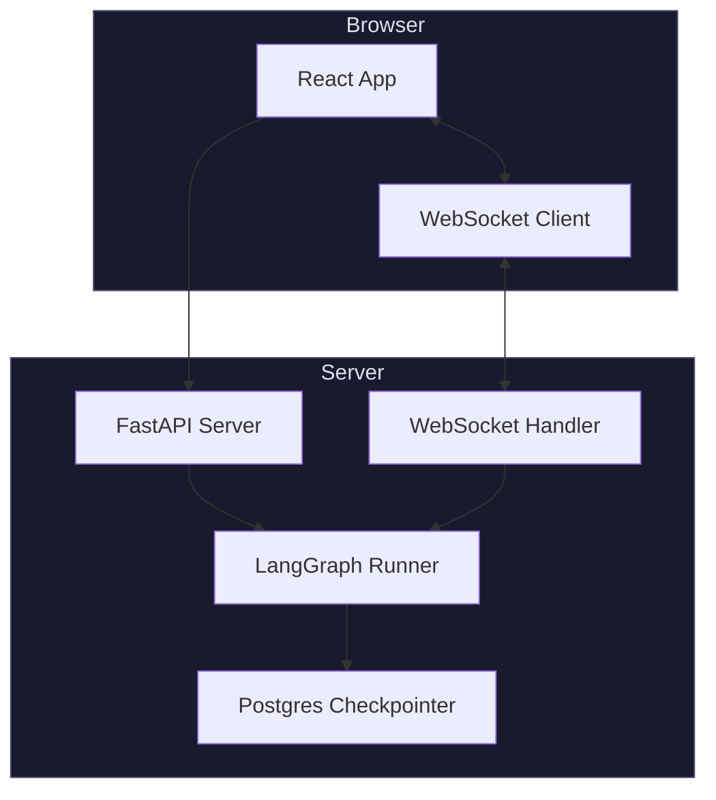
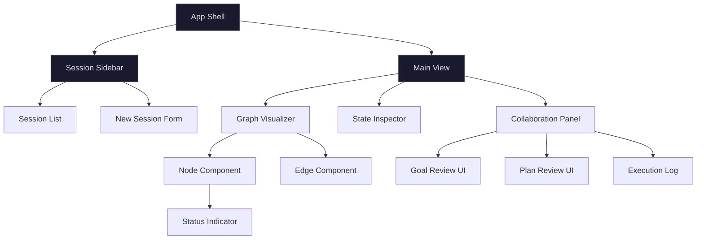

# Stage 5: Web Client

### Objective

Replace the CLI with a web interface that visualizes the graph, shows execution state in real-time, indicates where human input is required, and supports attaching to a running agent session for collaboration.

### Architecture



### API Design

```
POST   /api/sessions                     Create a new agent session
GET    /api/sessions                     List active sessions
GET    /api/sessions/:id                 Get session state
POST   /api/sessions/:id/resume          Resume with human input
DELETE /api/sessions/:id                 Cancel a session
WS     /api/sessions/:id/stream          Real-time event stream
GET    /api/sessions/:id/history         Full state history
```

#### Request/Response Schemas

```typescript
// POST /api/sessions
interface CreateSessionRequest {
  goal: string;
  repo_url: string;
  model?: string; // default: "claude-sonnet-4-5-20250929"
  base_branch?: string; // default: "main"
}

interface CreateSessionResponse {
  session_id: string;
  status: "running";
  created_at: string;
}

// POST /api/sessions/:id/resume
interface ResumeRequest {
  decision: "accept" | "refine" | "approve" | "modify" | "reject";
  feedback?: string;
  modified_plan?: Plan;
}

// WebSocket messages (server → client)
interface WSEvent {
  type: "node_start" | "node_end" | "interrupt" | "error" | "complete";
  node?: string;
  data: any;
  timestamp: string;
}
```

### UI Components



### Graph Visualization

The graph visualizer shows the LangGraph topology with real-time state. Each node displays its current status.

```
Node States:
  ○ idle        — not yet reached
  ◉ active      — currently executing
  ● complete    — finished successfully
  ✕ failed      — error or max retries
  ⏸ waiting     — interrupted, awaiting human input
```

The active node pulses. Completed nodes show duration. The waiting node shows a prominent input affordance. Edges animate to show data flow direction.

### Collaboration Panel

When the graph is interrupted (waiting for human input), the collaboration panel activates:

**Goal Review Mode:**

- Displays the structured goal, feasibility assessment, and adversarial debate transcript.
- Text input for feedback.
- "Accept" / "Refine" buttons.
- Shows iteration count and history of previous refinements.

**Plan Review Mode:**

- Displays the plan as an editable ordered list.
- Users can drag to reorder, edit step descriptions, add/remove steps.
- "Approve" / "Request Changes" / "Reject" buttons.
- Diff view showing what changed from the previous iteration.

**Execution Monitor:**

- Real-time log stream from the executor.
- Per-step progress with verification results.
- Git commit timeline.
- Expand any step to see code diffs and tool invocations.

### Session Attachment

Users can disconnect and reconnect to running sessions. The WebSocket stream replays recent events on connection and continues live.

```typescript
function useSession(sessionId: string) {
  const [state, setState] = useState<SessionState>(null);
  const [events, setEvents] = useState<WSEvent[]>([]);
  const wsRef = useRef<WebSocket>(null);

  useEffect(() => {
    // Fetch current state
    fetch(`/api/sessions/${sessionId}`)
      .then((r) => r.json())
      .then(setState);

    // Connect WebSocket for live updates
    const ws = new WebSocket(`${WS_BASE}/api/sessions/${sessionId}/stream`);
    ws.onmessage = (msg) => {
      const event: WSEvent = JSON.parse(msg.data);
      setEvents((prev) => [...prev, event]);

      if (event.type === "node_end" || event.type === "interrupt") {
        // Refresh full state
        fetch(`/api/sessions/${sessionId}`)
          .then((r) => r.json())
          .then(setState);
      }
    };
    wsRef.current = ws;
    return () => ws.close();
  }, [sessionId]);

  const resume = async (input: ResumeRequest) => {
    await fetch(`/api/sessions/${sessionId}/resume`, {
      method: "POST",
      headers: { "Content-Type": "application/json" },
      body: JSON.stringify(input),
    });
  };

  return { state, events, resume };
}
```

### Server Implementation

```python
from fastapi import FastAPI, WebSocket
from langgraph.checkpoint.postgres.aio import AsyncPostgresSaver

app = FastAPI()
sessions: dict[str, RunHandle] = {}

@app.post("/api/sessions")
async def create_session(req: CreateSessionRequest):
    session_id = str(uuid4())
    checkpointer = AsyncPostgresSaver.from_conn_string(DB_URL)
    graph = build_graph(init_chat_model(req.model), checkpointer)
    config = {"configurable": {"thread_id": session_id}}

    # Start the graph in a background task
    handle = asyncio.create_task(
        graph.ainvoke({"raw_goal": req.goal, ...}, config)
    )
    sessions[session_id] = RunHandle(task=handle, config=config, graph=graph)
    return {"session_id": session_id, "status": "running"}

@app.websocket("/api/sessions/{session_id}/stream")
async def stream_events(ws: WebSocket, session_id: str):
    await ws.accept()
    handle = sessions[session_id]

    async for event in handle.graph.astream_events(
        None, handle.config, version="v2"
    ):
        await ws.send_json({
            "type": event["event"],
            "node": event.get("name"),
            "data": serialize(event.get("data")),
            "timestamp": datetime.now().isoformat(),
        })

@app.post("/api/sessions/{session_id}/resume")
async def resume_session(session_id: str, req: ResumeRequest):
    handle = sessions[session_id]
    result = await handle.graph.ainvoke(
        Command(resume=req.dict()),
        handle.config,
    )
    return {"status": "resumed", "phase": result.get("phase")}
```

### Deliverables

| Artifact                                | Description                                 |
| --------------------------------------- | ------------------------------------------- |
| `server/main.py`                        | FastAPI app with REST + WebSocket endpoints |
| `server/sessions.py`                    | Session management and lifecycle            |
| `client/src/App.tsx`                    | React app shell                             |
| `client/src/components/GraphView.tsx`   | Interactive graph visualizer                |
| `client/src/components/CollabPanel.tsx` | Goal/plan review UI                         |
| `client/src/components/ExecLog.tsx`     | Real-time execution log                     |
| `client/src/hooks/useSession.ts`        | WebSocket + state hook                      |

### Exit Criteria

- [ ] User creates a session and sees the graph visualize in real-time.
- [ ] Active nodes pulse; completed nodes show a checkmark.
- [ ] When the graph interrupts, the collaboration panel activates with the right review mode.
- [ ] User submits feedback; the graph resumes and the UI updates.
- [ ] User can close the browser, reopen, and reattach to a running session.
- [ ] Multiple sessions can run concurrently.
- [ ] Execution log streams code diffs and verification results live.
