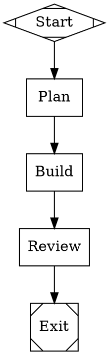
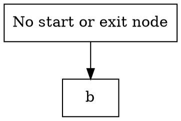

# Stage 1: Core Pipeline Engine (Simulation Mode)

## Overview

Deliver the foundational pipeline runner: parse a DOT file, validate the graph, execute a linear pipeline in simulation mode (no LLM calls), persist execution state to CXDB, and expose it through a CLI. This is the minimum viable pipeline runner — a human can write a `.dot` file, compile it for validation, run it, and inspect the execution trace in CXDB.

## What a Human Can Do After This Stage

1. Write a `.dot` pipeline file using the attractor spec's DOT subset
2. Run `orchestra compile pipeline.dot` to validate the graph and see diagnostics
3. Run `orchestra run pipeline.dot` to execute the pipeline in simulation mode
4. See events printed to stdout as the pipeline executes (stage started, completed, etc.)
5. Open the CXDB UI to inspect the execution trace: typed turns for each event and node completion, with prompts, responses, and outcomes as structured payloads
6. Run `orchestra doctor` to verify CXDB connectivity

## Scope

### Included

- **DOT Parser.** Parse the attractor spec's DOT subset into an in-memory graph model: `digraph`, graph/node/edge attributes, chained edges (`A -> B -> C`), node/edge default blocks, subgraphs, comments, all value types (String, Integer, Float, Boolean, Duration). Reject unsupported features (undirected graphs, multiple graphs per file, HTML labels).
- **Graph Validation.** Lint rules per attractor Section 7: `start_node`, `terminal_node`, `reachability`, `edge_target_exists`, `start_no_incoming`, `exit_no_outgoing`, `condition_syntax`, `stylesheet_syntax`, `prompt_on_llm_nodes`. Diagnostic model with ERROR/WARNING/INFO severity. `validate_or_raise()` rejects pipelines with errors.
- **Pipeline Execution Engine (linear only).** Core traversal loop per attractor Section 3.2: execute handler → record outcome → select next edge → advance. Single-threaded. For this stage, edge selection is simplified: follow the single outgoing edge (no branching logic yet).
- **Node Handlers.** Start (no-op), Exit (no-op), Codergen (simulation mode: returns `[Simulated] Response for stage: {node_id}` without calling any LLM).
- **Context and Outcome Model.** Key-value Context store. Structured Outcome (status, preferred_label, suggested_next_ids, context_updates, notes, failure_reason). Context updates applied after each node. Built-in context keys set by the engine (`outcome`, `graph.goal`, `current_node`, `last_stage`, `last_response`).
- **Variable Expansion Transform.** Expand `$goal` in node prompts to the graph-level `goal` attribute.
- **CXDB Client.** Thin Python HTTP wrapper (`orchestra.storage.cxdb_client`) for CXDB's HTTP API. Supports: create context, append turn, get turns, list contexts, publish type bundle, health check.
- **CXDB Type Bundle.** Register Orchestra's turn types with the CXDB type registry: `dev.orchestra.PipelineLifecycle` (start/complete/fail), `dev.orchestra.NodeExecution` (node start/complete with prompt, response, outcome), `dev.orchestra.Checkpoint` (full checkpoint state for resume).
- **Event System.** Typed events emitted during execution: PipelineStarted, PipelineCompleted, PipelineFailed, StageStarted, StageCompleted, StageFailed, CheckpointSaved. Events are both printed to stdout (observer pattern for real-time display) AND appended as typed CXDB turns (persistent queryable event log).
- **Checkpoint (save only).** After each node, a `dev.orchestra.Checkpoint` turn is appended to the CXDB context (current_node, completed_nodes, context snapshot). The CXDB context's head pointer advances. Resume is Stage 2.
- **CLI.** `orchestra compile <pipeline.dot>` — validate, resolve references, print graph structure. `orchestra run <pipeline.dot>` — compile and execute, print events to stdout, persist to CXDB. `orchestra doctor` — verify CXDB connectivity and type registry.
- **orchestra.yaml CXDB config.** `cxdb.url` setting for the CXDB endpoint (default: `http://localhost:9010`).

### Excluded (deferred to later stages)

- Conditional routing and edge selection (Stage 2)
- Retries, goal gates, failure routing (Stage 2)
- Checkpoint resume, session lifecycle, and CXDB context forking (Stage 2)
- LLM calls and CodergenBackend implementations (Stage 3)
- Agent configuration and prompt composition (Stage 3)
- Model stylesheet application (Stage 3)
- Human-in-the-loop (Stage 4)
- Parallel execution (Stage 5)
- Git integration (Stage 6)

## Automated End-to-End Tests

All tests use simulation mode (no LLM). External dependency: CXDB instance (Docker container in CI).

### DOT Parsing Tests

| Test | Description |
|------|-------------|
| Parse simple linear pipeline | `digraph { start [shape=Mdiamond]; exit [shape=Msquare]; a [shape=box]; start -> a -> exit }` parses into correct graph model |
| Parse graph-level attributes | `goal`, `label`, `model_stylesheet` extracted from `graph [...]` block |
| Parse node attributes | `label`, `shape`, `prompt`, `goal_gate`, `max_retries`, `timeout`, `class` extracted correctly |
| Parse edge attributes | `label`, `condition`, `weight` extracted correctly |
| Parse chained edges | `A -> B -> C [label="x"]` produces two edges, both with label "x" |
| Parse node/edge defaults | `node [shape=box, timeout="900s"]` applies to subsequent nodes unless overridden |
| Parse subgraphs | Subgraph contents flattened into parent graph; default attributes scoped |
| Parse comments | `//` line comments and `/* */` block comments stripped |
| Parse all value types | String, Integer, Float, Boolean, Duration values parse correctly |
| Reject undirected graph | `graph { A -- B }` produces a clear error |
| Reject multiple graphs | File with two `digraph` blocks produces a clear error |

### Validation Tests

| Test | Description |
|------|-------------|
| Missing start node | Graph without `shape=Mdiamond` → ERROR diagnostic |
| Missing exit node | Graph without `shape=Msquare` → ERROR diagnostic |
| Start node has incoming edges | Edge pointing to start → ERROR |
| Exit node has outgoing edges | Edge from exit → ERROR |
| Unreachable node | Node not reachable from start → ERROR |
| Edge target doesn't exist | Edge to nonexistent node → ERROR |
| Missing prompt on codergen node | Codergen node with no `prompt` or `label` → WARNING |
| Valid pipeline passes | Well-formed pipeline produces no ERROR diagnostics |
| Actionable error messages | Each diagnostic includes rule name, severity, node/edge ID, human-readable message, and suggested fix |

### Execution Tests

| Test | Description |
|------|-------------|
| Execute 3-node linear pipeline | `start → plan → exit` executes all nodes in order, final outcome SUCCESS |
| Execute 5-node linear pipeline | All nodes execute sequentially, each node's context updates visible to the next |
| Simulation mode output | Codergen handler returns `[Simulated] Response for stage: {node_id}` |
| Variable expansion | Node with `prompt="Implement: $goal"` and `graph [goal="build widget"]` → prompt becomes `"Implement: build widget"` |
| Context propagation | Node A sets `context_updates={"key": "value"}`, Node B can read `context.get("key")` == `"value"` |
| Events emitted | PipelineStarted, StageStarted/StageCompleted (per node), CheckpointSaved (per node), PipelineCompleted emitted in correct order |

### CXDB Storage Tests

| Test | Description |
|------|-------------|
| Context created | `orchestra run` creates a CXDB context; context_id matches session_id |
| Turns appended | Each event and checkpoint appended as a typed turn to the context |
| Turn types correct | PipelineStarted turns use `dev.orchestra.PipelineLifecycle`, node completions use `dev.orchestra.NodeExecution` |
| Checkpoint turns | `dev.orchestra.Checkpoint` turns contain current_node, completed_nodes, context snapshot |
| NodeExecution payloads | Prompt text, response text, and outcome included in turn payload |
| Turn order | Turns retrieved from CXDB are in correct execution order |
| Type bundle registered | Orchestra's type bundle is published to CXDB before first run |
| CXDB health check | `orchestra doctor` reports CXDB status correctly |
| Content deduplication | Identical prompts across pipeline runs stored only once (verify via CXDB stats) |

### CLI Tests

| Test | Description |
|------|-------------|
| `orchestra compile` valid pipeline | Exits 0, prints graph structure summary |
| `orchestra compile` invalid pipeline | Exits non-zero, prints diagnostics with rule names and suggestions |
| `orchestra run` linear pipeline | Executes end-to-end, prints events, persists to CXDB, exits 0 |
| `orchestra run` invalid pipeline | Exits non-zero with validation errors before execution |
| `orchestra run` without CXDB | Exits non-zero with clear "CXDB not available" error |
| `orchestra doctor` | Reports CXDB connectivity and type registry status |

## Manual Testing Guide

### Prerequisites
- Python 3.11+ and `uv` installed
- `uv sync` to install dependencies
- `orchestra` CLI available (via `uv run orchestra` or installed entry point)
- CXDB running locally: `docker run -p 9009:9009 -p 9010:9010 cxdb/cxdb:latest`
- Verify: `orchestra doctor` reports CXDB healthy

### Test 1: Compile a Valid Pipeline

Create a file `test-linear.dot`:

Run: `orchestra compile test-linear.dot`

**Verify:**
- Output shows the parsed graph structure (5 nodes, 4 edges)
- No errors or warnings (except possibly the advisory about simulation mode)
- Exit code 0

### Test 2: Compile an Invalid Pipeline

Create a file `test-invalid.dot`:

Run: `orchestra compile test-invalid.dot`

**Verify:**
- Output shows ERROR diagnostics for missing start and exit nodes
- Error messages are human-readable with suggested fixes
- Exit code non-zero

### Test 3: Run a Pipeline

Run: `orchestra run test-linear.dot`

**Verify:**
- Events print to stdout: PipelineStarted, StageStarted/StageCompleted for each node, PipelineCompleted
- Output shows `[Simulated] Response for stage: plan`, etc.
- Output shows the session ID (CXDB context ID)

### Test 4: Inspect Execution in CXDB UI

Open the CXDB UI: `http://localhost:9010`

**Verify:**
- A new context appears for the pipeline run
- Click into the context to see the turn chain
- Turns include: PipelineStarted → NodeExecution(start) → NodeExecution(plan) → ... → PipelineCompleted
- Click a NodeExecution turn — the payload shows:
  - `prompt`: the expanded prompt ("Plan the implementation for: Run a simple linear pipeline")
  - `response`: the simulated response
  - `outcome`: SUCCESS
  - `node_id`: "plan"

### Test 5: Verify CXDB Doctor

Run: `orchestra doctor`

**Verify:**
- Reports CXDB connectivity: OK
- Reports type bundle registration: OK
- Lists registered Orchestra turn types

## Success Criteria

- [ ] A human can write a `.dot` file, compile it, and run it — end-to-end without errors
- [ ] DOT parser handles the full attractor spec subset (digraph, attributes, chained edges, subgraphs, comments, all value types)
- [ ] Validation catches all error-severity issues and produces actionable diagnostics
- [ ] Execution traverses a linear graph from start to exit in simulation mode
- [ ] Context propagates between nodes — updates from one node are visible to the next
- [ ] Events are emitted, printed to stdout, and persisted as typed CXDB turns
- [ ] Checkpoint turns appended to CXDB after every node with full state
- [ ] Node execution turns include prompt, response, and outcome in structured payloads
- [ ] CXDB type bundle registered with correct Orchestra turn types
- [ ] CXDB UI shows the execution trace with typed, structured turn payloads
- [ ] `orchestra doctor` validates CXDB connectivity and type registry
- [ ] All automated tests pass (against a real CXDB instance)
