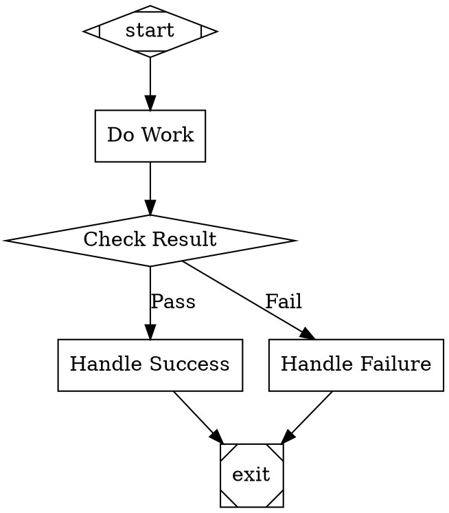

# Stage 2: Control Flow and Persistence

## Overview

Extend the pipeline engine with the full attractor spec control flow: conditional routing via the 5-step edge selection algorithm, the condition expression language, retry policies with backoff, goal gate enforcement, and failure routing. Add checkpoint resume and session management so pipelines survive crashes and can be paused/resumed.

After this stage, the execution engine is fully spec-compliant for single-threaded execution (minus parallel and human handlers). Pipelines can branch, retry, enforce critical gates, and resume from any checkpoint.

## What a Human Can Do After This Stage

1. Build pipelines with conditional branches (diamond nodes with conditions on edges)
2. Observe retries when a node fails — see backoff delays and retry counts
3. See goal gate enforcement — pipeline refuses to exit when critical nodes haven't succeeded
4. Pause a running pipeline (Ctrl-C) and resume it later with `orchestra resume`
5. View session status with `orchestra status` — see running/completed sessions
6. Replay from a specific checkpoint with `orchestra replay`

## Prerequisites

- Stage 1 complete (DOT parsing, validation, linear execution, CLI)

## Scope

### Included

- **Condition Expression Language.** Parse and evaluate boolean expressions on edges per attractor Section 10: `=`, `!=` operators, `&&` conjunction, `outcome`, `preferred_label`, and `context.*` variable resolution. Empty conditions always evaluate to true.
- **5-Step Edge Selection Algorithm.** Per attractor Section 3.3: (1) condition match, (2) preferred label match, (3) suggested next IDs, (4) highest weight, (5) lexical tiebreak.
- **Conditional Handler.** No-op handler for diamond-shaped nodes — routing handled by the engine's edge selection.
- **Retry System.** Per-node `max_retries` with backoff policies (standard, aggressive, linear, patient, none). Jitter. `should_retry` predicate. `execute_with_retry` loop per attractor Section 3.5-3.6.
- **Goal Gate Enforcement.** At exit, check all visited `goal_gate=true` nodes. If any unsatisfied, reroute to `retry_target` / `fallback_retry_target` / graph-level targets. Per attractor Section 3.4.
- **Failure Routing.** On FAIL: check fail edge → retry_target → fallback_retry_target → pipeline termination. Per attractor Section 3.7.
- **`allow_partial`.** Accept PARTIAL_SUCCESS when retries exhausted on nodes with `allow_partial=true`.
- **Checkpoint Resume.** Read the head turn of the CXDB context, extract the `dev.orchestra.Checkpoint` turn payload, restore context, completed_nodes, retry counters, determine next node, continue execution. New turns are appended to the same CXDB context.
- **Session Management via CXDB Contexts.** Each `orchestra run` creates a CXDB context (the session). Session status is tracked via turn types: PipelineStarted → NodeExecution... → PipelineCompleted/PipelineFailed. `orchestra status` queries CXDB contexts and reads head turns to determine status.
- **Replay via CXDB Fork.** `orchestra replay <session_id> --checkpoint <turn_id>` forks the CXDB context at the specified turn (`POST /v1/contexts/fork`). This creates a new context sharing history up to that turn. Execution proceeds from the fork point into the new context.
- **CLI Extensions.** `orchestra status` — list sessions (CXDB contexts) with status and turn count. `orchestra resume <session_id>` — resume from head turn. `orchestra replay <session_id> --checkpoint <turn_id>` — fork context and re-execute.

### Excluded

- LLM calls (Stage 3) — retries tested with simulation mode that can return configurable outcomes
- Human-in-the-loop (Stage 4)
- Parallel execution (Stage 5)

## Automated End-to-End Tests

All tests use simulation mode. For retry and goal gate tests, a configurable simulation backend is needed that can return specific outcomes per node (e.g., FAIL twice then SUCCESS).

### Condition Expression Tests

| Test | Description |
|------|-------------|
| Parse `outcome=success` | Evaluates to true when outcome is SUCCESS |
| Parse `outcome!=success` | Evaluates to true when outcome is not SUCCESS |
| Parse `context.key=value` | Evaluates to true when context has key with matching value |
| Parse `&&` conjunction | `outcome=success && context.flag=true` requires both clauses |
| Missing context key | `context.missing=value` evaluates to false (missing key = empty string) |
| Empty condition | Always evaluates to true |
| Invalid condition syntax | Produces parse error during validation |

### Edge Selection Tests

| Test | Description |
|------|-------------|
| Condition match wins | Edge with matching condition selected over higher-weight unconditional edge |
| Preferred label match | Outcome with `preferred_label="Fix"` selects edge labeled "Fix" |
| Label normalization | `"[Y] Yes"` normalizes to match `"yes"` |
| Suggested next IDs | Outcome with `suggested_next_ids=["node_b"]` selects edge to `node_b` |
| Weight tiebreak | Among unconditional edges, highest weight wins |
| Lexical tiebreak | Equal weights broken by alphabetical target node ID |
| Full priority chain | All 5 steps tested in a single graph with competing edges |

### Retry Tests

| Test | Description |
|------|-------------|
| Retry on FAIL | Node with `max_retries=2` retried twice after initial failure |
| Retry on RETRY status | Node returning RETRY status triggers retry |
| Retry exhaustion | After all retries, final outcome used for routing |
| Backoff delays | Standard policy delays: 200ms, 400ms, 800ms (verify within tolerance) |
| allow_partial | Node with `allow_partial=true` returns PARTIAL_SUCCESS when retries exhausted |
| No retry on SUCCESS | Successful node not retried |

### Goal Gate Tests

| Test | Description |
|------|-------------|
| Gate satisfied | All goal_gate nodes succeeded → pipeline exits normally |
| Gate unsatisfied with retry_target | Goal gate failed → engine reroutes to retry_target instead of exiting |
| Gate unsatisfied with graph retry_target | Node-level retry_target missing → falls back to graph-level |
| Gate unsatisfied no target | No retry target at any level → pipeline fails with clear error |
| Partial success satisfies gate | PARTIAL_SUCCESS counts as satisfied |

### Failure Routing Tests

| Test | Description |
|------|-------------|
| Fail edge | Node fails → follows `condition="outcome=fail"` edge |
| Retry target | No fail edge → jumps to node-level `retry_target` |
| Fallback retry target | No retry_target → jumps to `fallback_retry_target` |
| Pipeline termination | No failure route → pipeline terminates with error |

### Checkpoint/Resume Tests

| Test | Description |
|------|-------------|
| Resume from checkpoint | Execute 3-node pipeline, stop after node 2, resume → node 3 executes, pipeline completes |
| Context restored | After resume, context values from before pause are present |
| Completed nodes skipped | After resume, already-completed nodes are not re-executed |
| Retry counters preserved | Node with 1 retry used before pause → only 1 retry remaining after resume |
| Checkpoint turn integrity | Checkpoint turn payload in CXDB is valid and contains all required fields |
| Resume reads head turn | Resume reads the CXDB context's head turn to find the latest checkpoint |

### Session Management Tests (CXDB Contexts)

| Test | Description |
|------|-------------|
| Session created | `orchestra run` creates a CXDB context; context_id is the session_id |
| Session completed | Successful pipeline → PipelineCompleted turn appended to context |
| Session failed | Failed pipeline → PipelineFailed turn appended to context |
| Session query | `orchestra status` lists CXDB contexts with status derived from head turn type |
| Session resume | `orchestra resume <id>` reads head turn from CXDB context and continues |

### Replay Tests (CXDB Fork)

| Test | Description |
|------|-------------|
| Fork from checkpoint | `orchestra replay --checkpoint <turn_id>` creates a new CXDB context via fork |
| Fork preserves history | New context shares turns up to the fork point with the original |
| Fork diverges | New execution appends new turns to the forked context, not the original |
| Original unchanged | Original context's turns are unaffected by the replay |

### CLI Tests

| Test | Description |
|------|-------------|
| `orchestra status` | Shows sessions (CXDB contexts) with ID, pipeline name, status, turn count |
| `orchestra resume` valid session | Resumes paused session from CXDB head turn, prints events, exits 0 |
| `orchestra resume` invalid session | Exits non-zero with "session not found" (CXDB context not found) |
| `orchestra replay` from checkpoint | Forks CXDB context at specified turn, re-executes from that point |

## Manual Testing Guide

### Prerequisites
- Stage 1 complete and passing
- `orchestra` CLI available

### Test 1: Conditional Branching

Create `test-branching.dot`:

Run: `orchestra run test-branching.dot`

**Verify:**
- In simulation mode, `do_work` returns SUCCESS
- The `gate` routes to `success` (not `failure`)
- Events show: start → do_work → gate → success → exit

### Test 2: Observe Retry Behavior

Create `test-retry.dot` with a node configured with `max_retries=2`. Use a simulation mode configuration that causes the node to fail initially.

**Verify:**
- Events show StageRetrying with attempt number and delay
- After retries exhausted, failure routing kicks in
- Backoff delays are visible in event timestamps

### Test 3: Pause and Resume

Run: `orchestra run test-linear.dot` (the 5-node pipeline from Stage 1)

During execution, press Ctrl-C to pause.

**Verify:**
- Pipeline stops gracefully
- Session status shows "paused"
- `orchestra status` lists the paused session

Run: `orchestra resume <session_id>`

**Verify:**
- Execution continues from the last checkpoint
- Already-completed nodes are not re-executed
- Pipeline completes normally

### Test 4: Session Status

Run several pipelines (some complete, some paused).

Run: `orchestra status`

**Verify:**
- Table shows all sessions with ID, pipeline name, status, and timestamps
- Completed, paused, and failed sessions all shown correctly

## Success Criteria

- [ ] Condition expressions parse and evaluate correctly for all operators and variable types
- [ ] 5-step edge selection algorithm is deterministic and follows the spec priority order
- [ ] Retry system respects max_retries, applies backoff with jitter, and handles exhaustion
- [ ] Goal gates prevent exit when critical nodes haven't succeeded, and reroute correctly
- [ ] Failure routing follows the correct fallback chain (fail edge → retry_target → fallback → terminate)
- [ ] Checkpoint resume reads the CXDB head turn and restores full pipeline state
- [ ] Session management uses CXDB contexts — no SQLite or local files
- [ ] Replay forks the CXDB context at any checkpoint turn (O(1))
- [ ] CLI commands (status, resume, replay) work correctly against CXDB
- [ ] A human can build a branching pipeline, run it, pause it, and resume it
- [ ] All automated tests pass
