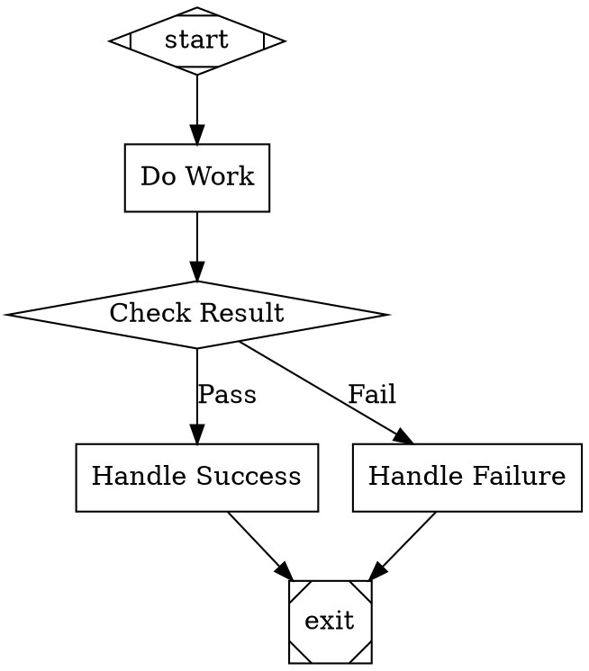

# Stage 2a: Control Flow

## Overview

Extend the pipeline engine with the full attractor spec control flow: conditional routing via the 5-step edge selection algorithm, the condition expression language, retry policies with backoff, goal gate enforcement, and failure routing.

After this stage, the execution engine handles branching, retries, and critical gate enforcement. Pipelines can take different paths based on node outcomes. Persistence (resume, sessions, replay) is deferred to Stage 2b.

## What a Human Can Do After This Stage

1. Build pipelines with conditional branches (diamond nodes with conditions on edges)
2. Observe retries when a node fails — see backoff delays and retry counts in stdout events
3. See goal gate enforcement — pipeline refuses to exit when critical nodes haven't succeeded
4. Watch failure routing — failed nodes route to retry targets or fail edges

## Prerequisites

- Stage 1 complete (DOT parsing, validation, linear execution, CLI)

## Scope

### Included

- **Condition Expression Language.** Parse and evaluate boolean expressions on edges per attractor Section 10: `=`, `!=` operators, `&&` conjunction, `outcome`, `preferred_label`, and `context.*` variable resolution. Empty conditions always evaluate to true.
- **5-Step Edge Selection Algorithm.** Per attractor Section 3.3: (1) condition match, (2) preferred label match, (3) suggested next IDs, (4) highest weight, (5) lexical tiebreak. Replaces Stage 1's simplified "follow the single outgoing edge" logic.
- **Conditional Handler.** No-op handler for diamond-shaped nodes — routing handled by the engine's edge selection.
- **Retry System.** Per-node `max_retries` with backoff policies (standard, aggressive, linear, patient, none). Jitter. `should_retry` predicate. `execute_with_retry` loop per attractor Section 3.5-3.6. Configurable simulation backend that can return specific outcomes per node (e.g., FAIL twice then SUCCESS) for testing.
- **Goal Gate Enforcement.** At exit, check all visited `goal_gate=true` nodes. If any unsatisfied, reroute to `retry_target` / `fallback_retry_target` / graph-level targets. Per attractor Section 3.4.
- **Failure Routing.** On FAIL: check fail edge → retry_target → fallback_retry_target → pipeline termination. Per attractor Section 3.7.
- **`allow_partial`.** Accept PARTIAL_SUCCESS when retries exhausted on nodes with `allow_partial=true`.

### Excluded (deferred)

- Checkpoint resume, session management, replay (Stage 2b)
- LLM calls (Stage 3) — retries tested with simulation mode that can return configurable outcomes
- Human-in-the-loop (Stage 4)
- Parallel execution (Stage 5)

## Automated End-to-End Tests

All tests use simulation mode. For retry and goal gate tests, a configurable simulation backend returns specific outcomes per node (e.g., FAIL twice then SUCCESS).

### Condition Expression Tests

| Test | Description |
|------|-------------|
| Parse `outcome=success` | Evaluates to true when outcome is SUCCESS |
| Parse `outcome!=success` | Evaluates to true when outcome is not SUCCESS |
| Parse `context.key=value` | Evaluates to true when context has key with matching value |
| Parse `&&` conjunction | `outcome=success && context.flag=true` requires both clauses |
| Missing context key | `context.missing=value` evaluates to false (missing key = empty string) |
| Empty condition | Always evaluates to true |
| Invalid condition syntax | Produces parse error during validation |

### Edge Selection Tests

| Test | Description |
|------|-------------|
| Condition match wins | Edge with matching condition selected over higher-weight unconditional edge |
| Preferred label match | Outcome with `preferred_label="Fix"` selects edge labeled "Fix" |
| Label normalization | `"[Y] Yes"` normalizes to match `"yes"` |
| Suggested next IDs | Outcome with `suggested_next_ids=["node_b"]` selects edge to `node_b` |
| Weight tiebreak | Among unconditional edges, highest weight wins |
| Lexical tiebreak | Equal weights broken by alphabetical target node ID |
| Full priority chain | All 5 steps tested in a single graph with competing edges |

### Retry Tests

| Test | Description |
|------|-------------|
| Retry on FAIL | Node with `max_retries=2` retried twice after initial failure |
| Retry on RETRY status | Node returning RETRY status triggers retry |
| Retry exhaustion | After all retries, final outcome used for routing |
| Backoff delays | Standard policy delays: 200ms, 400ms, 800ms (verify within tolerance) |
| allow_partial | Node with `allow_partial=true` returns PARTIAL_SUCCESS when retries exhausted |
| No retry on SUCCESS | Successful node not retried |

### Goal Gate Tests

| Test | Description |
|------|-------------|
| Gate satisfied | All goal_gate nodes succeeded → pipeline exits normally |
| Gate unsatisfied with retry_target | Goal gate failed → engine reroutes to retry_target instead of exiting |
| Gate unsatisfied with graph retry_target | Node-level retry_target missing → falls back to graph-level |
| Gate unsatisfied no target | No retry target at any level → pipeline fails with clear error |
| Partial success satisfies gate | PARTIAL_SUCCESS counts as satisfied |

### Failure Routing Tests

| Test | Description |
|------|-------------|
| Fail edge | Node fails → follows `condition="outcome=fail"` edge |
| Retry target | No fail edge → jumps to node-level `retry_target` |
| Fallback retry target | No retry_target → jumps to `fallback_retry_target` |
| Pipeline termination | No failure route → pipeline terminates with error |

## Manual Testing Guide

### Prerequisites
- Stage 1 complete and passing
- `orchestra` CLI available

### Test 1: Conditional Branching

Create `test-branching.dot`:

Run: `orchestra run test-branching.dot`

**Verify:**
- In simulation mode, `do_work` returns SUCCESS
- The `gate` routes to `success` (not `failure`)
- Events show: start → do_work → gate → success → exit

### Test 2: Observe Retry Behavior

Create `test-retry.dot` with a node configured with `max_retries=2`. Use a simulation mode configuration that causes the node to fail initially.

**Verify:**
- Events show StageRetrying with attempt number and delay
- After retries exhausted, failure routing kicks in
- Backoff delays are visible in event timestamps

## Success Criteria

- [x] Condition expressions parse and evaluate correctly for all operators and variable types
- [x] 5-step edge selection algorithm is deterministic and follows the spec priority order
- [x] Retry system respects max_retries, applies backoff with jitter, and handles exhaustion
- [x] Goal gates prevent exit when critical nodes haven't succeeded, and reroute correctly
- [x] Failure routing follows the correct fallback chain (fail edge → retry_target → fallback → terminate)
- [x] A human can build a branching pipeline, run it, and observe correct routing
- [x] All automated tests pass

## Implementation Plan

- [x] Add condition expression parser using Lark
  - [x] Create `src/orchestra/conditions/grammar.lark` with the condition expression grammar (Section 10.2): `ConditionExpr ::= Clause ('&&' Clause)*`, `Clause ::= Key Operator Literal`, operators `=` and `!=`, keys `outcome`, `preferred_label`, `context.*`
  - [x] Create `src/orchestra/conditions/evaluator.py` with `parse_condition(expr: str)` and `evaluate_condition(expr: str, outcome: Outcome, context: Context) -> bool`. Implement `resolve_key()` for outcome, preferred_label, and context.* variable resolution. Missing context keys resolve to empty string. Empty condition always returns true.
  - [x] Add `condition_syntax` validation to `src/orchestra/validation/rules.py` — parse all edge conditions during validation and report syntax errors as ERROR diagnostics
  - [x] Write tests in `tests/test_conditions.py`: parse `outcome=success`, `outcome!=success`, `context.key=value`, `&&` conjunction, missing context key, empty condition, invalid syntax (7 tests per plan)
  - [x] Mark TODO complete and commit the changes to git

- [x] Extend edge selection with steps 1-3 (condition match, preferred label, suggested next IDs)
  - [x] Update `src/orchestra/engine/edge_selection.py` to implement the full 5-step algorithm: (1) evaluate condition expressions on edges, select first matching conditional edge; (2) if outcome has preferred_label, find edge with matching label after normalization (lowercase, trim, strip accelerator prefixes like `[Y] `, `Y) `, `Y - `); (3) if outcome has suggested_next_ids, find edge whose target is in the list; (4) highest weight among unconditional edges; (5) lexical tiebreak
  - [x] Update existing edge selection test `test_unconditional_preferred_over_conditional` — the semantics change: with condition evaluation, conditional edges that *match* now win over unconditional edges (Step 1 beats Step 4). This test used invalid condition syntax (`outcome == success` with spaces), so it should be updated to use valid syntax and test the correct behavior.
  - [x] Write tests in `tests/test_edge_selection.py`: condition match wins, preferred label match, label normalization (`[Y] Yes` → `yes`), suggested next IDs, full priority chain (all 5 steps in one graph). Keep existing weight tiebreak, lexical tiebreak, and no-edges tests.
  - [x] Mark TODO complete and commit the changes to git

- [x] Add conditional (diamond) handler
  - [x] Create `src/orchestra/handlers/conditional.py` — no-op handler for `shape=diamond` nodes. Returns SUCCESS (routing is handled by edge selection, not the handler).
  - [x] Register in `src/orchestra/handlers/registry.py` `default_registry()`: `registry.register("diamond", ConditionalHandler())`
  - [x] Mark TODO complete and commit the changes to git

- [x] Add configurable simulation backend for testing retries
  - [x] Extend `src/orchestra/handlers/codergen.py` `SimulationCodergenHandler` to accept an optional `outcome_sequences: dict[str, list[OutcomeStatus]]`. On each `handle()` call for a node_id, pop the next status from the list. If the list is exhausted, use the last status. If no sequence for a node_id, return SUCCESS as before.
  - [x] Write test in `tests/test_configurable_simulation.py` verifying: node returns FAIL twice then SUCCESS when sequence is `[FAIL, FAIL, SUCCESS]`; node without sequence returns SUCCESS; exhausted sequence returns last status
  - [x] Mark TODO complete and commit the changes to git

- [x] Implement retry system with backoff policies
  - [x] Create `src/orchestra/engine/retry.py` with: `BackoffConfig` dataclass (initial_delay_ms, backoff_factor, max_delay_ms, jitter), `RetryPolicy` dataclass (max_attempts, backoff), preset policies dict (`none`, `standard`, `aggressive`, `linear`, `patient` with exact parameters from spec), `calculate_delay(config, attempt, rng)` function, `execute_with_retry(node, handler, context, graph, policy, emitter, rng) -> Outcome` function
  - [x] Add `StageRetrying` event type to `src/orchestra/events/types.py` with fields: node_id, attempt, max_attempts, delay_ms
  - [x] Integrate into `src/orchestra/engine/runner.py`: extract `_execute_node()` method, wrap handler.handle() call with retry loop. Resolve retry policy from node attributes: `max_retries` (default 0, also respect graph-level `default_max_retry`), `backoff_policy` name (default `standard`), `allow_partial` (default false). Pass seedable `random.Random` instance for jitter determinism in tests.
  - [x] Write tests in `tests/test_retry.py`: retry on FAIL (node with max_retries=2 retried twice), retry on RETRY status, retry exhaustion (final outcome used for routing), backoff delays (standard policy: ~200ms, ~400ms, ~800ms within tolerance), allow_partial (PARTIAL_SUCCESS when retries exhausted), no retry on SUCCESS (6 tests per plan)
  - [x] Mark TODO complete and commit the changes to git

- [x] Implement failure routing
  - [x] Create `src/orchestra/engine/failure_routing.py` with `resolve_failure_target(node, graph) -> str | None` implementing the 4-step fallback chain: (1) outgoing edge with `condition="outcome=fail"` — use condition evaluator; (2) node attribute `retry_target`; (3) node attribute `fallback_retry_target`; (4) return None (pipeline terminates)
  - [x] Integrate into `src/orchestra/engine/runner.py`: after retry exhaustion with FAIL outcome, call `resolve_failure_target()`. If a target is found, set `current_node` to that target and continue the loop. If None, emit PipelineFailed and return.
  - [x] Write tests in `tests/test_failure_routing.py`: fail edge followed, retry_target used when no fail edge, fallback_retry_target used when no retry_target, pipeline termination when no failure route (4 tests per plan)
  - [x] Mark TODO complete and commit the changes to git

- [x] Implement goal gate enforcement
  - [x] Create `src/orchestra/engine/goal_gates.py` with `check_goal_gates(visited_outcomes: dict[str, OutcomeStatus], graph: PipelineGraph) -> str | None` — iterate visited nodes with `goal_gate=true` attribute, check if their outcome is SUCCESS or PARTIAL_SUCCESS. If any unsatisfied, return the reroute target: node's `retry_target` → node's `fallback_retry_target` → graph's `retry_target` → graph's `fallback_retry_target` → None (fail). Include max reroute counter (default = graph's `default_max_retry` or 50) to prevent infinite loops.
  - [x] Integrate into `src/orchestra/engine/runner.py`: when reaching an exit node (shape=Msquare), call `check_goal_gates()` before exiting. If a reroute target is returned, set `current_node` to that target and continue the loop. If None and gates unsatisfied, emit PipelineFailed.
  - [x] Write tests in `tests/test_goal_gates.py`: gate satisfied (exit normally), gate unsatisfied with retry_target (reroute), gate unsatisfied with graph-level retry_target (fallback), gate unsatisfied no target (pipeline fails), partial success satisfies gate (5 tests per plan)
  - [x] Mark TODO complete and commit the changes to git

- [x] Refactor PipelineRunner.run() into extracted methods
  - [x] Extract `_execute_node()` — handles a single node: get handler, emit StageStarted, call execute_with_retry, update context, emit StageCompleted/StageFailed, emit CheckpointSaved
  - [x] Extract `_handle_node_failure()` — calls failure routing, returns next node or None
  - [x] Extract `_check_exit_gates()` — calls goal gate enforcement at exit, returns next node or None
  - [x] Track `visited_outcomes: dict[str, OutcomeStatus]` for goal gate checking
  - [x] Track `retry_counters: dict[str, int]` for checkpoint state
  - [x] Track `reroute_count: int` for cycle protection
  - [x] Verify all 68 existing Stage 1 tests still pass after refactoring
  - [x] Mark TODO complete and commit the changes to git

- [x] Add test fixtures for manual testing
  - [x] Create `tests/fixtures/test-branching.dot` — the conditional branching pipeline from the Stage 2a plan (start → do_work → gate → success/failure → exit)
  - [x] Create `tests/fixtures/test-retry.dot` — a pipeline with a node configured with `max_retries=2` for testing retry behavior
  - [x] Verify `orchestra run tests/fixtures/test-branching.dot` works end-to-end
  - [x] Mark TODO complete and commit the changes to git

- [x] Identify all specs that need to be run and updated
  - [x] Look at all previous TODOs and changes in git to identify changes
  - [x] Run full test suite: `uv run pytest tests/ -v` and verify all tests pass (68 existing + new Stage 2a tests)
  - [x] Identify any specs that failed and add a new TODO to fix them
  - [x] Identify any missing spec coverage — check that all 23 test cases from the Stage 2a plan are covered
  - [x] Mark TODO complete and commit the changes to git

- [x] Identify any code that is unused, or could be cleaned up
  - [x] Look at all previous TODOs and changes in git to identify changes
  - [x] Identify any code that is no longer used, and remove it
  - [x] Identify any unnecessary comments, and remove them (comments that explain "what" for a single line of code)
  - [x] If there are any obvious code smells of redundant code, add TODOs below to address them
  - [x] Mark TODO complete and commit the changes to git
