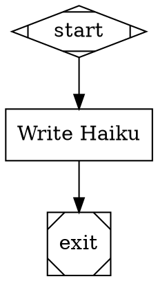

# Stage 3: LLM Integration and Agent Configuration

## Overview

Replace simulation mode with real LLM execution. Implement the CodergenBackend interface with three backends (LangGraph, Direct LLM, CLI Agent), the provider/model resolution system (aliases + model stylesheet), layered prompt composition from YAML files, the file discovery system, and the agent-level tool registry. After this stage, Orchestra runs real AI-powered pipelines.

## What a Human Can Do After This Stage

1. Define agents with layered prompts (role + persona + personality + task) in YAML files
2. Configure providers with semantic model tiers (smart/worker/cheap) in `orchestra.yaml`
3. Use the model stylesheet in DOT files to assign models per-node by class or ID
4. Run a pipeline that makes real LLM calls and produces actual AI-generated output
5. Switch between backends (LangGraph for agentic tool use, DirectLLM for analysis, CLI for wrapping Claude Code/Codex)
6. Register custom tools and make them available to agents
7. Switch all agents between providers by changing one line in config

## Prerequisites

- Stage 2b complete (full execution engine with control flow and persistence)

## Scope

### Included

- **CodergenBackend Interface.** `run(node, prompt, context, on_turn=None) -> str | Outcome` protocol. This extends the attractor spec's `CodergenBackend` interface (Section 4.5) by adding an optional `on_turn` callback parameter. The pipeline engine calls this interface and passes an `on_turn` callback. Backends that support turn-level visibility invoke `on_turn` after each agent loop turn with an `AgentTurn` containing messages, tool calls, files written, token usage, and serialized agent state. Backends that don't support turn-level visibility (DirectLLM, CLI) ignore the callback. When a backend returns a bare `str`, the `CodergenHandler` wraps it in an `Outcome(status=SUCCESS, notes=response_text, context_updates={"last_response": response_text})`.
- **CodergenHandler Adapter Layer.** The existing `NodeHandler` protocol (`handle(node, context, graph) -> Outcome`) is preserved. `CodergenHandler` implements `NodeHandler` and wraps a `CodergenBackend`. It is responsible for: (1) composing the prompt via the prompt engine, (2) resolving the model via the resolution chain, (3) calling `backend.run(node, prompt, context, on_turn)`, (4) converting `str` results to `Outcome`, (5) writing `prompt.md` and `response.md` to the stage logs directory. The `SimulationCodergenHandler` is retained as `SimulationBackend` — a `CodergenBackend` implementation that returns simulated responses, usable for dry-runs and all existing tests.
- **Handler Registry Changes.** `default_registry()` registers `CodergenHandler(backend=SimulationBackend())` for shape `"box"` by default. When `orchestra.yaml` specifies a real backend, the CLI commands construct the appropriate backend and pass it to `CodergenHandler`. The `PipelineRunner` and `_execute_node()` method are unchanged — they continue to call `handler.handle(node, context, graph)`.
- **AgentTurn Data Model.** Dataclass emitted by backends after each turn: `turn_number`, `model`, `provider`, `messages`, `tool_calls`, `files_written`, `token_usage`, `agent_state`. The workspace layer (Stage 6) hooks into this for per-turn commits. A new CXDB turn type `dev.orchestra.AgentTurn` is registered for persisting agent turn data.
- **WriteTracker.** Tracks file modifications made by tools within each agent turn. Write tools (write-file, edit-file) call `write_tracker.record(path)` after every modification. `flush()` returns the tracked paths and resets for the next turn. The `@modifies_files` decorator auto-records paths for custom tools.
- **DirectLLMBackend.** Single LLM API call with no tool use. Suitable for analysis, review, and synthesis nodes. Uses LangChain chat model. Does not invoke `on_turn`.
- **LangGraphBackend.** LangGraph ReAct agent for within-node agentic execution with tools (read_file, edit_file, shell, grep, glob, plus agent-configured additions). Streams execution turn-by-turn, invokes `on_turn` after each turn with write-tracked files and agent state. This is the primary backend.
- **CLIAgentBackend.** Spawns CLI coding agents (Claude Code, Codex, Gemini CLI) as subprocesses. Passes prompt via stdin and context as JSON on a temp file (path provided via `--context-file` flag or `ORCHESTRA_CONTEXT_FILE` env var). Captures stdout as the response. Does not invoke `on_turn` — the workspace layer falls back to `git status` at node completion.
- **Backend Selection.** Configurable at global level in `orchestra.yaml`, per-pipeline, and (future) per-node.
- **Provider Configuration.** `orchestra.yaml` providers section: default provider, per-provider model maps with semantic tiers (smart/worker/cheap), provider-specific settings (max_tokens, api_base).
- **Provider Alias Resolution.** `llm_model: smart` + `llm_provider: anthropic` → `claude-opus-4-20250514`. Unknown aliases pass through as literal model strings.
- **Model Stylesheet Application.** Parse the CSS-like `model_stylesheet` graph attribute per attractor spec Section 8. Apply rules by specificity (ID > class > universal). Set `llm_model`, `llm_provider`, `reasoning_effort` on nodes that don't have explicit overrides. Implemented as a graph transform (applied after parsing, before validation).
- **Model Resolution Precedence.** Explicit node attribute > stylesheet rule (by specificity) > agent config model > graph-level default > provider default.
- **Prompt Composition Engine.** Four layers from YAML files: role (system prompt), persona (modifiers), personality (modifiers), task (Jinja2 template). Layers concatenated in order. Task layer uses Jinja2 for variable interpolation (`{{pr_diff}}`, etc.). Note: `$goal` expansion in DOT `prompt` attributes uses the existing variable expansion transform (simple string replacement). Jinja2 is used only in the task layer YAML files, which are a separate composition system. The two template syntaxes serve different scopes and do not overlap.
- **File Discovery.** Three-level resolution: pipeline-relative → project config paths → `~/.orchestra/`. Stops at first match.
- **Agent Configuration.** `agents` section in `orchestra.yaml`: per-agent role, persona, personality, task, tools. Node-level `agent` attribute references config by name. Inline agent attributes (`agent.role`, `agent.persona`, etc.) as alternatives.
- **Agent-Level Tool Registry.** Decorator-based registration (`@tool_registry.register()`). Flat tool names in Stage 3 (no repo-scoped naming — repo-scoped `backend:read-file` naming deferred to Stage 6 when workspace/repo concepts exist). Built-in tools: read-file, write-file, edit-file, search-code, shell. YAML shell command tool loading from `orchestra.yaml` tools section. Hybrid model: backend base set + agent additions + agent restrictions.
- **orchestra.yaml Configuration Loading.** Parse and validate the full `orchestra.yaml` structure: providers, agents, tools, backend selection.
- **LLM Error Handling.** LLM API errors (rate limits, network timeouts, auth failures) are caught by the backend and surfaced as `Outcome(status=FAIL, failure_reason=...)`. The existing node-level retry system (Stage 2a) handles retries at the pipeline level. Backends do NOT retry internally — this keeps retry policy centralized and configurable via DOT attributes.
- **New Dependencies.** Added to `pyproject.toml`: `langchain-core`, `langchain-anthropic`, `langchain-openai`, `langgraph`, `jinja2`.

### Excluded

- Human-in-the-loop and interactive mode (Stage 4)
- Parallel execution (Stage 5)
- Git integration — session branches, worktrees, workspace snapshots (Stage 6)
- Workspace tools that depend on git state (Stage 6)

## Automated End-to-End Tests

LLM calls are mocked in all automated tests. Use LangChain's `FakeListChatModel` or equivalent mocks. No API keys or network access required.

### CodergenBackend Tests

| Test | Description |
|------|-------------|
| DirectLLMBackend mock | Mock LLM returns expected response → backend returns it as string |
| DirectLLMBackend Outcome | Mock LLM returns structured JSON → backend parses into Outcome |
| DirectLLMBackend no on_turn | DirectLLMBackend does not invoke `on_turn` callback |
| LangGraphBackend mock | Mock LLM + mock tools → agent runs tool loop → returns result |
| LangGraphBackend tool use | Agent calls read_file tool → tool returns content → agent incorporates it |
| LangGraphBackend on_turn called | `on_turn` callback invoked after each agent loop turn |
| LangGraphBackend AgentTurn data | AgentTurn contains correct turn_number, messages, tool_calls, token_usage |
| LangGraphBackend files_written | Agent calls write_file → `AgentTurn.files_written` contains the path |
| LangGraphBackend agent_state | AgentTurn contains serialized agent state for resume |
| CLIAgentBackend mock | Mock subprocess returns stdout → backend captures it |
| CLIAgentBackend no on_turn | CLIAgentBackend does not invoke `on_turn` callback |
| Backend interface contract | All three backends conform to `run(node, prompt, context, on_turn) -> str | Outcome` |

### WriteTracker Tests

| Test | Description |
|------|-------------|
| Record and flush | `record("a.py")` then `flush()` → returns `["a.py"]` |
| Flush resets | After `flush()`, second `flush()` returns `[]` |
| Deduplication | `record("a.py")` twice → `flush()` returns `["a.py"]` once |
| Multiple files | Record multiple paths → all returned in order |
| Write tool integration | Built-in write-file tool calls `write_tracker.record()` on modification |
| Edit tool integration | Built-in edit-file tool calls `write_tracker.record()` on modification |
| modifies_files decorator | Custom tool with `@modifies_files` auto-records returned paths |

### Provider/Model Resolution Tests

| Test | Description |
|------|-------------|
| Alias resolution | `smart` + `anthropic` → `claude-opus-4-20250514` |
| Literal passthrough | `gpt-4o` → `gpt-4o` (not an alias, passes through) |
| Provider default | No provider specified → uses `providers.default` |
| Per-agent provider override | Agent specifies provider → overrides default |
| Provider-specific config | `max_tokens`, `api_base` passed to model constructor |

### Model Stylesheet Tests

| Test | Description |
|------|-------------|
| Parse stylesheet | `* { llm_model: smart; }` parses into rule with universal selector |
| Universal selector | `*` rule applies to all nodes |
| Class selector | `.code { llm_model: worker; }` applies to nodes with `class="code"` |
| ID selector | `#review { llm_model: gpt-4o; }` applies to node with ID `review` |
| Specificity order | ID > class > universal — higher specificity wins |
| Explicit override | Node attribute `llm_model="custom"` overrides stylesheet |
| Multiple classes | Node with `class="code,critical"` matches both `.code` and `.critical` |
| Full resolution chain | Explicit > stylesheet (by specificity) > agent config > graph default > provider default |

### Prompt Composition Tests

| Test | Description |
|------|-------------|
| Single layer | Role-only prompt composes correctly |
| All four layers | Role + persona + personality + task concatenated in order |
| Jinja2 interpolation | Task template with `{{variable}}` interpolated from context |
| Missing layer | Agent without persona → role + personality + task (skip missing) |
| Prompt snapshot tests | Composed prompts for known agent configs match expected snapshots |

### File Discovery Tests

| Test | Description |
|------|-------------|
| Pipeline-relative | Prompt file found relative to `.dot` file directory |
| Project config path | Prompt file found via `orchestra.yaml` configured path |
| Global fallback | Prompt file found in `~/.orchestra/` when not in other locations |
| Precedence | Pipeline-relative found → project config not checked |
| Not found | Clear error when prompt file not found at any level |

### Tool Registry Tests

| Test | Description |
|------|-------------|
| Register builtin tool | `@register("read-file")` → tool available as `read-file` |
| Register custom tool | `@register("run-migration")` → tool registered and callable |
| YAML shell tool | Tool defined in `orchestra.yaml` tools section → registered and callable |
| Agent tool resolution | Agent config `tools: [run-tests, read-file]` → correct tools assembled |
| Agent tool restriction | Agent config `tools: [read-file]` → only `read-file` available, not `write-file` |
| Unknown tool error | Agent references non-existent tool name → clear error at config validation |

### CodergenHandler Adapter Tests

| Test | Description |
|------|-------------|
| Handler wraps backend | CodergenHandler(backend=mock) calls backend.run() and returns Outcome |
| String to Outcome conversion | Backend returns str → handler wraps in Outcome(status=SUCCESS, notes=str) |
| Backend returns Outcome | Backend returns Outcome directly → handler passes it through |
| Prompt composition integration | Handler composes prompt from agent config before passing to backend |
| Model resolution integration | Handler resolves model from resolution chain and passes to backend |
| Writes prompt.md and response.md | Handler writes prompt and response files to stage logs directory |
| SimulationBackend compatibility | SimulationBackend returns same results as old SimulationCodergenHandler |
| Existing tests unchanged | All 137 existing tests pass with CodergenHandler(backend=SimulationBackend()) |

### End-to-End Integration Tests (Mocked LLM)

| Test | Description |
|------|-------------|
| Pipeline with agent config | Pipeline references agent by name → prompt composed from YAML layers → passed to mocked backend |
| Pipeline with stylesheet | Stylesheet assigns models → correct model resolved for each node → mocked backend called with correct model |
| Pipeline with inline agent | Node with `agent.role="engineer"` → role loaded → prompt composed correctly |
| Pipeline with tools | Agent has tools configured → LangGraphBackend receives correct tool set |
| Config validation | Invalid `orchestra.yaml` → clear, actionable errors |
| Backend selection | `orchestra.yaml` sets `backend: direct` → DirectLLMBackend used |

## Manual Testing Guide

### Prerequisites
- Stage 2b complete and passing
- At least one LLM API key available (e.g., `ANTHROPIC_API_KEY`)
- `orchestra.yaml` configured with provider credentials

### Test 1: Simple LLM Pipeline

Create `orchestra.yaml`:
```yaml
providers:
  default: anthropic
  anthropic:
    models:
      smart: claude-opus-4-20250514
      worker: claude-sonnet-4-20250514
      cheap: claude-haiku-3-20250514
```

Create `test-llm.dot`:


Run: `orchestra run test-llm.dot`

**Verify:**
- Pipeline executes with a real LLM call
- `write/response.md` in the run directory contains an actual haiku
- `write/prompt.md` contains the expanded prompt
- Events show real execution timing

### Test 2: Agent with Layered Prompts

Create prompt files:
- `prompts/roles/code-reviewer.yaml` with a role system prompt
- `prompts/personas/senior-engineer.yaml` with persona modifiers
- `prompts/tasks/review-code.yaml` with a task template using `{{code_snippet}}`

Create an agent configuration in `orchestra.yaml` referencing these files. Create a pipeline using this agent.

Run: `orchestra run test-agent.dot`

**Verify:**
- Inspect `{node}/prompt.md` — all four layers are present in the composed prompt
- The Jinja2 template variable was interpolated
- The LLM response is coherent with the combined prompt

### Test 3: Model Stylesheet

Create a pipeline with a `model_stylesheet` that assigns different models to different node classes.

Run: `orchestra run test-stylesheet.dot`

**Verify:**
- Different nodes use different models (observable via events or logs showing which model was called)
- Specificity works: ID override > class > universal

### Test 4: Switch Providers

Change `providers.default` in `orchestra.yaml` from `anthropic` to `openai`. Run the same pipeline.

**Verify:**
- All nodes now use OpenAI models
- The smart/worker/cheap aliases resolve to OpenAI model names
- Pipeline produces valid output from a different provider

## Success Criteria

- [ ] All three CodergenBackend implementations work and conform to the `run(node, prompt, context, on_turn=None)` interface
- [ ] CodergenHandler wraps CodergenBackend and implements the existing NodeHandler protocol — PipelineRunner is unchanged
- [ ] SimulationBackend replaces SimulationCodergenHandler and all existing tests continue to pass
- [ ] LangGraphBackend invokes `on_turn` after each agent loop turn with correct AgentTurn data
- [ ] AgentTurn data is persisted to CXDB as `dev.orchestra.AgentTurn` turns
- [ ] WriteTracker records file modifications from write tools and flushes per turn
- [ ] `@modifies_files` decorator auto-records paths for custom tools
- [ ] Provider alias resolution maps semantic tiers to concrete model strings
- [ ] Model stylesheet applies per-node overrides by specificity (implemented as a graph transform)
- [ ] Full model resolution precedence chain works (explicit > stylesheet > agent > graph > provider)
- [ ] Prompt composition assembles four layers from YAML files with Jinja2 interpolation
- [ ] File discovery resolves files via the 3-level chain
- [ ] Tool registry supports decorator registration, YAML shell tools, and flat naming
- [ ] Agent configuration from `orchestra.yaml` correctly composes prompts, resolves models, and assembles tools
- [ ] LLM API errors surface as Outcome(status=FAIL) and are handled by the existing node-level retry system
- [ ] A human can run a pipeline with real LLM calls and inspect the AI-generated output
- [ ] Changing one line in `orchestra.yaml` (default provider) switches all agents to a different provider
- [ ] All automated tests pass with mocked LLMs (including all 137 existing tests via SimulationBackend)
