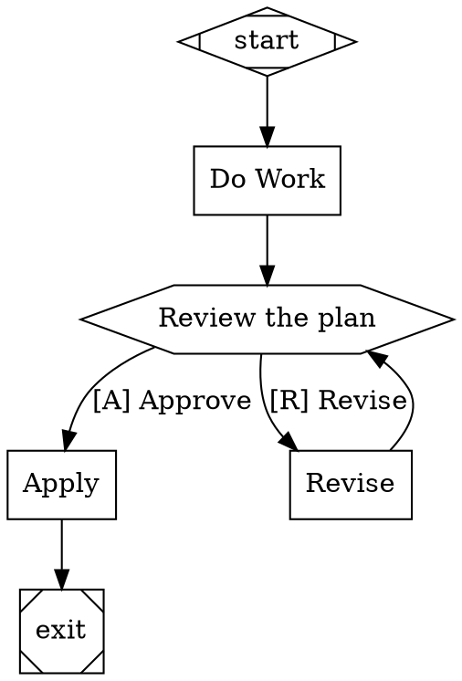

# Stage 4: Human-in-the-Loop

## Overview

Add human interaction to pipelines. Implement the Interviewer pattern for `wait.human` nodes (structured decisions from outgoing edge labels) and chat-style interactive mode for codergen nodes (`agent.mode="interactive"`). A human can now participate in pipeline execution — approving gates, selecting options, and collaborating with agents in real-time conversation.

## What a Human Can Do After This Stage

1. Define `wait.human` nodes (hexagon shape) as decision points with labeled outgoing edges
2. When the pipeline reaches a human gate, see the choices and select one in the terminal
3. Watch the pipeline route based on their selection
4. Collaborate with an agent in interactive mode — exchange messages until signaling `/done`
5. Use AutoApproveInterviewer for automated/CI pipelines that skip human interaction
6. Use QueueInterviewer to script deterministic human responses for testing

## Prerequisites

- Stage 3 complete (LLM integration, agent configuration)

## Scope

### Included

- **Interviewer Interface.** `ask(question) -> Answer`, `ask_multiple(questions) -> [Answer]`, `inform(message, stage)`. All human interaction goes through this abstraction.
- **Question/Answer Model.** Question types: YES_NO, MULTIPLE_CHOICE, FREEFORM, CONFIRMATION. Option with key and label. Answer with value, selected_option, text. AnswerValue: YES, NO, SKIPPED, TIMEOUT.
- **ConsoleInterviewer.** CLI implementation: formatted prompts, option display with accelerator keys, stdin reading.
- **AutoApproveInterviewer.** Always YES / first option. For automation and CI.
- **QueueInterviewer.** Pre-filled answer queue for deterministic testing and replay.
- **CallbackInterviewer.** Delegates to a provided function for external system integration.
- **RecordingInterviewer.** Wraps another interviewer and records all Q&A pairs for audit.
- **Wait.Human Handler.** Derives choices from outgoing edge labels, parses accelerator keys, presents to interviewer, routes based on selection. Supports timeout and `human.default_choice`. Per attractor Section 4.6.
- **Accelerator Key Parsing.** Extracts shortcut keys from edge labels: `[K] Label`, `K) Label`, `K - Label`, first character fallback.
- **Chat-Style Interactive Mode.** For codergen nodes with `agent.mode="interactive"`. Agent streams output, human responds in multi-turn conversation. Commands: `/done`, `/approve`, `/reject`. Each human turn is a checkpoint boundary.
- **Timeout Handling.** Configurable `timeout_seconds` on questions. Default answer on timeout if configured. TIMEOUT answer if no default.
- **Interviewer Configuration.** Configurable in `orchestra.yaml` or per-run CLI flag (e.g., `--auto-approve`).

### Excluded

- Web UI for human interaction (deferred — the interface supports it, but only CLI is implemented)
- Parallel execution (Stage 5)

## Automated End-to-End Tests

Human interaction is tested using QueueInterviewer (pre-filled answers) and AutoApproveInterviewer (always first option). No actual stdin reading in automated tests.

### Interviewer Implementation Tests

| Test | Description |
|------|-------------|
| AutoApprove YES_NO | Returns YES |
| AutoApprove MULTIPLE_CHOICE | Returns first option |
| AutoApprove FREEFORM | Returns "auto-approved" |
| Queue single answer | Dequeues and returns the pre-filled answer |
| Queue multiple answers | Each `ask()` call dequeues the next answer |
| Queue exhausted | Returns SKIPPED when queue is empty |
| Recording wraps inner | Delegates to inner interviewer and records the Q&A pair |
| Recording retrieval | All recorded pairs accessible after pipeline execution |
| Callback delegation | Provided function receives the question and its return value is the answer |

### Wait.Human Handler Tests

| Test | Description |
|------|-------------|
| Derive choices from edges | Node with 3 outgoing edges → 3 choices with labels |
| Accelerator key `[K] Label` | `[A] Approve` → key=A, label="Approve" |
| Accelerator key `K) Label` | `Y) Yes, deploy` → key=Y, label="Yes, deploy" |
| Accelerator key first char | `Fix issues` → key=F |
| Route on selection | Human selects "Approve" → outcome `suggested_next_ids` points to approve edge target |
| Context updated | `human.gate.selected` and `human.gate.label` set in context |
| No outgoing edges | Returns FAIL with "No outgoing edges for human gate" |
| Timeout with default | Timeout → uses `human.default_choice` attribute |
| Timeout without default | Timeout → returns RETRY |

### Interactive Mode Tests

| Test | Description |
|------|-------------|
| Multi-turn exchange | Agent sends message → human responds → agent sends → human `/done` → completes |
| `/approve` command | Human sends `/approve` → node outcome SUCCESS |
| `/reject` command | Human sends `/reject` → node outcome FAIL |
| Checkpoint per turn | Each human message creates a checkpoint boundary |
| Resume mid-conversation | Stop after 2 turns → resume → conversation continues from turn 3 |

### End-to-End Integration Tests

| Test | Description |
|------|-------------|
| Pipeline with human gate | `start → work → gate → [approve/reject] → exit/retry` with QueueInterviewer answering "approve" → routes to exit |
| Pipeline with reject | QueueInterviewer answers "reject" → routes to retry path |
| Pipeline with auto-approve | AutoApproveInterviewer → gate auto-selects first option → routes accordingly |
| Pipeline with interactive node | Codergen node in interactive mode, QueueInterviewer provides responses → agent and human exchange → node completes |
| Multiple human gates | Pipeline with 2 human gates → QueueInterviewer with 2 answers → both gates route correctly |

## Manual Testing Guide

### Prerequisites
- Stage 3 complete and passing
- `orchestra` CLI available with LLM credentials configured

### Test 1: Human Approval Gate

Create `test-human-gate.dot`:


Run: `orchestra run test-human-gate.dot`

**Verify:**
- Pipeline executes `do_work` (LLM generates a plan)
- Pipeline pauses at `review_gate` and displays:
  ```
  [?] Review the plan
    [A] Approve
    [R] Revise
  Select:
  ```
- Type `A` and press Enter
- Pipeline continues to `apply` and then `exit`
- Events show the human interaction

### Test 2: Revise Loop

Run the same pipeline, but at the gate type `R`.

**Verify:**
- Pipeline routes to `revise`
- After `revise`, pipeline returns to `review_gate` for another decision
- Type `A` to approve and exit

### Test 3: Interactive Mode

Create a pipeline with a codergen node that has `agent.mode="interactive"`.

Run: `orchestra run test-interactive.dot`

**Verify:**
- At the interactive node, the agent produces output
- A prompt appears for human input
- Type a response and see the agent respond
- Type `/done` to complete the node
- Pipeline continues to the next node

### Test 4: Auto-Approve Mode

Run: `orchestra run test-human-gate.dot --auto-approve`

**Verify:**
- Pipeline does NOT pause at the human gate
- First option (Approve) is automatically selected
- Pipeline completes without human input
- Events show "auto-approved" for the human gate

## Success Criteria

- [ ] Wait.human handler derives choices from outgoing edge labels and routes based on selection
- [ ] Accelerator key parsing works for all patterns: `[K] Label`, `K) Label`, `K - Label`, first character
- [ ] ConsoleInterviewer displays formatted prompts and reads selections from stdin
- [ ] AutoApproveInterviewer works for CI/automation (no stdin required)
- [ ] QueueInterviewer enables deterministic testing with pre-filled answers
- [ ] RecordingInterviewer captures all Q&A pairs for audit
- [ ] Chat-style interactive mode supports multi-turn human-agent conversation via ConversationalBackend protocol
- [ ] Interactive mode stores conversation history in context, enabling resume from node start with history replay
- [ ] Timeout handling works with and without default choices
- [ ] A human can make decisions at gates and collaborate interactively with agents
- [ ] All automated tests pass using QueueInterviewer and AutoApproveInterviewer

---

## Plan

### Phase 1: Question/Answer Models and Interviewer Interface

- [x] Create `src/orchestra/interviewer/models.py` with Question/Answer pydantic models
    - `QuestionType` enum: `YES_NO`, `MULTIPLE_CHOICE`, `FREEFORM`, `CONFIRMATION`
    - `AnswerValue` enum: `YES`, `NO`, `SKIPPED`, `TIMEOUT`
    - `Option` model: `key: str`, `label: str`
    - `Question` model: `text: str`, `type: QuestionType`, `options: list[Option]`, `stage: str`, `timeout_seconds: float | None`, `default: Answer | None`
    - `Answer` model: `value: str | AnswerValue`, `selected_option: Option | None`, `text: str`
    - Per attractor spec Section 6.1–6.3
    - Mark TODO complete and commit the changes to git

- [x] Create `src/orchestra/interviewer/base.py` with Interviewer protocol
    - `ask(question: Question) -> Answer` method
    - `ask_multiple(questions: list[Question]) -> list[Answer]` method (default: iterate and call ask)
    - `inform(message: str, stage: str) -> None` method (default: no-op)
    - Use `typing.Protocol` with `runtime_checkable`, matching `NodeHandler` and `CodergenBackend` patterns
    - Mark TODO complete and commit the changes to git

### Phase 2: Interviewer Implementations

- [x] Create `src/orchestra/interviewer/auto_approve.py` — AutoApproveInterviewer
    - `YES_NO` / `CONFIRMATION` → `Answer(value=AnswerValue.YES)`
    - `MULTIPLE_CHOICE` → `Answer(value=options[0].key, selected_option=options[0])`
    - `FREEFORM` → `Answer(value="auto-approved", text="auto-approved")`
    - Per attractor spec Section 6.4
    - Mark TODO complete and commit the changes to git

- [x] Create `src/orchestra/interviewer/queue.py` — QueueInterviewer
    - Constructor takes `answers: list[Answer]`, stores as `collections.deque`
    - `ask()` dequeues next answer, returns `Answer(value=AnswerValue.SKIPPED)` when empty
    - Per attractor spec Section 6.4
    - Mark TODO complete and commit the changes to git

- [x] Create `src/orchestra/interviewer/callback.py` — CallbackInterviewer
    - Constructor takes `callback: Callable[[Question], Answer]`
    - `ask()` delegates to callback
    - Per attractor spec Section 6.4
    - Mark TODO complete and commit the changes to git

- [x] Create `src/orchestra/interviewer/recording.py` — RecordingInterviewer
    - Constructor takes `inner: Interviewer`
    - `ask()` delegates to inner, appends `(question, answer)` to `recordings: list[tuple[Question, Answer]]`
    - `recordings` property for programmatic access
    - Per attractor spec Section 6.4
    - Mark TODO complete and commit the changes to git

- [x] Create `src/orchestra/interviewer/console.py` — ConsoleInterviewer
    - `ask()` formats prompt: `[?] {question.text}` with options as `  [{key}] {label}`
    - Reads stdin via `input()` for `MULTIPLE_CHOICE`, `YES_NO`, `FREEFORM`
    - Timeout support via `threading.Event` + daemon thread for stdin read
    - Returns `Answer(value=AnswerValue.TIMEOUT)` on timeout
    - `inform()` prints `[i] {message}` to stdout
    - Mark TODO complete and commit the changes to git

- [x] Create `src/orchestra/interviewer/__init__.py` re-exporting all public types
    - Mark TODO complete and commit the changes to git

### Phase 3: Accelerator Key Parsing

- [x] Create `src/orchestra/interviewer/accelerator.py` with shared accelerator parsing
    - `parse_accelerator(label: str) -> tuple[str, str]` returning `(key, clean_label)`
    - Handle all 4 patterns: `[K] Label`, `K) Label`, `K - Label`, first character fallback
    - Edge labels with no text → use edge `to_node` as fallback label
    - Mark TODO complete and commit the changes to git

- [x] Refactor `src/orchestra/engine/edge_selection.py` to use shared `parse_accelerator`
    - Replace `_ACCELERATOR_PREFIX` regex with import from `interviewer.accelerator`
    - `_normalize_label` calls `parse_accelerator(label)` and returns the clean_label lowercased
    - Verify existing edge selection tests still pass
    - Mark TODO complete and commit the changes to git

### Phase 4: WaitHumanHandler

- [x] Create `src/orchestra/handlers/wait_human.py` — WaitHumanHandler
    - Constructor takes `interviewer: Interviewer`
    - `handle(node, context, graph) -> Outcome`:
        1. Get outgoing edges from `graph.get_outgoing_edges(node.id)`
        2. Build choices: for each edge, `parse_accelerator(edge.label or edge.to_node)` → `(key, label)`, store `to_node`
        3. If no choices: return `Outcome(status=FAIL, failure_reason="No outgoing edges for human gate")`
        4. Build `Question(text=node.label, type=MULTIPLE_CHOICE, options=[Option(key, label)...], stage=node.id)`
        5. Call `interviewer.ask(question)`
        6. Handle TIMEOUT: check `node.attributes["human.default_choice"]`, fall back to `Outcome(status=RETRY)`
        7. Handle SKIPPED: return `Outcome(status=FAIL, failure_reason="human skipped interaction")`
        8. Match answer to choice, fallback to first choice
        9. Return `Outcome(status=SUCCESS, suggested_next_ids=[selected.to_node], context_updates={"human.gate.selected": key, "human.gate.label": label})`
    - Per attractor spec Section 4.6
    - Mark TODO complete and commit the changes to git

- [x] Register WaitHumanHandler in `src/orchestra/handlers/registry.py`
    - Add `interviewer: Interviewer | None = None` parameter to `default_registry()`
    - If interviewer provided: `registry.register("hexagon", WaitHumanHandler(interviewer))`
    - If not provided: register with `AutoApproveInterviewer()` as default
    - Mark TODO complete and commit the changes to git

### Phase 5: HumanInteraction Event

- [x] Add `HumanInteraction` event to `src/orchestra/events/types.py`
    - Fields: `node_id: str`, `question_text: str`, `question_type: str`, `answer_value: str`, `answer_text: str`, `selected_option_key: str`
    - Add to `EVENT_TYPE_MAP`
    - Mark TODO complete and commit the changes to git

### Phase 6a: Multi-Turn Backend Protocol

- [x] Define `ConversationalBackend` protocol in `src/orchestra/backends/protocol.py`
    - New protocol alongside existing `CodergenBackend` (non-breaking):
        - `send_message(node, message, context, on_turn=None) -> str | Outcome` — send a single message in an ongoing conversation
        - `reset_conversation() -> None` — clear conversation state
    - `CodergenBackend` remains unchanged — single-shot `run()` still works for non-interactive nodes
    - Mark TODO complete and commit the changes to git

- [x] Implement `ConversationalBackend` on existing backends
    - **SimulationBackend**: `send_message()` returns canned responses (same as `run()`)
    - **DirectLLMBackend**: Accumulate `HumanMessage`/`AIMessage` list across calls to `send_message()`. Each call appends the human message and invokes the LLM with the full history. `reset_conversation()` clears the message list.
    - **LangGraphBackend**: Accumulate messages in the agent's message history. Each `send_message()` invokes the agent with the new message appended. `reset_conversation()` creates a fresh agent.
    - **CLIAgentBackend**: Accumulate conversation history as formatted text. Each `send_message()` passes the full history as stdin. `reset_conversation()` clears history.
    - Existing `run()` method is unchanged — it remains the single-shot entry point
    - Mark TODO complete and commit the changes to git

### Phase 6b: InteractiveHandler and Dispatcher

- [x] Create `src/orchestra/handlers/interactive.py` — InteractiveHandler
    - Constructor takes `backend: ConversationalBackend`, `interviewer: Interviewer`, `config: OrchestraConfig | None`
    - `handle(node, context, graph) -> Outcome`:
        1. Compose initial prompt (reuse prompt composition logic extracted to shared helper)
        2. Check `context.get("interactive.history")` for resume case — if history exists, replay it via `backend.send_message()` for each prior turn, then `interviewer.inform()` to show the user what happened
        3. Call `backend.send_message(node, prompt, context)` for first agent response
        4. Loop:
            a. Present agent response via `interviewer.ask(Question(text=response, type=FREEFORM, stage=node.id))`
            b. Check for commands: `/done` → break SUCCESS, `/approve` → break SUCCESS, `/reject` → break FAIL
            c. Append `{"agent": response, "human": answer.text}` to history list
            d. Call `backend.send_message(node, answer.text, context)` for next agent response
        5. Store history: `context_updates={"interactive.history": history}`
        6. Call `backend.reset_conversation()`
    - Return `Outcome(status=..., notes=full_conversation, context_updates=...)`
    - Mark TODO complete and commit the changes to git

- [x] Extract shared prompt composition helper from `CodergenHandler`
    - Create `src/orchestra/handlers/prompt_helper.py` (or similar)
    - Extract `_get_agent_config()` and prompt composition logic used by both CodergenHandler and InteractiveHandler
    - Update CodergenHandler to use the shared helper
    - Verify existing CodergenHandler tests still pass
    - Mark TODO complete and commit the changes to git

- [x] Create `CodergenDispatcher` in `src/orchestra/handlers/codergen_dispatcher.py`
    - Constructor takes `standard: CodergenHandler`, `interactive: InteractiveHandler`
    - `handle(node, context, graph) -> Outcome`:
        - If `node.attributes.get("agent.mode") == "interactive"`: delegate to `interactive.handle()`
        - Otherwise: delegate to `standard.handle()`
    - Mark TODO complete and commit the changes to git

- [x] Wire dispatcher into `src/orchestra/handlers/registry.py`
    - Update `default_registry()`: when both backend and interviewer are provided, create `CodergenDispatcher(CodergenHandler(...), InteractiveHandler(...))`
    - Register the dispatcher for shape `"box"`
    - When interviewer is None, fall back to plain `CodergenHandler` (no interactive support)
    - Mark TODO complete and commit the changes to git

### Phase 7: CLI Integration

- [x] Add `--auto-approve` flag to `orchestra run` command
    - In `src/orchestra/cli/run.py`: add `auto_approve: bool = False` parameter
    - If `--auto-approve`: use `AutoApproveInterviewer()`
    - Otherwise: use `ConsoleInterviewer()`
    - Pass interviewer to `default_registry(backend=backend, config=config, interviewer=interviewer)`
    - Mark TODO complete and commit the changes to git

- [x] Update `src/orchestra/cli/main.py` to wire the `--auto-approve` option
    - Ensure the typer option is properly defined and passed through
    - Mark TODO complete and commit the changes to git

### Phase 8: Test Fixtures

- [x] Create DOT fixture files for human-in-the-loop tests
    - `tests/fixtures/test-human-gate.dot` — start → work → hexagon gate → [approve/reject] → exit/retry
    - `tests/fixtures/test-multiple-gates.dot` — pipeline with 2 sequential human gates
    - `tests/fixtures/test-interactive.dot` — pipeline with codergen node using `agent.mode="interactive"`
    - Mark TODO complete and commit the changes to git

### Phase 9: Interviewer Unit Tests

- [x] Write `tests/test_interviewer.py` — unit tests for all interviewer implementations
    - AutoApprove: YES_NO → YES, MULTIPLE_CHOICE → first option, FREEFORM → "auto-approved"
    - Queue: single answer dequeue, multiple answers in sequence, exhausted → SKIPPED
    - Recording: wraps inner, records Q&A pairs, recordings accessible
    - Callback: delegates to provided function, return value is the answer
    - Mark TODO complete and commit the changes to git

### Phase 10: Accelerator Key Tests

- [x] Write `tests/test_accelerator.py` — unit tests for accelerator key parsing
    - `[A] Approve` → key="A", label="Approve"
    - `Y) Yes, deploy` → key="Y", label="Yes, deploy"
    - `Y - Yes, deploy` → key="Y", label="Yes, deploy"
    - `Fix issues` → key="F", label="Fix issues"
    - Empty label → fallback behavior
    - Run existing `tests/test_edge_selection.py` to verify no regressions from refactor
    - Mark TODO complete and commit the changes to git

### Phase 11: WaitHumanHandler Tests

- [x] Write `tests/test_wait_human_handler.py` — unit tests for WaitHumanHandler
    - Derive choices from 3 outgoing edges → 3 choices with correct labels
    - Route on selection → outcome `suggested_next_ids` points to correct edge target
    - Context updated with `human.gate.selected` and `human.gate.label`
    - No outgoing edges → FAIL outcome
    - Timeout with `human.default_choice` → uses default
    - Timeout without default → RETRY outcome
    - SKIPPED answer → FAIL outcome
    - All tests use `QueueInterviewer` for deterministic answers
    - Mark TODO complete and commit the changes to git

### Phase 12: Interactive Mode and Dispatcher Tests

- [x] Write `tests/test_conversational_backend.py` — unit tests for ConversationalBackend protocol
    - SimulationBackend: `send_message()` returns canned responses, `reset_conversation()` is no-op
    - DirectLLMBackend: message history accumulates across `send_message()` calls, `reset_conversation()` clears it
    - LangGraphBackend: messages accumulate, agent receives full history on each call
    - CLIAgentBackend: conversation formatted as text, subprocess receives full history
    - All backends: `run()` still works unchanged (non-breaking)
    - Mark TODO complete and commit the changes to git

- [x] Write `tests/test_interactive_handler.py` — unit tests for InteractiveHandler
    - Multi-turn exchange: agent sends → human responds → agent sends → human `/done` → SUCCESS
    - `/approve` command → SUCCESS outcome
    - `/reject` command → FAIL outcome
    - Conversation history stored in `outcome.context_updates["interactive.history"]`
    - Resume: pre-populate `context` with `interactive.history` → handler replays history and continues
    - Use `QueueInterviewer` for deterministic human responses and `SimulationBackend` for agent responses
    - Mark TODO complete and commit the changes to git

- [x] Write `tests/test_codergen_dispatcher.py` — unit tests for CodergenDispatcher
    - Node without `agent.mode` → delegates to standard CodergenHandler
    - Node with `agent.mode="interactive"` → delegates to InteractiveHandler
    - Mark TODO complete and commit the changes to git

### Phase 13: End-to-End Integration Tests

- [x] Write `tests/test_human_e2e.py` — end-to-end pipeline tests with human gates
    - Pipeline with human gate: QueueInterviewer answers "approve" → routes to exit
    - Pipeline with reject: QueueInterviewer answers "reject" → routes to retry path
    - Pipeline with auto-approve: AutoApproveInterviewer → first option selected → completes
    - Multiple human gates: QueueInterviewer with 2 answers → both gates route correctly
    - Pipeline with interactive node: QueueInterviewer + SimulationBackend → multi-turn exchange → node completes
    - Mark TODO complete and commit the changes to git

### Phase 14: Review and Cleanup

- [x] Identify any code that is unused, or could be cleaned up
    - Look at all previous TODOs and changes in git to identify changes
    - Identify any code that is no longer used, and remove it
    - Identify any unnecessary comments, and remove them
    - If there are any obvious code smells of redundant code, add TODOs below to address them
    - Mark TODO complete and commit the changes to git

### Phase 15: Verify All Specs Pass

- [ ] Identify all specs that need to be run and updated
    - Run full test suite: `pytest tests/ -v`
    - Run new tests in isolation: `pytest tests/test_interviewer.py tests/test_accelerator.py tests/test_wait_human_handler.py tests/test_interactive_mode.py tests/test_human_e2e.py -v`
    - Run existing tests that may be affected: `pytest tests/test_edge_selection.py tests/test_engine.py tests/test_execution.py tests/test_codergen_handler.py -v`
    - Identify any specs that failed and fix them
    - Mark TODO complete and commit the changes to git
