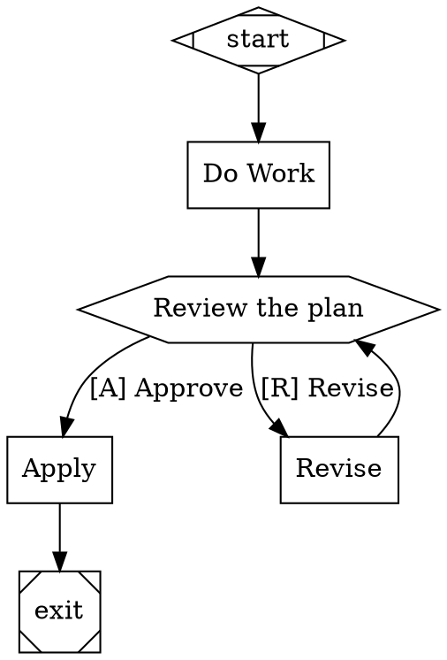

# Stage 4: Human-in-the-Loop

## Overview

Add human interaction to pipelines. Implement the Interviewer pattern for `wait.human` nodes (structured decisions from outgoing edge labels) and chat-style interactive mode for codergen nodes (`agent.mode="interactive"`). A human can now participate in pipeline execution — approving gates, selecting options, and collaborating with agents in real-time conversation.

## What a Human Can Do After This Stage

1. Define `wait.human` nodes (hexagon shape) as decision points with labeled outgoing edges
2. When the pipeline reaches a human gate, see the choices and select one in the terminal
3. Watch the pipeline route based on their selection
4. Collaborate with an agent in interactive mode — exchange messages until signaling `/done`
5. Use AutoApproveInterviewer for automated/CI pipelines that skip human interaction
6. Use QueueInterviewer to script deterministic human responses for testing

## Prerequisites

- Stage 3 complete (LLM integration, agent configuration)

## Scope

### Included

- **Interviewer Interface.** `ask(question) -> Answer`, `ask_multiple(questions) -> [Answer]`, `inform(message, stage)`. All human interaction goes through this abstraction.
- **Question/Answer Model.** Question types: YES_NO, MULTIPLE_CHOICE, FREEFORM, CONFIRMATION. Option with key and label. Answer with value, selected_option, text. AnswerValue: YES, NO, SKIPPED, TIMEOUT.
- **ConsoleInterviewer.** CLI implementation: formatted prompts, option display with accelerator keys, stdin reading.
- **AutoApproveInterviewer.** Always YES / first option. For automation and CI.
- **QueueInterviewer.** Pre-filled answer queue for deterministic testing and replay.
- **CallbackInterviewer.** Delegates to a provided function for external system integration.
- **RecordingInterviewer.** Wraps another interviewer and records all Q&A pairs for audit.
- **Wait.Human Handler.** Derives choices from outgoing edge labels, parses accelerator keys, presents to interviewer, routes based on selection. Supports timeout and `human.default_choice`. Per attractor Section 4.6.
- **Accelerator Key Parsing.** Extracts shortcut keys from edge labels: `[K] Label`, `K) Label`, `K - Label`, first character fallback.
- **Chat-Style Interactive Mode.** For codergen nodes with `agent.mode="interactive"`. Agent streams output, human responds in multi-turn conversation. Commands: `/done`, `/approve`, `/reject`. Each human turn is a checkpoint boundary.
- **Timeout Handling.** Configurable `timeout_seconds` on questions. Default answer on timeout if configured. TIMEOUT answer if no default.
- **Interviewer Configuration.** Configurable in `orchestra.yaml` or per-run CLI flag (e.g., `--auto-approve`).

### Excluded

- Web UI for human interaction (deferred — the interface supports it, but only CLI is implemented)
- Parallel execution (Stage 5)

## Automated End-to-End Tests

Human interaction is tested using QueueInterviewer (pre-filled answers) and AutoApproveInterviewer (always first option). No actual stdin reading in automated tests.

### Interviewer Implementation Tests

| Test | Description |
|------|-------------|
| AutoApprove YES_NO | Returns YES |
| AutoApprove MULTIPLE_CHOICE | Returns first option |
| AutoApprove FREEFORM | Returns "auto-approved" |
| Queue single answer | Dequeues and returns the pre-filled answer |
| Queue multiple answers | Each `ask()` call dequeues the next answer |
| Queue exhausted | Returns SKIPPED when queue is empty |
| Recording wraps inner | Delegates to inner interviewer and records the Q&A pair |
| Recording retrieval | All recorded pairs accessible after pipeline execution |
| Callback delegation | Provided function receives the question and its return value is the answer |

### Wait.Human Handler Tests

| Test | Description |
|------|-------------|
| Derive choices from edges | Node with 3 outgoing edges → 3 choices with labels |
| Accelerator key `[K] Label` | `[A] Approve` → key=A, label="Approve" |
| Accelerator key `K) Label` | `Y) Yes, deploy` → key=Y, label="Yes, deploy" |
| Accelerator key first char | `Fix issues` → key=F |
| Route on selection | Human selects "Approve" → outcome `suggested_next_ids` points to approve edge target |
| Context updated | `human.gate.selected` and `human.gate.label` set in context |
| No outgoing edges | Returns FAIL with "No outgoing edges for human gate" |
| Timeout with default | Timeout → uses `human.default_choice` attribute |
| Timeout without default | Timeout → returns RETRY |

### Interactive Mode Tests

| Test | Description |
|------|-------------|
| Multi-turn exchange | Agent sends message → human responds → agent sends → human `/done` → completes |
| `/approve` command | Human sends `/approve` → node outcome SUCCESS |
| `/reject` command | Human sends `/reject` → node outcome FAIL |
| Checkpoint per turn | Each human message creates a checkpoint boundary |
| Resume mid-conversation | Stop after 2 turns → resume → conversation continues from turn 3 |

### End-to-End Integration Tests

| Test | Description |
|------|-------------|
| Pipeline with human gate | `start → work → gate → [approve/reject] → exit/retry` with QueueInterviewer answering "approve" → routes to exit |
| Pipeline with reject | QueueInterviewer answers "reject" → routes to retry path |
| Pipeline with auto-approve | AutoApproveInterviewer → gate auto-selects first option → routes accordingly |
| Pipeline with interactive node | Codergen node in interactive mode, QueueInterviewer provides responses → agent and human exchange → node completes |
| Multiple human gates | Pipeline with 2 human gates → QueueInterviewer with 2 answers → both gates route correctly |

## Manual Testing Guide

### Prerequisites
- Stage 3 complete and passing
- `orchestra` CLI available with LLM credentials configured

### Test 1: Human Approval Gate

Create `test-human-gate.dot`:


Run: `orchestra run test-human-gate.dot`

**Verify:**
- Pipeline executes `do_work` (LLM generates a plan)
- Pipeline pauses at `review_gate` and displays:
  ```
  [?] Review the plan
    [A] Approve
    [R] Revise
  Select:
  ```
- Type `A` and press Enter
- Pipeline continues to `apply` and then `exit`
- Events show the human interaction

### Test 2: Revise Loop

Run the same pipeline, but at the gate type `R`.

**Verify:**
- Pipeline routes to `revise`
- After `revise`, pipeline returns to `review_gate` for another decision
- Type `A` to approve and exit

### Test 3: Interactive Mode

Create a pipeline with a codergen node that has `agent.mode="interactive"`.

Run: `orchestra run test-interactive.dot`

**Verify:**
- At the interactive node, the agent produces output
- A prompt appears for human input
- Type a response and see the agent respond
- Type `/done` to complete the node
- Pipeline continues to the next node

### Test 4: Auto-Approve Mode

Run: `orchestra run test-human-gate.dot --auto-approve`

**Verify:**
- Pipeline does NOT pause at the human gate
- First option (Approve) is automatically selected
- Pipeline completes without human input
- Events show "auto-approved" for the human gate

## Success Criteria

- [ ] Wait.human handler derives choices from outgoing edge labels and routes based on selection
- [ ] Accelerator key parsing works for all patterns: `[K] Label`, `K) Label`, `K - Label`, first character
- [ ] ConsoleInterviewer displays formatted prompts and reads selections from stdin
- [ ] AutoApproveInterviewer works for CI/automation (no stdin required)
- [ ] QueueInterviewer enables deterministic testing with pre-filled answers
- [ ] RecordingInterviewer captures all Q&A pairs for audit
- [ ] Chat-style interactive mode supports multi-turn human-agent conversation
- [ ] Interactive mode checkpoints after each human turn, enabling resume mid-conversation
- [ ] Timeout handling works with and without default choices
- [ ] A human can make decisions at gates and collaborate interactively with agents
- [ ] All automated tests pass using QueueInterviewer and AutoApproveInterviewer
