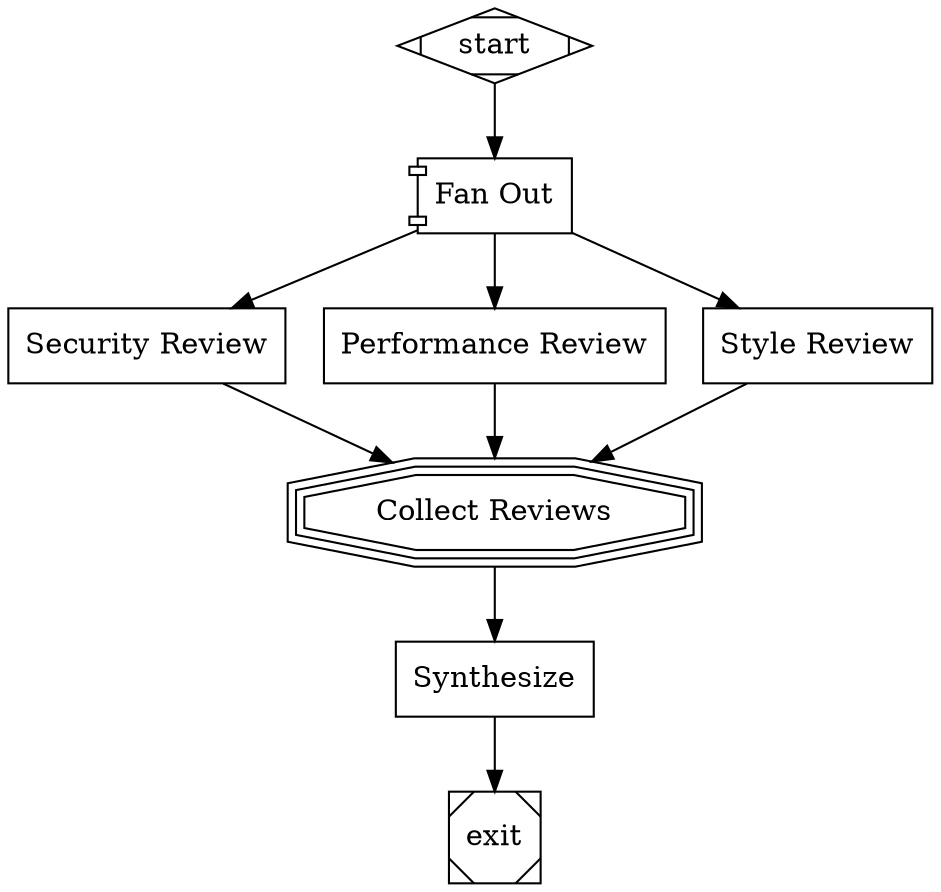

# Stage 5: Parallel Execution

## Overview

Add concurrent multi-branch execution to the pipeline engine. Implement the parallel handler (fan-out), fan-in handler (consolidation), join and error policies, and context isolation for parallel branches. After this stage, pipelines can run multiple agents concurrently and consolidate their results.

## What a Human Can Do After This Stage

1. Define parallel fan-out nodes (component shape) that spawn multiple concurrent branches
2. Define fan-in nodes (tripleoctagon shape) that wait for branches and consolidate results
3. Configure join policies: wait_all, first_success, k_of_n, quorum
4. Configure error policies: fail_fast, continue, ignore
5. Run pipelines where multiple agents work simultaneously on different tasks
6. See parallel execution events showing branch starts, completions, and consolidation

## Prerequisites

- Stage 3 complete (LLM integration — parallel branches need working codergen nodes)
- Stage 2a complete (control flow — fan-in may use conditional routing)

## Scope

### Included

- **Parallel Handler.** Fan-out to multiple branches via outgoing edges from component-shaped nodes. Bounded parallelism (`max_parallel` attribute). Each branch receives an isolated clone of the parent context.
- **Fan-In Handler.** Waits for all parallel branches. Consolidates results. Supports LLM-based evaluation (if node has a prompt) or heuristic selection (rank by outcome status, then score, then ID).
- **Join Policies.** `wait_all` (all branches complete), `first_success` (any one succeeds), `k_of_n` (at least K succeed), `quorum` (configurable fraction).
- **Error Policies.** `fail_fast` (cancel remaining on first failure), `continue` (collect all results), `ignore` (ignore failures, return only successes).
- **Context Isolation.** Each parallel branch gets a deep clone of the context. Branch context changes are NOT merged back into the parent. Only the fan-in handler's outcome and context_updates are applied to the parent context.
- **Parallel Results in Context.** Parallel handler stores branch results in `parallel.results` context key. Fan-in reads from this key.
- **Parallel Events as CXDB Turns.** ParallelStarted, ParallelBranchStarted, ParallelBranchCompleted, ParallelCompleted events appended as `dev.orchestra.ParallelExecution` typed turns. Each parallel branch forks the CXDB context at the fan-out turn; fan-in reads from all branch contexts.
- **CXDB Branch Modeling.** Each parallel branch is a CXDB context fork from the fan-out turn. Branch turns are appended to the forked context. At fan-in, the parent context resumes with a ParallelCompleted turn that references the branch contexts.
- **Subgraph Execution.** Each parallel branch can be a single node or a chain of nodes (subgraph traversal within the branch).

### Excluded

- Worktree-per-agent git isolation (Stage 6)
- Git merge at fan-in (Stage 6)

## Automated End-to-End Tests

All tests use simulation mode or mocked LLMs. Parallel execution timing verified via events.

### Parallel Handler Tests

| Test | Description |
|------|-------------|
| Fan-out to 2 branches | Parallel node with 2 outgoing edges → both branches execute |
| Fan-out to 4 branches | All 4 branches execute, results collected |
| Bounded parallelism | `max_parallel=2` with 4 branches → at most 2 branches concurrent |
| Branch context isolation | Branch A sets `context.key=A`, Branch B sets `context.key=B` → parent context unchanged |
| Branch results stored | `parallel.results` contains outcomes from all branches |

### Fan-In Handler Tests

| Test | Description |
|------|-------------|
| Consolidate all results | Fan-in receives results from all branches, selects best |
| Heuristic selection | SUCCESS > PARTIAL_SUCCESS > FAIL; among equals, first by ID |
| LLM-based evaluation | Fan-in node with prompt → mocked LLM evaluates candidates |
| All branches failed | Fan-in returns FAIL |
| Mixed outcomes | Some SUCCESS, some FAIL → fan-in returns SUCCESS with best candidate |
| Context updates from fan-in | `parallel.fan_in.best_id` and `parallel.fan_in.best_outcome` set |

### Join Policy Tests

| Test | Description |
|------|-------------|
| wait_all | All branches must complete before fan-in proceeds |
| wait_all with failures | All complete (some fail) → PARTIAL_SUCCESS |
| first_success | First successful branch satisfies join, others may be cancelled |
| k_of_n | K=2, N=3, 2 succeed → join satisfied |
| k_of_n insufficient | K=2, N=3, only 1 succeeds → join fails |
| quorum | 75% quorum, 3/4 succeed → join satisfied |

### Error Policy Tests

| Test | Description |
|------|-------------|
| fail_fast | First branch fails → remaining branches cancelled → overall FAIL |
| continue | Branch fails → other branches continue → results include failure |
| ignore | Branch fails → failure not included in results → only successes returned |

### Parallel Events Tests

| Test | Description |
|------|-------------|
| Event sequence | ParallelStarted → ParallelBranchStarted (per branch) → ParallelBranchCompleted (per branch) → ParallelCompleted |
| Branch count in events | ParallelStarted reports correct branch_count |
| Branch timing | ParallelBranchCompleted reports duration per branch |
| Success/failure counts | ParallelCompleted reports success_count and failure_count |

### End-to-End Integration Tests

| Test | Description |
|------|-------------|
| Full fan-out/fan-in pipeline | `start → fan_out → [A, B, C] → fan_in → synthesize → exit` — all branches execute, fan-in consolidates, synthesizer uses results |
| Parallel with conditions | Fan-out branches have different conditions → only matching branches execute |
| Parallel with retry | Branch fails, retries, then succeeds → fan-in receives success |
| Nested parallel (if supported) | Parallel within parallel (branch itself has a parallel fan-out) |
| Checkpoint during parallel | Checkpoint saved at parallel boundaries |
| CXDB branch contexts | Each parallel branch creates a forked CXDB context |
| CXDB fan-in references | ParallelCompleted turn references branch context IDs |

## Manual Testing Guide

### Prerequisites
- Stage 3 complete and passing
- LLM API key configured (or use simulation mode)

### Test 1: Parallel Reviewers (Simulation Mode)

Create `test-parallel.dot`:

Run: `orchestra run test-parallel.dot`

**Verify:**
- Events show ParallelStarted with 3 branches
- All three reviewers execute (events: ParallelBranchStarted/Completed for each)
- Events show ParallelCompleted with success_count=3
- Fan-in consolidates results
- Synthesize node receives consolidated results
- Run directory has subdirectories for all nodes

### Test 2: Parallel with Real LLM

Run the same pipeline without simulation mode (with LLM credentials).

**Verify:**
- All three review nodes produce different, domain-specific AI responses
- Security reviewer focuses on security, performance reviewer on performance, style on style
- Synthesize node's response references all three reviews
- Inspect `{node}/response.md` for each reviewer — responses are substantive and distinct

### Test 3: Error Policy

Modify the pipeline so one branch is expected to fail (e.g., prompt references a nonexistent resource).

Run with `error_policy="continue"`.

**Verify:**
- Failed branch is reported in events
- Other branches complete successfully
- Fan-in receives results from successful branches

### Test 4: Observe Concurrent Execution

For the 3-branch parallel pipeline:

**Verify:**
- Events show all 3 branches starting before any completes (true concurrency)
- Total wall-clock time is roughly the maximum branch time, not the sum (unless API rate-limited)

## Success Criteria

- [ ] Parallel handler fans out to multiple branches concurrently
- [ ] Fan-in handler waits for all branches and consolidates results
- [ ] Context isolation prevents parallel branches from affecting each other or the parent
- [ ] Join policies (wait_all, first_success, k_of_n, quorum) work correctly
- [ ] Error policies (fail_fast, continue, ignore) work correctly
- [ ] Bounded parallelism respects `max_parallel` attribute
- [ ] Parallel events emitted with correct sequence, counts, and timing
- [ ] Fan-in selects best candidate via heuristic or LLM evaluation
- [ ] A human can run a pipeline with parallel agents and see concurrent execution
- [ ] All automated tests pass
