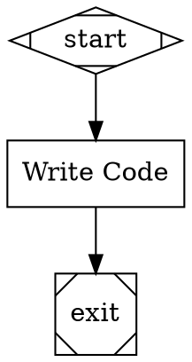

# Stage 6: Git Integration and Workspace Management

## Overview

Add the workspace layer that makes Orchestra a software development tool: multi-repo workspace management, session branches, worktree-per-agent isolation for parallel writes, workspace snapshots linking checkpoints to git SHAs, and repo-scoped tools that operate on git-managed code. After this stage, pipelines can manage git repositories as part of their execution — creating branches, committing agent changes, isolating parallel writes, and snapshotting state for reproducibility.

## What a Human Can Do After This Stage

1. Configure multi-repo workspaces in `orchestra.yaml` (e.g., backend + frontend repos)
2. Run a pipeline and see it create session branches (`orchestra/pipeline-name/session-id`)
3. Observe agents commit their changes to the session branch automatically
4. Run parallel agents that each get their own git worktree for write isolation
5. See worktrees merged back at fan-in, with conflicts surfaced
6. Resume a pipeline from a checkpoint and have git repos restored to the correct SHAs
7. Use `orchestra cleanup` to remove stale session branches and worktrees
8. Inspect workspace snapshots showing which git SHA corresponds to each checkpoint
9. Configure a remote repo and have Orchestra clone it, run a pipeline, and push session branches back
10. Deploy Orchestra to a cloud server or ephemeral container and have it manage repos via remote URLs

## Prerequisites

- Stage 5 complete (parallel execution — worktree-per-agent depends on fan-out/fan-in)
- Stage 2b complete (checkpoint/resume — workspace snapshots extend checkpoints)

## Scope

### Included

- **Multi-Repo Workspace Configuration.** `workspace.repos` section in `orchestra.yaml`: named repos with paths and branch prefixes. Single-repo is the degenerate case. Repo-qualified tool naming (`backend:run-tests`).
- **Session Branches.** At pipeline start, create a session branch in each workspace repo: `{branch_prefix}{pipeline-name}/{session-short-id}`. Record base commit SHA per repo. Branches left in place on completion for user to merge/delete.
- **Per-Turn Commits (via `on_turn` callback).** The workspace layer hooks into the `on_turn` callback from CodergenBackend (implemented in Stage 3). After each agent turn that has `files_written`, the workspace layer: (1) stages exactly those files with `git add`, (2) generates a commit message via an LLM call (cheap model tier) from the diff and agent intent, (3) commits with agent metadata (author and git trailers), (4) records the SHA in the `dev.orchestra.AgentTurn` CXDB turn.
- **LLM Commit Message Generation.** A separate LLM call (using the `cheap` model tier) generates a conventional commit message from the staged diff and a summary of the agent's intent (extracted from the turn's messages). The message has an imperative summary line (under 72 chars) and a brief description.
- **Agent Metadata in Git.** Each per-turn commit includes: commit author set to `{node_id} ({model}) <orchestra@local>`, and git trailers: `Orchestra-Model`, `Orchestra-Provider`, `Orchestra-Node`, `Orchestra-Pipeline`, `Orchestra-Session`, `Orchestra-Turn`. This enables tracing from any git commit back to the CXDB session/node/turn.
- **CLIAgentBackend Fallback.** For backends that don't support `on_turn` (CLIAgentBackend), the workspace layer falls back to a single commit per node using `git status` to detect all changes, with the commit message generated from the full diff.
- **Per-Turn CXDB Recording.** Each agent turn (whether or not it has file writes) is recorded as a `dev.orchestra.AgentTurn` CXDB turn with: turn_number, model, provider, messages, tool_calls, files_written, token_usage, git_sha (null if no files changed), commit_message, and agent_state_ref.
- **Worktree-Per-Agent Isolation.** When parallel handler fans out to codergen nodes with write access to the same repo, create a git worktree per branch: `.orchestra/worktrees/{session-id}/{agent-name}`. Each agent commits independently to its worktree. Per-turn commits within parallel agents write to the agent's worktree.
- **Worktree Merge at Fan-In.** At fan-in, merge worktrees back into the session branch (3-way merge). Surface merge conflicts to the downstream agent or human via the Interviewer. Clean up worktrees after successful merge. Preserve worktrees on failure for inspection.
- **Workspace Snapshots at Two Granularities.** Fine-grained: each `dev.orchestra.AgentTurn` with file writes includes the git SHA of that turn's commit. Coarse-grained: the `dev.orchestra.Checkpoint` at each node boundary includes a workspace snapshot with the current HEAD SHA for each repo. Only recorded when repo state has changed.
- **Resume at Agent Turn Granularity.** `orchestra resume <session_id> --turn <turn_id>` restores to a specific AgentTurn: pipeline state from the enclosing Checkpoint, git state from the AgentTurn's git_sha, LangGraph agent state from agent_state_ref. Standard `orchestra resume <session_id>` resumes from the latest node-boundary Checkpoint.
- **Replay at Agent Turn Granularity.** `orchestra replay <session_id> --turn <turn_id>` forks the CXDB context at the specified AgentTurn and creates a new execution branch from that point.
- **Repo-Scoped Built-In Tools.** Auto-generate per-repo versions of built-in tools (read-file, write-file, search-code) that operate on the correct worktree/branch. Tools resolve paths relative to the repo's working directory. Write tools (write-file, edit-file) call the WriteTracker (from Stage 3) to record modifications.
- **Workspace Events.** Events for branch creation, per-turn commit, worktree creation/merge, snapshot recording.
- **CLI: `orchestra cleanup`.** Remove stale session branches (configurable age threshold), orphaned worktrees, and old run directories.
- **RepoContext.** Context object passed to tools containing repo path, current branch, worktree path (if applicable), and git state.

- **Remote Git Operations.** Workspace repos can be configured with a `remote` for cloud and CI/CD deployments where repos are not pre-existing on the host. Orchestra manages the clone/fetch/push lifecycle around the existing local git operations.
    - **Clone on session start.** If a workspace repo's `path` does not exist but `remote` is configured, Orchestra clones it before creating the session branch. If the path exists, Orchestra fetches to ensure the local clone is up to date.
    - **Push session branches.** Controlled by the `push` policy in `workspace.repos.{name}`: `on_completion` (default — push session branches to remote when the pipeline completes), `on_checkpoint` (push after each checkpoint for durability in ephemeral environments), or `never` (local only, the default when no `remote` is configured).
    - **Push at checkpoints.** When `push: on_checkpoint`, the session branch is pushed after each auto-commit. This ensures code changes survive container restarts or crashes in ephemeral cloud environments. The push is non-blocking and failures are logged as warnings, not pipeline errors.
    - **Push at completion.** When `push: on_completion`, session branches for all repos are pushed to their remotes after the pipeline completes successfully. Failed pipelines do not auto-push (the user or a cleanup policy decides).
    - **Credentials.** Git authentication uses the host environment's existing credential configuration (SSH keys, credential helpers, `GIT_ASKPASS`, etc.). Orchestra does not manage credentials — it delegates to git. This works with cloud IAM roles, CI/CD credential injection, and SSH agent forwarding.
    - **Shallow clones.** For large repos in ephemeral environments, `clone_depth` can be set per repo to use shallow clones (`git clone --depth N`). Session branches are created from the shallow clone. Deep history is fetched on demand only if needed (e.g., for merge conflict resolution).

### Excluded

- Multi-repo coordination atomicity (deferred — treat snapshots as best-effort)
- Transactional semantics across repos (deferred)

### Workspace Configuration with Remote

```yaml
# orchestra.yaml — local workspace (no remote, default behavior)
workspace:
  repos:
    project:
      path: ./my-project
      branch_prefix: orchestra/

# orchestra.yaml — cloud/CI deployment (remote repos)
workspace:
  repos:
    backend:
      path: /workspace/backend
      remote: git@github.com:org/backend.git
      branch_prefix: orchestra/
      push: on_completion          # push session branches when pipeline completes
    frontend:
      path: /workspace/frontend
      remote: git@github.com:org/frontend.git
      branch_prefix: orchestra/
      push: on_checkpoint          # push after each checkpoint (ephemeral environments)
      clone_depth: 50              # shallow clone for large repos

# orchestra.yaml — ephemeral container deployment
workspace:
  repos:
    monorepo:
      path: /tmp/workspace/monorepo
      remote: https://github.com/org/monorepo.git
      branch_prefix: orchestra/
      push: on_checkpoint
      clone_depth: 1
```

**Push policy reference:**

| Policy | When Pushed | Use Case |
|--------|-------------|----------|
| `never` | Never (default when no `remote`) | Local-only development |
| `on_completion` | After pipeline completes successfully (default when `remote` is set) | Standard cloud deployment — durable remote, short-lived pipelines |
| `on_checkpoint` | After each auto-commit/checkpoint | Ephemeral containers — survive crash/restart |

## Automated End-to-End Tests

Tests use temporary git repositories created in a test fixture. No external git repos or network access. Remote git tests use local bare repositories as remotes to avoid network dependencies.

### Session Branch Tests

| Test | Description |
|------|-------------|
| Branch creation | Pipeline start → session branch created in each workspace repo |
| Branch naming | Branch name follows `{prefix}{pipeline}/{session-id}` convention |
| Base SHA recorded | Base commit SHA recorded for each repo at session start |
| Branch persists | After pipeline completion, session branch still exists (not deleted) |
| Multi-repo branches | 2 repos configured → 2 session branches created, one per repo |

### Per-Turn Commit Tests

| Test | Description |
|------|-------------|
| Turn with writes committed | Agent turn writes a file → exactly that file committed to session branch |
| Only tracked files staged | Agent turn writes `a.py` → only `a.py` staged, not other dirty files |
| Turn without writes no commit | Agent turn that only reads files → no commit |
| Multiple turns multiple commits | 3 turns with writes → 3 separate commits on session branch |
| Commit message via LLM | Commit message generated by LLM from diff and agent intent |
| Commit message format | First line under 72 chars, imperative mood, blank line, description |
| Agent metadata in author | Commit author is `{node_id} ({model}) <orchestra@local>` |
| Agent metadata in trailers | Commit has trailers: Orchestra-Model, Orchestra-Provider, Orchestra-Node, Orchestra-Pipeline, Orchestra-Session, Orchestra-Turn |
| CLIAgentBackend fallback | CLI backend → single commit per node via `git status`, not per-turn |

### Worktree Tests

| Test | Description |
|------|-------------|
| Worktree created for parallel | Parallel fan-out with 2 write-access agents → 2 worktrees created |
| Worktree isolation | Agent A's write in worktree A is not visible in worktree B |
| Worktree path | Created at `.orchestra/worktrees/{session-id}/{agent-name}` |
| Sequential agents no worktree | After fan-in, sequential nodes work directly on session branch (no worktree overhead) |

### Worktree Merge Tests

| Test | Description |
|------|-------------|
| Clean merge | Two agents edit different files → merge succeeds automatically |
| Merge conflict surfaced | Two agents edit the same file → conflict reported to downstream node/human |
| Worktree cleanup on success | After successful merge, worktrees are removed |
| Worktree preserved on failure | Merge failure → worktrees preserved for inspection |

### Per-Turn CXDB Recording Tests

| Test | Description |
|------|-------------|
| AgentTurn recorded per turn | Each agent loop turn → `dev.orchestra.AgentTurn` CXDB turn appended |
| AgentTurn with writes has SHA | Turn that writes files → AgentTurn.git_sha populated with commit SHA |
| AgentTurn without writes null SHA | Read-only turn → AgentTurn.git_sha is null |
| AgentTurn contains messages | AgentTurn payload includes LLM messages for that turn |
| AgentTurn contains tool calls | AgentTurn payload includes tool calls made in that turn |
| AgentTurn contains model metadata | AgentTurn payload includes model and provider strings |
| AgentTurn contains agent state | AgentTurn payload includes agent_state_ref for resume |
| Checkpoint includes workspace snapshot | Node-boundary Checkpoint turn has workspace_snapshot with current HEAD SHAs |
| Checkpoint snapshot only on change | Read-only node → no workspace_snapshot in Checkpoint |

### Resume with Git State Tests (CXDB)

| Test | Description |
|------|-------------|
| Resume at node boundary | Pause after node 2, resume → repo at Checkpoint workspace_snapshot SHA |
| Resume at node restores multiple repos | Both repos restored to correct SHAs from Checkpoint turn |
| Resume at agent turn | `--turn <turn_id>` → repo checked out to AgentTurn.git_sha |
| Resume at agent turn restores agent state | Agent continues from next turn with full prior context |
| Resume at read-only turn | AgentTurn with null git_sha → repo at most recent prior SHA |
| Resume restores worktree | Resume during parallel execution → worktrees recreated from context state |

### Replay at Agent Turn Tests (CXDB Fork)

| Test | Description |
|------|-------------|
| Replay from agent turn | `--turn <turn_id>` → CXDB context forked at that AgentTurn |
| Replay restores git state | Forked context + git at AgentTurn.git_sha → agent continues with correct code |
| Replay diverges | New execution appends new AgentTurns to forked context, original unchanged |

### Cleanup Tests

| Test | Description |
|------|-------------|
| Cleanup removes old branches | Session branches older than threshold removed |
| Cleanup removes orphaned worktrees | Worktrees from crashed sessions removed |
| Cleanup preserves active sessions | Branches for running/paused sessions not removed |
| Cleanup reports what was removed | CLI output lists removed branches and worktrees |

### End-to-End Integration Tests

| Test | Description |
|------|-------------|
| Full workspace lifecycle | Pipeline starts → branches created → agent modifies files across multiple turns → per-turn commits with LLM messages and metadata → AgentTurn CXDB turns with SHAs → Checkpoint with workspace snapshot → pipeline completes → branches remain |
| Per-turn commit chain | Agent makes 3 turns with writes → `git log` shows 3 commits with correct authors and trailers → CXDB has 3 AgentTurns with corresponding SHAs |
| Bidirectional correlation | Given CXDB AgentTurn → can checkout git_sha → code matches. Given git commit → trailers identify CXDB session/turn |
| Parallel with worktrees | Fan-out → 2 agents write to same repo in isolated worktrees → per-turn commits in each worktree → fan-in → worktrees merged → session branch has both agents' commits |
| Resume at node boundary | Run pipeline → pause → resume → git state correct → pipeline completes |
| Resume at agent turn | Run pipeline → pause mid-node → resume --turn → agent continues from that turn with correct code and context |
| Multi-repo pipeline | Pipeline modifies files in 2 repos → separate branches, per-turn commits, and snapshots per repo |

### Remote Git Tests

| Test | Description |
|------|-------------|
| Clone on start | `remote` configured + `path` does not exist → repo cloned before session branch created |
| Fetch on start | `remote` configured + `path` exists → `git fetch` run before session branch created |
| No clone without remote | `remote` not configured + `path` exists → no clone/fetch, existing local behavior |
| Missing path no remote | `remote` not configured + `path` does not exist → clear error (not a silent clone) |
| Shallow clone | `clone_depth: 50` → `git clone --depth 50` used |
| Shallow clone default | No `clone_depth` → full clone |

### Push Policy Tests

| Test | Description |
|------|-------------|
| Push on completion | `push: on_completion` → session branch pushed to remote after pipeline completes |
| Push on checkpoint | `push: on_checkpoint` → session branch pushed after each auto-commit |
| Push never | `push: never` → no push even when `remote` is configured |
| Default push with remote | `remote` configured, no explicit `push` → defaults to `on_completion` |
| Default push without remote | No `remote` configured → defaults to `never` |
| Push failure non-fatal | Push fails (e.g., remote unreachable) → warning logged, pipeline continues |
| No push on pipeline failure | `push: on_completion` + pipeline fails → session branch not pushed |
| Multi-repo push | 2 repos with `push: on_completion` → both pushed on completion |
| Checkpoint push per-repo | Repo A `push: on_checkpoint`, Repo B `push: on_completion` → A pushed at each checkpoint, B only at completion |

### Remote End-to-End Integration Tests

| Test | Description |
|------|-------------|
| Full remote lifecycle | Clone from bare remote → pipeline runs → agent modifies files → auto-committed → pushed to remote on completion → remote has session branch with agent commits |
| Ephemeral container simulation | Clone from remote → run pipeline → push on checkpoint → delete local clone → re-clone → resume from CXDB checkpoint → git state restored from remote |
| Remote with parallel worktrees | Clone → fan-out → worktrees → fan-in → merge → push → remote has merged session branch |

## Manual Testing Guide

### Prerequisites
- Stage 5 complete and passing
- A git repository to use as a workspace (can be a fresh test repo)
- LLM API key configured

### Test 1: Session Branches

Create `orchestra.yaml` with a workspace pointing to a test git repo:
```yaml
workspace:
  repos:
    project:
      path: ./test-repo
      branch_prefix: orchestra/
```

Create a simple pipeline that modifies a file:


Run: `orchestra run test-git.dot`

**Verify:**
- `git branch` in the test repo shows a new branch: `orchestra/test-git/{session-id}`
- `git log` on the session branch shows per-turn commits (one per agent turn that wrote files)
- Each commit has a meaningful LLM-generated message (not a generic "auto-commit")
- Each commit author is `code ({model}) <orchestra@local>`
- Each commit has `Orchestra-Model`, `Orchestra-Node`, `Orchestra-Session`, `Orchestra-Turn` trailers
- The main branch is unchanged
- CXDB shows AgentTurn entries with git SHAs matching the commit SHAs

### Test 2: Parallel with Worktrees

Create a pipeline with parallel agents that both write to the same repo.

Run: `orchestra run test-parallel-git.dot`

**Verify:**
- During execution, `.orchestra/worktrees/{session-id}/` contains worktree directories
- After fan-in, worktrees are merged into the session branch
- `git log` on the session branch shows commits from both agents
- Both agents' changes are present in the final state

### Test 3: Resume at Node Boundary

Run: `orchestra run test-git.dot` (multi-node pipeline)

During execution, press Ctrl-C between nodes.

Make an external change to the repo (e.g., `git checkout main` and modify a file).

Run: `orchestra resume <session_id>`

**Verify:**
- Repo is restored to the session branch at the correct commit
- Pipeline continues from the next node
- Final state includes both the resumed work and new work

### Test 3b: Resume at Agent Turn

Run: `orchestra run test-git.dot`

During execution, press Ctrl-C mid-agent-loop (agent has made some turns).

Run: `orchestra status <session_id>` to see AgentTurn entries and their turn IDs.

Run: `orchestra resume <session_id> --turn <turn_id>`

**Verify:**
- Repo is checked out to the git SHA from the specified AgentTurn
- Agent continues from the next turn (not from the beginning of the node)
- New turns produce new commits with correct sequence numbering

### Test 4: Cleanup

Run several pipelines, then:

Run: `orchestra cleanup --older-than 0`

**Verify:**
- Stale session branches are removed
- Orphaned worktrees are removed
- Active session branches are preserved
- Output lists what was cleaned up

### Test 5: Remote Git Operations

Create a bare git repo to act as a remote:
```bash
git init --bare /tmp/test-remote.git
cd /tmp/test-source && git init && echo "hello" > README.md && git add . && git commit -m "init"
git remote add origin /tmp/test-remote.git && git push -u origin main
```

Create `orchestra.yaml` with a remote workspace:
```yaml
workspace:
  repos:
    project:
      path: /tmp/orchestra-workspace/project
      remote: /tmp/test-remote.git
      branch_prefix: orchestra/
      push: on_completion
```

Run: `orchestra run test-git.dot`

**Verify:**
- `/tmp/orchestra-workspace/project` was cloned from the bare remote
- Session branch created and agent changes committed locally
- After pipeline completion, session branch pushed to remote
- `git -C /tmp/test-remote.git branch` shows the session branch
- CXDB checkpoint turns contain workspace snapshots with SHAs that match the remote

## Success Criteria

- [ ] Session branches created at pipeline start, one per workspace repo
- [ ] Per-turn commits: each agent turn with file writes produces a commit with only the tracked files staged
- [ ] Commit messages generated by LLM (cheap tier) from staged diff and agent intent
- [ ] Agent metadata in every commit: author identifies agent/model, git trailers provide session/node/turn/model/provider
- [ ] CLIAgentBackend fallback: single commit per node via `git status` when `on_turn` is not available
- [ ] `dev.orchestra.AgentTurn` CXDB turns recorded for each agent loop turn with messages, tool calls, files written, git SHA, and agent state
- [ ] Bidirectional correlation: CXDB AgentTurn → git SHA, and git commit trailers → CXDB session/node/turn
- [ ] Worktrees created for parallel agents writing to the same repo; per-turn commits write to agent's worktree
- [ ] Worktrees merged at fan-in with conflict detection and reporting
- [ ] Workspace snapshots at two granularities: per-turn SHA in AgentTurn, per-node HEAD SHAs in Checkpoint
- [ ] Resume at node boundary restores pipeline state + git HEAD per repo
- [ ] Resume at agent turn restores pipeline state + git to turn's SHA + LangGraph agent state
- [ ] Replay at agent turn forks CXDB context at any AgentTurn
- [ ] Repo-scoped built-in tools operate on the correct worktree/branch and record writes via WriteTracker
- [ ] `orchestra cleanup` removes stale branches and orphaned worktrees
- [ ] Multi-repo workspaces work with independent branches and snapshots per repo
- [ ] A human can run a pipeline, inspect per-turn commits with `git log` (seeing agent metadata), and correlate with CXDB turns
- [ ] Repos with `remote` configured are cloned/fetched automatically at session start
- [ ] Session branches pushed to remote per the configured `push` policy (`on_completion`, `on_checkpoint`, `never`)
- [ ] Push failures are non-fatal — logged as warnings, pipeline continues
- [ ] Shallow clones work with `clone_depth` configuration
- [ ] Ephemeral environments work: clone → run → push → destroy → re-clone → resume from CXDB
- [ ] All automated tests pass using temporary git repositories (remotes simulated with local bare repos)
