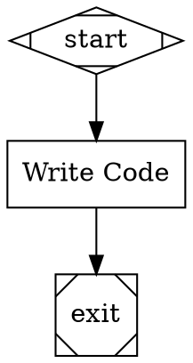

# Stage 6a: Workspace Configuration, Session Branches, and Per-Turn Commits

## Overview

Add the foundational workspace layer: multi-repo workspace configuration in `orchestra.yaml`, session branch management, per-turn git commits with LLM-generated messages and agent metadata, and CXDB recording of agent turns with git SHAs. After this stage, every pipeline run creates a session branch, and agent changes are committed automatically with full traceability between git history and CXDB session data.

This is the first of three sub-stages decomposing Stage 6 (Git Integration and Workspace Management). It focuses on the core git integration that works for sequential (non-parallel) pipelines using the LangGraph backend. Worktree isolation for parallel agents is deferred to Stage 6b. MCP tool server and CLI agent integration are deferred to Stage 6b. Remote git operations are deferred to Stage 6c.

## What a Human Can Do After This Stage

1. Configure workspaces in `orchestra.yaml` with one or more repos
2. Run a pipeline and see it create session branches (`orchestra/pipeline-name/session-id`)
3. Observe agents commit their changes to the session branch automatically after each turn
4. See LLM-generated commit messages (not generic "auto-commit")
5. Inspect commit author and git trailers tracing back to the CXDB session/node/turn
6. Correlate CXDB AgentTurn entries with git commits via SHA
7. Use `git log` on the session branch to see the full history of agent changes
8. Find their repo back on its original branch after the pipeline completes (session branch still exists for inspection)

## Prerequisites

- Stage 5 complete (parallel execution — needed for handler registry integration)
- Stage 2b complete (checkpoint/resume — CXDB recording extends existing checkpoint infrastructure)

## Scope

### Included

- **Multi-Repo Workspace Configuration.** `workspace.repos` section in `orchestra.yaml`: named repos with paths and branch prefixes. Single-repo is the degenerate case. Repo-qualified tool naming (`backend:run-tests`).
- **Session Branches.** At pipeline start, create a session branch in each workspace repo: `{branch_prefix}{pipeline-name}/{session-short-id}`. Record base commit SHA and original branch per repo. On pipeline completion or failure, restore original branch in each repo. Session branches are left in place for user to merge/delete.
- **Git Operations Layer.** Thin wrapper around subprocess `git` CLI calls — no external git library dependency. Provides: `create_branch`, `checkout`, `add`, `commit`, `status`, `log`, `rev_parse`, `diff`. All operations take a `cwd` parameter for repo path.
- **Per-Turn Commits (via `on_turn` callback).** The workspace layer hooks into the `on_turn` callback from CodergenBackend (implemented in Stage 3). After each agent turn that has `files_written`, the workspace layer: (1) stages exactly those files with `git add`, (2) generates a commit message via an LLM call (cheap model tier) from the diff and agent intent, (3) commits with agent metadata (author and git trailers), (4) records the SHA in the `dev.orchestra.AgentTurn` CXDB turn.
- **LLM Commit Message Generation.** A dedicated `CommitMessageGenerator` class that uses the `cheap` model alias from the providers config (`resolve_model("cheap", ...)`) to generate a conventional commit message from the staged diff and a summary of the agent's intent (extracted from the turn's messages). The message has an imperative summary line (under 72 chars) and a brief description. Mockable in tests with a deterministic generator.
- **Agent Metadata in Git.** Each per-turn commit includes: commit author set to `{node_id} ({model}) <orchestra@local>`, and git trailers: `Orchestra-Model`, `Orchestra-Provider`, `Orchestra-Node`, `Orchestra-Pipeline`, `Orchestra-Session`, `Orchestra-Turn`. This enables tracing from any git commit back to the CXDB session/node/turn.
- **AgentTurnCompleted Event Emission.** The `on_turn` callback is always wired (with or without workspace) to emit `AgentTurnCompleted` events via the `EventDispatcher`. This fixes the existing gap where `CxdbObserver._append_agent_turn()` and `StdoutObserver` handle `AgentTurnCompleted` but nothing emits it. When workspace is configured, the callback chain is: git commit first, then emit event with `git_sha` populated. When no workspace is configured, a simple callback just emits the event. This ensures CXDB always records agent turn data.
- **Per-Turn CXDB Recording.** Each agent turn (whether or not it has file writes) is recorded as a `dev.orchestra.AgentTurn` CXDB turn with: turn_number, model, provider, messages, tool_calls, files_written, token_usage, git_sha (empty string if no files changed), commit_message, and agent_state_ref.
- **Workspace Events.** Events for branch creation (`SessionBranchCreated`) and per-turn commit (`AgentCommitCreated`).
- **RepoContext.** Context object passed to tools containing repo path, current branch, and git state. (Worktree path added in 6b.)
- **Repo-Scoped Built-In Tools.** Auto-generate per-repo versions of built-in tools (read-file, write-file, edit-file, search-code) that operate on the repo's working directory. Write tools call the WriteTracker (from Stage 3) to record modifications. Tool factory generates `{repo_name}:read-file`, `{repo_name}:write-file`, etc.

### Excluded (deferred)

- MCP tool server for CLI agents — repo-scoped write tools over stdio (Stage 6b)
- CLI agent abstraction — tool restrictions, MCP server config, Claude Code adapter (Stage 6b)
- CLI agent per-turn commits — CLIAgentBackend on_turn after subprocess (Stage 6b)
- Worktree-per-agent isolation for parallel execution (Stage 6b)
- Worktree merge at fan-in (Stage 6b)
- Workspace snapshots in Checkpoint turns (Stage 6b)
- Resume at agent turn granularity (Stage 6b)
- Replay at agent turn granularity (Stage 6b)
- Remote git operations — clone, fetch, push (Stage 6c)
- Push policies (Stage 6c)
- `orchestra cleanup` CLI command (Stage 6c)
- Multi-repo coordination atomicity (deferred indefinitely)
- Transactional semantics across repos (deferred indefinitely)

### Workspace Configuration (Local Only)

```yaml
# orchestra.yaml — single repo workspace
workspace:
  repos:
    project:
      path: ./my-project
      branch_prefix: orchestra/

# orchestra.yaml — multi-repo workspace
workspace:
  repos:
    backend:
      path: /workspace/backend
      branch_prefix: orchestra/
    frontend:
      path: /workspace/frontend
      branch_prefix: orchestra/
```

Note: `remote`, `push`, and `clone_depth` fields are recognized but ignored in 6a. They are implemented in Stage 6c.

## Investigation

- [x] Review how `on_turn` callback is currently defined and wired (or not) in production code
  - `CodergenHandler.__init__` accepts `on_turn: OnTurnCallback | None = None` (`src/orchestra/handlers/codergen_handler.py:20`)
  - `default_registry()` at `src/orchestra/handlers/registry.py:44` creates `CodergenHandler(backend=backend, config=config)` — **no on_turn passed**
  - `LangGraphBackend.run()` at `src/orchestra/backends/langgraph_backend.py:34` accepts `on_turn` and fires it for each tool-calling step with `AgentTurn` including `files_written` from `WriteTracker.flush()`
  - `CLIAgentBackend.run()` accepts `on_turn` but never calls it (subprocess-based, no per-turn visibility)
  - **Gap confirmed**: on_turn is defined in protocol and supported by handler/backend, but never wired in production. `default_registry()` needs an `on_turn` parameter.

- [x] Review how WriteTracker integrates with builtins and LangGraphBackend
  - `WriteTracker` at `src/orchestra/backends/write_tracker.py` — simple `record(path)`/`flush()` with dict-backed storage
  - `write-file` and `edit-file` builtins accept optional `write_tracker` parameter and call `record()` on write
  - `LangGraphBackend` has a `_write_tracker` instance, calls `flush()` after each tool-calling step, populates `AgentTurn.files_written`
  - **Key**: `files_written` from `AgentTurn` tells the workspace layer exactly which files to `git add`

- [x] Review existing CXDB type bundle for AgentTurn v1 schema
  - `dev.orchestra.AgentTurn` v1 at `src/orchestra/storage/type_bundle.py:132-165` — fields: turn_number, node_id, model, provider, messages, tool_calls, files_written, token_usage, agent_state
  - `CxdbObserver._append_agent_turn()` at `src/orchestra/events/observer.py:157` emits v1 data from `AgentTurnCompleted` event
  - **Need**: v2 adds `git_sha` (field 10) and `commit_message` (field 11)

- [x] Review CLIAgentBackend for MCP/tool restriction integration points
  - `CLIAgentBackend` at `src/orchestra/backends/cli_agent.py` — runs `claude` command via subprocess with `--` args and env vars
  - No MCP server support, no tool restriction flags
  - `build_backend()` at `src/orchestra/cli/backend_factory.py:33` creates `CLIAgentBackend()` with no configuration
  - `on_turn` is accepted but never called — no per-turn visibility for CLI agents
  - **Deferred to 6b**: MCP tool server, CLI agent abstraction, and CLI per-turn commits. In 6a, workspace with CLI backend logs a warning that per-turn commits are not supported.

- [x] Confirm AgentTurnCompleted events are never emitted
  - `CxdbObserver._append_agent_turn()` at `observer.py:157` handles `AgentTurnCompleted` events
  - `StdoutObserver.on_event()` at `observer.py:53` handles `AgentTurnCompleted` events
  - **No code anywhere emits `AgentTurnCompleted`** — this is dead code from Stage 3
  - Stage 3 plan (line 431) intended: "Pass `on_turn` callback that emits `AgentTurnCompleted` events" — never implemented
  - **Fix in 6a**: Always wire an `on_turn` callback that emits `AgentTurnCompleted` via `EventDispatcher`, regardless of workspace config

- [x] Review cli/run.py for workspace integration points
  - `run()` at `src/orchestra/cli/run.py:25` — loads config, parses graph, connects CXDB, builds backend and registry, runs pipeline
  - Integration point: between `build_backend()` (line 111) and `runner.run()` (line 125) — insert workspace setup, pass on_turn to registry
  - `display_id` (line 93) serves as session ID for branch naming

- [x] Confirm no existing MCP or git infrastructure in codebase
  - No MCP code exists anywhere in `src/orchestra/`
  - No git utility code exists — this is all new

## Plan

### 1. Add workspace configuration models to OrchestraConfig

- [x] Create `RepoConfig` Pydantic model with fields: `path: str`, `branch_prefix: str = "orchestra/"`, `remote: str = ""` (recognized but ignored in 6a), `push: str = ""` (recognized but ignored), `clone_depth: int = 0` (recognized but ignored)
  - [x] Update `src/orchestra/config/settings.py` — add `RepoConfig` and `WorkspaceConfig` models
  - [x] `WorkspaceConfig` has `repos: dict[str, RepoConfig] = Field(default_factory=dict)`
  - [x] Add `workspace: WorkspaceConfig = WorkspaceConfig()` to `OrchestraConfig`
  - [x] Path resolution: relative paths resolved against `config_dir` (the directory containing `orchestra.yaml`)
  - [x] Write unit tests: `tests/unit/test_workspace_config.py` — parse single repo, multi-repo, empty workspace, relative path resolution, unknown fields ignored
  - [x] Run tests, verify passing
  - [x] Mark TODO complete and commit the changes to git

### 2. Create git operations layer

- [x] Create `src/orchestra/workspace/__init__.py` (empty package init)
- [x] Create `src/orchestra/workspace/git_ops.py` — thin subprocess wrapper around git CLI
  - [x] `run_git(*args, cwd: Path) -> str` — core runner, raises `GitError` on non-zero exit
  - [x] `GitError(Exception)` with `returncode`, `stderr`, `command` fields
  - [x] `rev_parse(ref: str, cwd: Path) -> str` — resolve ref to SHA
  - [x] `create_branch(name: str, cwd: Path) -> None` — `git checkout -b {name}`
  - [x] `checkout(ref: str, cwd: Path) -> None` — `git checkout {ref}`
  - [x] `add(paths: list[str], cwd: Path) -> None` — `git add` exactly the listed paths
  - [x] `commit(message: str, author: str, trailers: dict[str, str], cwd: Path) -> str` — `git commit` with `--author` and `--trailer` flags, returns commit SHA via `rev_parse("HEAD")`
  - [x] `status(cwd: Path) -> str` — `git status --porcelain`
  - [x] `log(n: int, format: str, cwd: Path) -> str` — `git log -n {n} --format={format}`
  - [x] `diff(staged: bool, cwd: Path) -> str` — `git diff` or `git diff --cached`
  - [x] `is_git_repo(path: Path) -> bool` — check if path is inside a git working tree
  - [x] `current_branch(cwd: Path) -> str` — `git rev-parse --abbrev-ref HEAD`
  - [x] Write unit tests: `tests/unit/test_git_ops.py` — use `git init` in tmp dirs to test each operation. Test: create_branch, checkout, add+commit, rev_parse, status, diff, is_git_repo, GitError on bad commands
  - [x] Run tests, verify passing
  - [x] Mark TODO complete and commit the changes to git

### 3. Create session branch manager

- [x] Create `src/orchestra/workspace/session_branch.py`
  - [x] `create_session_branches(repos: dict[str, RepoConfig], pipeline_name: str, session_id: str, config_dir: Path) -> dict[str, SessionBranchInfo]`
  - [x] `SessionBranchInfo` dataclass: `repo_name: str`, `repo_path: Path`, `branch_name: str`, `base_sha: str`, `original_branch: str`
  - [x] For each repo: resolve path (relative to config_dir), validate it's a git repo, record original branch (`current_branch()`), record base SHA (`rev_parse("HEAD")`), create branch `{prefix}{pipeline_name}/{session_id}`, checkout branch
  - [x] `restore_original_branches(branch_infos: dict[str, SessionBranchInfo]) -> None` — for each repo, checkout the `original_branch`. Called on pipeline completion or failure. Logs warnings on checkout failures (e.g., conflicts) but does not raise.
  - [x] Branch naming: sanitize pipeline_name (replace spaces/special chars with hyphens)
  - [x] Validation: raise `WorkspaceError` if repo path doesn't exist, isn't a git repo, or HEAD is invalid
  - [x] Write unit tests: `tests/unit/test_session_branch.py` — branch creation, naming convention, base SHA recording, original branch recorded, multi-repo, branch persists after function returns, validation errors for bad paths, original branch restored after restore call
  - [x] Run tests, verify passing
  - [x] Mark TODO complete and commit the changes to git

### 4. Add workspace events

- [x] Update `src/orchestra/events/types.py`
  - [x] Add `SessionBranchCreated(Event)` — fields: `repo_name: str`, `branch_name: str`, `base_sha: str`, `repo_path: str`
  - [x] Add `AgentCommitCreated(Event)` — fields: `repo_name: str`, `node_id: str`, `sha: str`, `message: str`, `files: list[str]`, `turn_number: int`
  - [x] Add both to `EVENT_TYPE_MAP`
- [x] Update `src/orchestra/events/observer.py`
  - [x] `StdoutObserver.on_event()` — handle `SessionBranchCreated` (log branch name) and `AgentCommitCreated` (log SHA and message summary)
  - [x] `CxdbObserver.on_event()` — no CXDB recording needed for these events (they're informational; the git data flows through AgentTurn v2)
- [x] Write unit tests: test event construction, StdoutObserver output for new events
- [x] Run tests, verify passing
- [x] Mark TODO complete and commit the changes to git

### 5. Extend AgentTurn model and CXDB type bundle

- [x] Update `src/orchestra/models/agent_turn.py`
  - [x] Add `git_sha: str = ""` and `commit_message: str = ""` fields to `AgentTurn` dataclass
  - [x] Update `to_dict()` to include new fields
- [x] Update `src/orchestra/events/types.py`
  - [x] Add `git_sha: str = ""` and `commit_message: str = ""` to `AgentTurnCompleted` event
- [x] Update `src/orchestra/storage/type_bundle.py`
  - [x] Add `dev.orchestra.AgentTurn` v2 with fields 1-9 (same as v1) plus field `10: git_sha (string, optional)` and field `11: commit_message (string, optional)`
- [x] Update `src/orchestra/events/observer.py`
  - [x] `CxdbObserver._append_agent_turn()` — emit v2 with `git_sha` and `commit_message` fields; use `type_version=2`
- [x] Write unit tests: verify AgentTurn.to_dict() includes new fields, verify CxdbObserver emits v2 data
- [x] Run existing tests to ensure backward compatibility
- [x] Mark TODO complete and commit the changes to git

### 6. Create commit message generator

- [x] Create `src/orchestra/workspace/commit_message.py`
  - [x] `CommitMessageGenerator` protocol/ABC with `generate(diff: str, intent: str) -> str`
  - [x] `LLMCommitMessageGenerator` — uses `resolve_model("cheap", ...)` and a LangChain ChatModel to generate messages
    - [x] Prompt template: given a git diff and a summary of the agent's intent, produce a conventional commit message with imperative summary line (under 72 chars) and brief description
    - [x] Extracts intent from the agent turn's most recent human message (or a summary of tool calls)
    - [x] On any error (API failure, timeout, malformed response): logs a warning, returns fallback message
  - [x] `DeterministicCommitMessageGenerator` — returns `"chore: auto-commit agent changes\n\nFiles: {file_list}"`. Used in tests and as fallback.
  - [x] `build_commit_message_generator(config: OrchestraConfig) -> CommitMessageGenerator` factory function
    - [x] Resolves `cheap` model alias; if it can't resolve (literal "cheap" returned), raise `WorkspaceError` with clear message to configure the alias
    - [x] Builds a LangChain ChatModel for the cheap tier (reuse pattern from `backend_factory.build_chat_model()` but with the cheap alias)
  - [x] Write unit tests: `tests/unit/test_commit_message_generator.py` — test LLM generator with mocked model, test deterministic generator, test fallback on error, test message format validation (summary line length, imperative mood heuristic), test intent extraction from messages
  - [x] Run tests, verify passing
  - [x] Mark TODO complete and commit the changes to git

### 7. Create RepoContext and repo-scoped tool factory

- [x] Create `src/orchestra/workspace/repo_context.py`
  - [x] `RepoContext` dataclass: `name: str`, `path: Path`, `branch: str`, `base_sha: str`
- [x] Create `src/orchestra/workspace/repo_tools.py`
  - [x] `create_repo_tools(repos: dict[str, RepoContext], write_tracker: WriteTracker) -> list[Tool]`
  - [x] For each repo, generate: `{repo}:read-file`, `{repo}:write-file`, `{repo}:edit-file`, `{repo}:search-code`
  - [x] Read tools resolve `path` argument relative to `repo.path`
  - [x] Write tools resolve path relative to `repo.path` AND call `write_tracker.record(absolute_path)`
  - [x] Path validation: reject paths that escape the repo directory (no `../` traversal)
  - [x] Return list of `Tool` instances for registration
- [x] Write unit tests: `tests/unit/test_repo_tools.py` — tool naming, path resolution, write tracking, path traversal rejection, multi-repo generates correct tool set
- [x] Run tests, verify passing
- [x] Mark TODO complete and commit the changes to git

### 8. Create WorkspaceManager

- [x] Create `src/orchestra/workspace/workspace_manager.py`
  - [x] `WorkspaceManager` class — the central orchestrator for workspace operations
  - [x] `__init__(config: OrchestraConfig, event_emitter: EventEmitter, commit_gen: CommitMessageGenerator)`
  - [x] `setup_session(pipeline_name: str, session_id: str) -> dict[str, RepoContext]`
    - [x] Validate workspace config (repo paths exist, are git repos, HEAD valid)
    - [x] Create session branches in each repo via `session_branch.create_session_branches()`
    - [x] Emit `SessionBranchCreated` events
    - [x] Store session metadata: pipeline_name, session_id, repo contexts, branch infos
    - [x] Return repo contexts for tool generation
  - [x] `teardown_session() -> None` — restore original branches in each repo
    - [x] Calls `session_branch.restore_original_branches(self._branch_infos)`
    - [x] Safe to call multiple times (idempotent)
    - [x] Logs warnings on failure but does not raise — pipeline completion/failure should not be blocked by branch restoration issues
  - [x] `on_turn_callback(turn: AgentTurn) -> None` — the on_turn callback passed to CodergenHandler
    - [x] `_current_node_id` tracked via EventObserver (see below). Note: `AgentTurn` does not have a `node_id` field — the node_id for git trailers comes from `_current_node_id` which is set by `StageStarted` events before `on_turn` fires.
    - [x] If `turn.files_written` is empty: emit `AgentTurnCompleted` event (with empty `git_sha`), return
    - [x] For each repo that has modified files (match `files_written` paths to repo directories):
      - [x] `git_ops.add(files, cwd=repo_path)` — stage exactly the written files
      - [x] `git_ops.diff(staged=True, cwd=repo_path)` — get staged diff for commit message
      - [x] Generate commit message via `commit_gen.generate(diff, intent)`
      - [x] Build author string: `{node_id} ({turn.model}) <orchestra@local>`
      - [x] Build trailers dict: `Orchestra-Model`, `Orchestra-Provider`, `Orchestra-Node`, `Orchestra-Pipeline`, `Orchestra-Session`, `Orchestra-Turn`
      - [x] `git_ops.commit(message, author, trailers, cwd=repo_path)` — commit with metadata
      - [x] Get SHA via return value of commit
      - [x] Set `turn.git_sha = sha`, `turn.commit_message = message`
      - [x] Emit `AgentCommitCreated` event
    - [x] After git operations (or if no files_written): emit `AgentTurnCompleted` event via `event_emitter` with all turn data including `git_sha` and `commit_message`. This is what triggers `CxdbObserver._append_agent_turn()` and `StdoutObserver` logging.
  - [x] Implement `EventObserver` protocol (`on_event(event: Event)`)
    - [x] On `StageStarted`: update `_current_node_id = event.node_id`
    - [x] On `StageCompleted`/`StageFailed`: clear `_current_node_id`
  - [x] `has_workspace` property — True if workspace config has repos
  - [x] Write unit tests: `tests/unit/test_workspace_manager.py` — setup creates branches, on_turn with writes commits, on_turn without writes skips, on_turn always emits AgentTurnCompleted, correct author/trailers, event emission, node tracking via EventObserver, teardown restores branches, teardown is idempotent
  - [x] Run tests, verify passing
  - [x] Mark TODO complete and commit the changes to git

### 9. Wire on_turn callback through handler registry

- [x] Update `src/orchestra/handlers/registry.py`
  - [x] Add `on_turn: OnTurnCallback | None = None` parameter to `default_registry()`
  - [x] Pass `on_turn` to `CodergenHandler(backend=backend, config=config, on_turn=on_turn)` at line 44
  - [x] Also pass to `CodergenDispatcher` and `InteractiveHandler` if they accept on_turn (check if needed — both route to backends that accept on_turn)
- [x] Update existing tests that call `default_registry()` to ensure they still pass (parameter is optional, defaults to None)
- [x] Write unit test: verify that when `on_turn` is provided, `CodergenHandler` receives it and passes it to `backend.run()`
- [x] Run tests, verify passing
- [x] Mark TODO complete and commit the changes to git

### 10. Integrate workspace into CLI run command

- [x] Create `src/orchestra/workspace/on_turn.py`
  - [x] `build_on_turn_callback(event_emitter: EventEmitter, workspace_manager: WorkspaceManager | None = None) -> OnTurnCallback`
    - [x] Returns a callback function that:
      1. If `workspace_manager` is not None: calls `workspace_manager.on_turn_callback(turn)` (which does git commit AND emits `AgentTurnCompleted`)
      2. If `workspace_manager` is None: emits `AgentTurnCompleted` event directly via `event_emitter` with data from the `AgentTurn` (no git fields)
    - [x] This ensures `AgentTurnCompleted` is always emitted regardless of workspace config, fixing the existing dead-code gap where `CxdbObserver._append_agent_turn()` was never triggered
  - [x] Write unit tests: callback emits AgentTurnCompleted with workspace=None, callback delegates to workspace_manager when present
- [x] Update `src/orchestra/cli/run.py`
  - [x] After `build_backend(config)` and before `default_registry()`:
    - [x] If `config.workspace.repos` is non-empty:
      - [x] If `config.backend == "cli"`: log warning that per-turn commits are not supported for CLI backend (deferred to 6b), skip workspace setup, set `workspace_manager = None`
      - [x] Otherwise: build commit message generator via `build_commit_message_generator(config)`, construct `WorkspaceManager`, call `workspace_manager.setup_session(pipeline_name, display_id)` to create branches, generate repo-scoped tools via `create_repo_tools()`, add `WorkspaceManager` as an `EventObserver` to `dispatcher`
    - [x] If `config.workspace.repos` is empty: set `workspace_manager = None`
  - [x] Build on_turn callback via `build_on_turn_callback(dispatcher, workspace_manager)` — always returns a callback, never None
  - [x] Pass `on_turn` to `default_registry()`
  - [x] Wrap `runner.run()` in try/finally to call `workspace_manager.teardown_session()` on completion or failure (restores original branches)
  - [x] Handle `WorkspaceError` with clear error messages and `typer.Exit(code=1)`
- [x] Write integration test: `tests/integration/test_workspace_cli_integration.py` — verify that running the CLI with a workspace-configured orchestra.yaml creates branches and commits, and restores original branch on completion
- [x] Run tests, verify passing
- [x] Mark TODO complete and commit the changes to git

### 11. Write integration tests for per-turn commits and CXDB

- [x] Create `tests/integration/test_per_turn_commits.py`
  - [x] Fixture: create a temp git repo with an initial commit, construct workspace config pointing to it
  - [x] Test: agent turn with writes → exactly those files committed to session branch
  - [x] Test: only tracked files staged (other dirty files untouched)
  - [x] Test: turn without writes → no commit
  - [x] Test: 3 turns with writes → 3 separate commits on session branch
  - [x] Test: commit author matches `{node_id} ({model}) <orchestra@local>`
  - [x] Test: commit has all 6 trailers (Orchestra-Model, Orchestra-Provider, Orchestra-Node, Orchestra-Pipeline, Orchestra-Session, Orchestra-Turn)
  - [x] Test: commit message generated by mock LLM
- [x] Create `tests/integration/test_cxdb_agent_turns.py`
  - [x] Test: AgentTurn with writes has SHA populated
  - [x] Test: AgentTurn without writes has empty SHA
  - [x] Test: AgentTurnCompleted emitted for every turn (with and without workspace)
  - [x] Test: bidirectional correlation — AgentTurn.git_sha matches git commit, git trailer values match CXDB session/turn
- [x] Create `tests/integration/test_workspace_e2e.py`
  - [x] Test: full lifecycle — pipeline starts, branches created, agent modifies files across turns, per-turn commits with metadata, AgentTurn CXDB turns with SHAs, pipeline completes, original branches restored, session branches still exist
  - [x] Test: multi-repo pipeline — 2 repos, separate branches and commits per repo
  - [x] Test: pipeline failure mid-run — original branches still restored via finally block
  - [x] Test: no workspace configured — AgentTurnCompleted still emitted, CXDB recording works, no git operations
- [x] Run all tests, verify passing
- [x] Mark TODO complete and commit the changes to git

### 12. Identify and run all specs that need updating

- [x] Look at all previous TODOs and changes in git to identify modified files
- [x] Run existing test suite: `pytest tests/` to catch any regressions
  - [x] Especially: `tests/unit/test_settings.py` (config changes), `tests/unit/test_observer.py` (event/observer changes), `tests/unit/test_type_bundle.py` (CXDB changes), `tests/unit/test_registry.py` (handler registry changes), `tests/unit/test_agent_turn.py` (model changes)
- [x] Fix any failing tests from modifications to existing modules
- [x] Identify any missing test coverage for edge cases:
  - [x] Workspace with no repos configured (should be no-op)
  - [x] Repo path that doesn't exist (clear error)
  - [x] Repo path that exists but isn't a git repo (clear error)
  - [x] Dirty working tree at session start (should still work — create branch from current state)
  - [x] Commit with empty diff (should not happen due to files_written check, but defensive)
  - [x] LLM commit message generation timeout/failure (fallback message)
  - [x] Branch restoration on success and on failure
  - [x] Branch restoration when original branch has been deleted externally (log warning, don't raise)
  - [x] CLI backend with workspace configured (warning logged, no git operations, AgentTurnCompleted still emitted)
- [x] Add any missing tests as new test cases
- [x] Mark TODO complete and commit the changes to git

### 13. Identify unused code and clean up

- [x] Look at all previous TODOs and changes in git to identify changes
- [x] Identify any code that is no longer used, and remove it
- [x] Identify any unnecessary comments, and remove them (comments that explain "what" for a single line of code)
- [x] If there are any obvious code smells of redundant code, add TODOs below to address them (for example, multiple new classes include private methods that perform similar functions, or are large with many private methods that could be extracted)
- [x] Verify imports are clean — no unused imports in modified files
- [x] Ensure consistent code style across new modules (type annotations, docstrings for public APIs only)
- [x] Mark TODO complete and commit the changes to git

## Automated End-to-End Tests

Tests use temporary git repositories created in a test fixture. No external git repos or network access.

### Session Branch Tests

| Test | Description |
|------|-------------|
| Branch creation | Pipeline start → session branch created in each workspace repo |
| Branch naming | Branch name follows `{prefix}{pipeline}/{session-id}` convention |
| Base SHA recorded | Base commit SHA recorded for each repo at session start |
| Original branch recorded | Original branch name recorded for each repo at session start |
| Branch persists | After pipeline completion, session branch still exists (not deleted) |
| Original branch restored on success | After pipeline completion, repo is back on original branch |
| Original branch restored on failure | After pipeline failure, repo is back on original branch |
| Multi-repo branches | 2 repos configured → 2 session branches created, one per repo |

### Per-Turn Commit Tests

| Test | Description |
|------|-------------|
| Turn with writes committed | Agent turn writes a file → exactly that file committed to session branch |
| Only tracked files staged | Agent turn writes `a.py` → only `a.py` staged, not other dirty files |
| Turn without writes no commit | Agent turn that only reads files → no commit |
| Multiple turns multiple commits | 3 turns with writes → 3 separate commits on session branch |
| Commit message via LLM | Commit message generated by LLM from diff and agent intent |
| Commit message format | First line under 72 chars, imperative mood, blank line, description |
| Agent metadata in author | Commit author is `{node_id} ({model}) <orchestra@local>` |
| Agent metadata in trailers | Commit has trailers: Orchestra-Model, Orchestra-Provider, Orchestra-Node, Orchestra-Pipeline, Orchestra-Session, Orchestra-Turn |

### Per-Turn CXDB Recording Tests

| Test | Description |
|------|-------------|
| AgentTurnCompleted always emitted | Each agent loop turn → `AgentTurnCompleted` event emitted (with or without workspace) |
| AgentTurn recorded per turn | Each agent loop turn → `dev.orchestra.AgentTurn` CXDB turn appended |
| AgentTurn with writes has SHA | Turn that writes files → AgentTurn.git_sha populated with commit SHA |
| AgentTurn without writes empty SHA | Read-only turn → AgentTurn.git_sha is empty string |
| AgentTurn contains messages | AgentTurn payload includes LLM messages for that turn |
| AgentTurn contains tool calls | AgentTurn payload includes tool calls made in that turn |
| AgentTurn contains model metadata | AgentTurn payload includes model and provider strings |
| AgentTurn contains agent state | AgentTurn payload includes agent_state_ref for resume |
| No workspace still records turns | Pipeline without workspace config → AgentTurnCompleted emitted → CXDB records turns (without git fields) |

### Repo-Scoped Tools Tests

| Test | Description |
|------|-------------|
| Tool factory generates per-repo tools | Workspace with 2 repos → `backend:read-file`, `frontend:read-file`, etc. |
| Read resolves relative to repo | `backend:read-file` with path `src/main.py` reads from backend repo |
| Write records via WriteTracker | `backend:write-file` calls WriteTracker.record() |
| Write resolves to repo path | `frontend:write-file` writes to frontend repo directory |

### End-to-End Integration Tests

| Test | Description |
|------|-------------|
| Full workspace lifecycle | Pipeline starts → branches created → agent modifies files across multiple turns → per-turn commits with LLM messages and metadata → AgentTurn CXDB turns with SHAs → pipeline completes → original branches restored → session branches remain |
| Per-turn commit chain | Agent makes 3 turns with writes → `git log` shows 3 commits with correct authors and trailers → CXDB has 3 AgentTurns with corresponding SHAs |
| Bidirectional correlation | Given CXDB AgentTurn → can checkout git_sha → code matches. Given git commit → trailers identify CXDB session/turn |
| Multi-repo pipeline | Pipeline modifies files in 2 repos → separate branches, per-turn commits per repo |
| Pipeline failure restores branches | Pipeline fails mid-run → original branches restored, partial commits preserved on session branch |
| No workspace pipeline | Pipeline runs without workspace config → AgentTurnCompleted emitted and CXDB records turns, no git operations |
| CLI backend warning | CLI backend with workspace config → warning logged, pipeline still runs, no per-turn commits |

## Manual Testing Guide

### Prerequisites
- Stage 5 complete and passing
- A git repository to use as a workspace (can be a fresh test repo)
- LLM API key configured (for commit message generation)

### Test 1: Session Branches and Per-Turn Commits

Create `orchestra.yaml` with a workspace pointing to a test git repo:
```yaml
workspace:
  repos:
    project:
      path: ./test-repo
      branch_prefix: orchestra/
```

Create a simple pipeline that modifies a file:


Run: `orchestra run test-git.dot`

**Verify:**
- The test repo is back on its original branch (e.g., `main`) after the pipeline completes
- `git branch` in the test repo shows a new branch: `orchestra/test-git/{session-id}`
- `git log orchestra/test-git/{session-id}` shows per-turn commits (one per agent turn that wrote files)
- Each commit has a meaningful LLM-generated message (not a generic "auto-commit")
- Each commit author is `code ({model}) <orchestra@local>`
- Each commit has `Orchestra-Model`, `Orchestra-Node`, `Orchestra-Session`, `Orchestra-Turn` trailers
- The main branch is unchanged
- CXDB shows AgentTurn entries with git SHAs matching the commit SHAs

## Success Criteria

- [ ] Workspace config parsed from `orchestra.yaml` with `workspace.repos` section
- [ ] Session branches created at pipeline start, one per workspace repo
- [ ] Branch naming follows `{prefix}{pipeline}/{session-id}` convention
- [ ] Original branches restored after pipeline completion or failure
- [ ] Per-turn commits: each agent turn with file writes produces a commit with only the written files staged
- [ ] Commit messages generated by LLM (cheap tier) from staged diff and agent intent
- [ ] Agent metadata in every commit: author identifies agent/model, git trailers provide session/node/turn/model/provider
- [ ] `AgentTurnCompleted` events always emitted (with or without workspace config), fixing existing dead-code gap
- [ ] `dev.orchestra.AgentTurn` CXDB turns recorded for each agent loop turn with messages, tool calls, files written, git SHA, and agent state
- [ ] Bidirectional correlation: CXDB AgentTurn → git SHA, and git commit trailers → CXDB session/node/turn
- [ ] Repo-scoped built-in tools operate on the correct repo directory and record writes via WriteTracker
- [ ] Multi-repo workspaces work with independent branches and commits per repo
- [ ] CLI backend with workspace config logs a warning (per-turn commits deferred to 6b)
- [ ] A human can run a pipeline, inspect per-turn commits with `git log` (seeing agent metadata), and correlate with CXDB turns
- [ ] All automated tests pass using temporary git repositories
