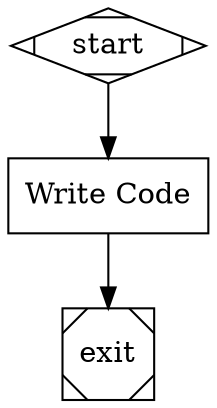

# Stage 6a: Workspace Configuration, Session Branches, and Per-Turn Commits

## Overview

Add the foundational workspace layer: multi-repo workspace configuration in `orchestra.yaml`, session branch management, per-turn git commits with LLM-generated messages and agent metadata, and CXDB recording of agent turns with git SHAs. After this stage, every pipeline run creates a session branch, and agent changes are committed automatically with full traceability between git history and CXDB session data.

This is the first of three sub-stages decomposing Stage 6 (Git Integration and Workspace Management). It focuses on the core git integration that works for sequential (non-parallel) pipelines. Worktree isolation for parallel agents is deferred to Stage 6b. Remote git operations are deferred to Stage 6c.

## What a Human Can Do After This Stage

1. Configure workspaces in `orchestra.yaml` with one or more repos
2. Run a pipeline and see it create session branches (`orchestra/pipeline-name/session-id`)
3. Observe agents commit their changes to the session branch automatically after each turn
4. See LLM-generated commit messages (not generic "auto-commit")
5. Inspect commit author and git trailers tracing back to the CXDB session/node/turn
6. Correlate CXDB AgentTurn entries with git commits via SHA
7. Use `git log` on the session branch to see the full history of agent changes

## Prerequisites

- Stage 5 complete (parallel execution — needed for handler registry integration)
- Stage 2b complete (checkpoint/resume — CXDB recording extends existing checkpoint infrastructure)

## Scope

### Included

- **Multi-Repo Workspace Configuration.** `workspace.repos` section in `orchestra.yaml`: named repos with paths and branch prefixes. Single-repo is the degenerate case. Repo-qualified tool naming (`backend:run-tests`).
- **Session Branches.** At pipeline start, create a session branch in each workspace repo: `{branch_prefix}{pipeline-name}/{session-short-id}`. Record base commit SHA per repo. Branches left in place on completion for user to merge/delete.
- **Git Operations Layer.** Thin wrapper around subprocess `git` CLI calls — no external git library dependency. Provides: `create_branch`, `checkout`, `add`, `commit`, `status`, `log`, `rev_parse`, `diff`. All operations take a `cwd` parameter for repo path.
- **Per-Turn Commits (via `on_turn` callback).** The workspace layer hooks into the `on_turn` callback from CodergenBackend (implemented in Stage 3). After each agent turn that has `files_written`, the workspace layer: (1) stages exactly those files with `git add`, (2) generates a commit message via an LLM call (cheap model tier) from the diff and agent intent, (3) commits with agent metadata (author and git trailers), (4) records the SHA in the `dev.orchestra.AgentTurn` CXDB turn.
- **LLM Commit Message Generation.** A dedicated `CommitMessageGenerator` class that uses the `cheap` model alias from the providers config (`resolve_model("cheap", ...)`) to generate a conventional commit message from the staged diff and a summary of the agent's intent (extracted from the turn's messages). The message has an imperative summary line (under 72 chars) and a brief description. Mockable in tests with a deterministic generator.
- **Agent Metadata in Git.** Each per-turn commit includes: commit author set to `{node_id} ({model}) <orchestra@local>`, and git trailers: `Orchestra-Model`, `Orchestra-Provider`, `Orchestra-Node`, `Orchestra-Pipeline`, `Orchestra-Session`, `Orchestra-Turn`. This enables tracing from any git commit back to the CXDB session/node/turn.
- **MCP Tool Server for CLI Agents.** Orchestra runs an MCP stdio server exposing repo-scoped write tools (`{repo}:write-file`, `{repo}:edit-file`). When CLIAgentBackend is used, the external agent is launched with native file-write tools disabled and Orchestra's MCP server attached. All file writes from any backend flow through Orchestra's WriteTracker, ensuring uniform per-turn commit behavior. No git-status fallback path is needed.
- **CLI Agent Abstraction.** CLIAgentBackend accepts a generic configuration for tool restrictions (allowed/disallowed tools) and MCP servers, hiding implementation details of the specific CLI agent. A concrete Claude Code adapter maps these to `--allowedTools` and `--mcp-server` flags. Other CLI agents can be supported by adding new adapters.
- **Per-Turn CXDB Recording.** Each agent turn (whether or not it has file writes) is recorded as a `dev.orchestra.AgentTurn` CXDB turn with: turn_number, model, provider, messages, tool_calls, files_written, token_usage, git_sha (null if no files changed), commit_message, and agent_state_ref.
- **Workspace Events.** Events for branch creation (`SessionBranchCreated`) and per-turn commit (`AgentCommitCreated`).
- **RepoContext.** Context object passed to tools containing repo path, current branch, and git state. (Worktree path added in 6b.)
- **Repo-Scoped Built-In Tools.** Auto-generate per-repo versions of built-in tools (read-file, write-file, edit-file, search-code) that operate on the repo's working directory. Write tools call the WriteTracker (from Stage 3) to record modifications. Tool factory generates `{repo_name}:read-file`, `{repo_name}:write-file`, etc.

### Excluded (deferred)

- Worktree-per-agent isolation for parallel execution (Stage 6b)
- Worktree merge at fan-in (Stage 6b)
- Workspace snapshots in Checkpoint turns (Stage 6b)
- Resume at agent turn granularity (Stage 6b)
- Replay at agent turn granularity (Stage 6b)
- Remote git operations — clone, fetch, push (Stage 6c)
- Push policies (Stage 6c)
- `orchestra cleanup` CLI command (Stage 6c)
- Multi-repo coordination atomicity (deferred indefinitely)
- Transactional semantics across repos (deferred indefinitely)

### Workspace Configuration (Local Only)

```yaml
# orchestra.yaml — single repo workspace
workspace:
  repos:
    project:
      path: ./my-project
      branch_prefix: orchestra/

# orchestra.yaml — multi-repo workspace
workspace:
  repos:
    backend:
      path: /workspace/backend
      branch_prefix: orchestra/
    frontend:
      path: /workspace/frontend
      branch_prefix: orchestra/
```

Note: `remote`, `push`, and `clone_depth` fields are recognized but ignored in 6a. They are implemented in Stage 6c.

## Automated End-to-End Tests

Tests use temporary git repositories created in a test fixture. No external git repos or network access.

### Session Branch Tests

| Test | Description |
|------|-------------|
| Branch creation | Pipeline start → session branch created in each workspace repo |
| Branch naming | Branch name follows `{prefix}{pipeline}/{session-id}` convention |
| Base SHA recorded | Base commit SHA recorded for each repo at session start |
| Branch persists | After pipeline completion, session branch still exists (not deleted) |
| Multi-repo branches | 2 repos configured → 2 session branches created, one per repo |

### Per-Turn Commit Tests

| Test | Description |
|------|-------------|
| Turn with writes committed | Agent turn writes a file → exactly that file committed to session branch |
| Only tracked files staged | Agent turn writes `a.py` → only `a.py` staged, not other dirty files |
| Turn without writes no commit | Agent turn that only reads files → no commit |
| Multiple turns multiple commits | 3 turns with writes → 3 separate commits on session branch |
| Commit message via LLM | Commit message generated by LLM from diff and agent intent |
| Commit message format | First line under 72 chars, imperative mood, blank line, description |
| Agent metadata in author | Commit author is `{node_id} ({model}) <orchestra@local>` |
| Agent metadata in trailers | Commit has trailers: Orchestra-Model, Orchestra-Provider, Orchestra-Node, Orchestra-Pipeline, Orchestra-Session, Orchestra-Turn |
| CLI writes via MCP | CLI backend writes through Orchestra MCP tools → WriteTracker fires → per-turn commits work |
| CLI native writes disabled | CLI backend cannot use native write tools → all writes go through Orchestra |

### Per-Turn CXDB Recording Tests

| Test | Description |
|------|-------------|
| AgentTurn recorded per turn | Each agent loop turn → `dev.orchestra.AgentTurn` CXDB turn appended |
| AgentTurn with writes has SHA | Turn that writes files → AgentTurn.git_sha populated with commit SHA |
| AgentTurn without writes null SHA | Read-only turn → AgentTurn.git_sha is null |
| AgentTurn contains messages | AgentTurn payload includes LLM messages for that turn |
| AgentTurn contains tool calls | AgentTurn payload includes tool calls made in that turn |
| AgentTurn contains model metadata | AgentTurn payload includes model and provider strings |
| AgentTurn contains agent state | AgentTurn payload includes agent_state_ref for resume |

### MCP Tool Server Tests

| Test | Description |
|------|-------------|
| MCP server starts | MCP stdio server starts and exposes repo-scoped tools |
| MCP write routes through WriteTracker | Write via MCP tool → WriteTracker.record() called |
| MCP read resolves to repo | Read via MCP tool resolves path relative to repo directory |
| CLI agent receives MCP config | CLIAgentBackend passes MCP server to external agent via abstracted interface |
| CLI agent write tools disabled | External agent launched with native file-write tools disabled |

### Repo-Scoped Tools Tests

| Test | Description |
|------|-------------|
| Tool factory generates per-repo tools | Workspace with 2 repos → `backend:read-file`, `frontend:read-file`, etc. |
| Read resolves relative to repo | `backend:read-file` with path `src/main.py` reads from backend repo |
| Write records via WriteTracker | `backend:write-file` calls WriteTracker.record() |
| Write resolves to repo path | `frontend:write-file` writes to frontend repo directory |

### End-to-End Integration Tests

| Test | Description |
|------|-------------|
| Full workspace lifecycle | Pipeline starts → branches created → agent modifies files across multiple turns → per-turn commits with LLM messages and metadata → AgentTurn CXDB turns with SHAs → pipeline completes → branches remain |
| Per-turn commit chain | Agent makes 3 turns with writes → `git log` shows 3 commits with correct authors and trailers → CXDB has 3 AgentTurns with corresponding SHAs |
| Bidirectional correlation | Given CXDB AgentTurn → can checkout git_sha → code matches. Given git commit → trailers identify CXDB session/turn |
| Multi-repo pipeline | Pipeline modifies files in 2 repos → separate branches, per-turn commits per repo |

## Manual Testing Guide

### Prerequisites
- Stage 5 complete and passing
- A git repository to use as a workspace (can be a fresh test repo)
- LLM API key configured (for commit message generation)

### Test 1: Session Branches and Per-Turn Commits

Create `orchestra.yaml` with a workspace pointing to a test git repo:
```yaml
workspace:
  repos:
    project:
      path: ./test-repo
      branch_prefix: orchestra/
```

Create a simple pipeline that modifies a file:


Run: `orchestra run test-git.dot`

**Verify:**
- `git branch` in the test repo shows a new branch: `orchestra/test-git/{session-id}`
- `git log` on the session branch shows per-turn commits (one per agent turn that wrote files)
- Each commit has a meaningful LLM-generated message (not a generic "auto-commit")
- Each commit author is `code ({model}) <orchestra@local>`
- Each commit has `Orchestra-Model`, `Orchestra-Node`, `Orchestra-Session`, `Orchestra-Turn` trailers
- The main branch is unchanged
- CXDB shows AgentTurn entries with git SHAs matching the commit SHAs

## Success Criteria

- [ ] Workspace config parsed from `orchestra.yaml` with `workspace.repos` section
- [ ] Session branches created at pipeline start, one per workspace repo
- [ ] Branch naming follows `{prefix}{pipeline}/{session-id}` convention
- [ ] Per-turn commits: each agent turn with file writes produces a commit with only the written files staged
- [ ] Commit messages generated by LLM (cheap tier) from staged diff and agent intent
- [ ] Agent metadata in every commit: author identifies agent/model, git trailers provide session/node/turn/model/provider
- [ ] MCP tool server exposes repo-scoped write tools over stdio for CLI agents
- [ ] CLIAgentBackend launches external agents with native write tools disabled and Orchestra MCP server attached
- [ ] CLI agent abstraction supports tool restrictions and MCP server config via a generic interface
- [ ] `dev.orchestra.AgentTurn` CXDB turns recorded for each agent loop turn with messages, tool calls, files written, git SHA, and agent state
- [ ] Bidirectional correlation: CXDB AgentTurn → git SHA, and git commit trailers → CXDB session/node/turn
- [ ] Repo-scoped built-in tools operate on the correct repo directory and record writes via WriteTracker
- [ ] Multi-repo workspaces work with independent branches and commits per repo
- [ ] A human can run a pipeline, inspect per-turn commits with `git log` (seeing agent metadata), and correlate with CXDB turns
- [ ] All automated tests pass using temporary git repositories
